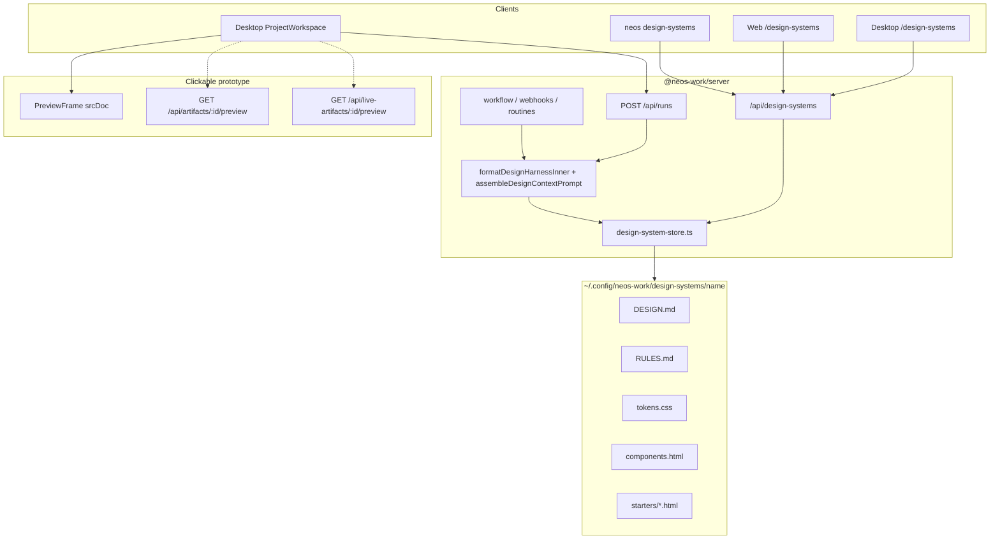
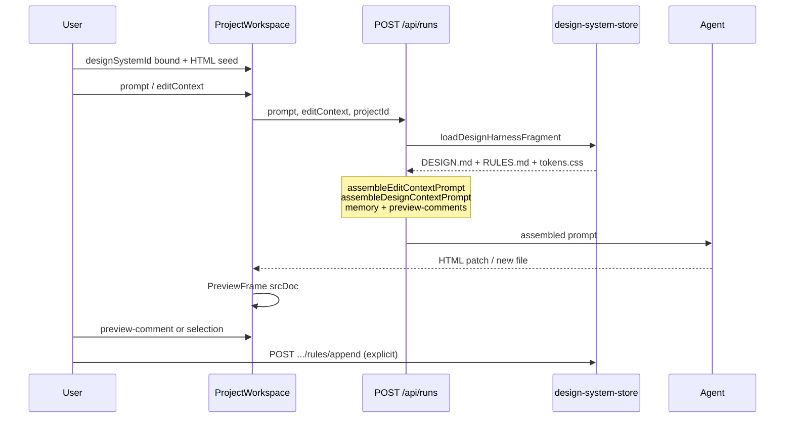
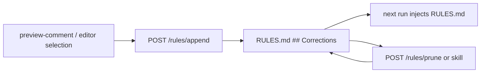

# PLAN: 디자인 하네스 (design harness) — 기존 디자인 시스템에 Rules + 프로토타입 루프 접목

| 항목 | 값 |
| --- | --- |
| **문서** | `docs/plans/PLAN_DESIGN_HARNESS.md` |
| **Author** | NEOS Work engineering (draft) |
| **Date** | 2026-09-21 |
| **Revision** | r3 — prune keeps `<!-- source -->` on surviving bullets; ko pruneConfirm is sequential (not AND); `project.promoteDesktopOnly` is Web hardcoded, not a `packages/ui` key |
| **Status** | Draft |
| **구현 범위** | 조사 + 기술 스펙 (이 문서가 구현 계약). 코드 변경은 별도 PR. |
| **대상 표면** | Desktop `/design-systems` + Design Project 런 주입 + Web 얇은 에디터 + CLI. FFmpeg `/video` 없음. **`/api/harness(es)` 부활 없음.** |
| **선행** | GeekNews [topic 34096](https://news.hada.io/topic?id=34096); 원문 x.com/willdjthrill (2026-09-21 번역 요약); OD §10; as-is `main` @ `a128cb62` |

---

## Overview

GeekNews 「나만의 디자인 하네스 만들기」는 별도 앱/플러그인이 아니라, 에이전트가 작업 전에 읽는 **텍스트 폴더**(Rules Md + Design Md)와 클릭형 HTML 프로토타입 루프를 핵심으로 둔다. 명시적 규칙이 없으면 에이전트는 학습 데이터의 평균적인 저품질 UI를 만든다.

NEOS Work는 이미 `~/.config/neos-work/design-systems/<name>/{DESIGN.md,manifest.json,tokens.css}` 카탈로그, 프로젝트/워크플로 `designSystemId` 바인딩, `<!-- DESIGN CONTEXT -->` 프롬프트 주입, Design Editor `PreviewFrame` srcDoc, live-artifact/artifact preview URL을 갖고 있다. 이 스펙은 Paper/Figma/새 캔버스 제품을 만들지 않는다. 기사 개념을 **기존 디자인 시스템 폴더 + 에이전트/디자인 프로젝트 루프**에 접목한다.

v1은 (1) `RULES.md`를 `DESIGN.md`·`tokens.css` 옆에 두고, (2) UI 생성·수정 전에 세 파일을 읽게 하며, (3) 사람이 고친 내용을 명시적으로 Rules에 승격하고, (4) 빈 화면이 아니라 기존 프로젝트 파일/live artifact/`components.html`에서 변형을 만들며, (5) 기존 preview로 호버/스크롤을 직접 경험하게 한다. **공유 팀 하네스와 `/api/harness(es)` HTTP 부활은 금지.**

---

## 용어 분리 (필수)

NEOS Work는 이미 **워커**를 옛 이름 harness로 불렀고, 그 HTTP는 **v0.10.2에서 410 Gone**이다. 이 문서의 “디자인 하네스”는 그 리소스가 아니다.

| 용어 | 의미 | HTTP / UI | 이 스펙에서 |
| --- | --- | --- | --- |
| **디자인 하네스 (design harness)** | Rules + Design 텍스트 폴더 + 프로토타입 루프 | **신규 컬렉션 없음.** `/api/design-systems` 확장 | **이 문서의 대상** |
| **워커 (worker)** | Domain agent worker (`systemPrompt`, `allowedTools`, …) | **`/api/workers`**. Desktop `/workers`, 별칭 `/harnesses` | 무변경. 혼동 금지 |
| **harness (레거시 HTTP)** | 워커의 옛 이름 | `apps/server/src/routes/harness.ts` — **모든 메서드 410** + `Link: </api/workers>; rel="successor-version"` | **부활 금지.** 새 라우트 `/api/design-harness(es)`도 금지 |
| **AgentNode 지역 변수 `harness` / `harnessId`** | 워커 BC (`workerId` 선호, `harnessId` 수용) | `packages/workflow-engine/src/nodes/agent.ts` | 이 스펙에서 리네임하지 않음 (K23) |

식별자: `designHarness`, `rulesMd`, `RULES.md`. UI 카피에서 단독 `harness` / `하네스`로 워커 페이지를 가리키지 않는다. 한국어 제품 문구는 **「디자인 하네스」**만 허용하고, 워커 화면 `common.harness.*` 키와 네임스페이스를 섞지 않는다.

---

## Background & Motivation

### 기사에서 가져올 것 (검증된 요약)

출처: [news.hada.io/topic?id=34096](https://news.hada.io/topic?id=34096). 관련: DESIGN.md 단일 파일 (hada 28861), 하네스 엔지니어링 (28966), 하네스란 무엇인가 (32813). 28966의 일반 에이전트 하네스 ≠ NEOS 워커 HTTP ≠ 이 문서의 디자인 하네스.

1. 핵심은 앱이 아니라 **에이전트가 작업 전에 읽는 일반 텍스트 폴더**.
2. **Rules Md**: 행동 방식, 사용할 도구, 절대 하지 말아야 할 일.
3. **Design Md**: 색상, 글자 크기, 간격, 컴포넌트 스타일, 철학, 선호 작업 방식.
4. 세션마다 잘못된 디자인을 고친 사례·효과적 패턴·반복하지 않을 실수를 축적하면 프롬프트를 덜 구체적으로 써도 결과가 좋아진다. **오래된 맥락은 결과를 악화시키므로 주기적으로 삭제.**
5. 빈 화면 대신 **실제 제품 컴포넌트**에서 출발해 여러 변형을 만들고, 비교·직접 수정한 뒤 한 방향으로 좁힌다.
6. **클릭 가능한 HTML 프로토타입**으로 호버/스크롤/전환을 직접 경험. 정적인 목업이 아님.
7. 바이브 코딩 UI는 디자인 시스템 토큰과 안 맞는 문제가 있으며, 하네스를 조정해 불일치를 해결한다.
8. 같은 코드를 캔버스·프로토타입·프로덕션에서 쓰면 세 충실도를 번역하지 않는다.
9. 잘 나온 코드는 다음 작업 시드로 복제해 보관. 규칙과 재사용 코드가 누적.
10. 현재는 개인용. 다음 단계는 팀의 규칙·참조·재사용 코드를 모든 디자이너와 에이전트가 읽는 **공유 하네스**.

### 현재 상태 (검증된 as-is, `main` @ `a128cb62`)

작성자가 트리에서 재확인. 발명하지 않음.

| 계층 | 사실 | 근거 |
| --- | --- | --- |
| 패키지 레이아웃 | `<name>/DESIGN.md`(필수) + 선택 `manifest.json` (`schema: od-design-system-project/v1`) + `tokens.css` + `components.html`. **`RULES.md` 없음.** | `apps/server/src/lib/design-system-store.ts` 헤더 · `loadFromDir` |
| 루트 | 사용자 `~/.config/neos-work/design-systems/` (`DESIGN_SYSTEMS_DIR`, **`NEOS_DATA_DIR` 미존중**). 번들 `design-systems/{neos-default,minimal-mono}/`. 이름 섀도잉 user > bundled. | `design-system-store.ts` `listDesignSystems` |
| 번들 | 각 폴더에 `DESIGN.md` + `manifest.json` + `tokens.css`. `components.html` **없음.** `source === 'bundled'`는 삭제/쓰기 거부 → 라우트 403. | `design-systems/`, `updateDesignSystemContent`, `deleteDesignSystem` |
| 생성 템플릿 | `createDesignSystem`은 `DESIGN.md` + `manifest.json`만 씀. **`tokens.css` / `RULES.md` / `components.html` 없음** → 신규 user 시스템은 `hasTokens: false`. | `createDesignSystem` ~377–441 |
| Store 플래그 | `hasManifest` / `hasTokens` / `hasComponents`. **`hasRules` 없음.** 심볼릭 링크 DESIGN.md·디렉터리 거부. | `loadFromDir`, `regularFileStatOrNull` |
| API | `GET/POST /api/design-systems`, `GET/DELETE :id`, `GET/PUT :id/content` (DESIGN.md), `GET :id/tokens` (tokens.css). **PUT tokens 없음. RULES 없음. components GET 없음.** | `apps/server/src/routes/design-systems.ts` |
| 가드 | 이름 `[a-zA-Z0-9_-]+`, 제어문자 거부, 빈 content 거부, null-byte 거부, `DESIGN_MD_MAX_CHARS = 1MiB`. tokens 읽기 256KiB 슬라이스. | 라우트 + store |
| 프로젝트 런 주입 | `POST /api/runs`가 `project.designSystemId`이면 `getDesignSystemContent` + `getDesignSystemTokens` → `assembleDesignContextPrompt` (DESIGN.md 32k + tokens 8k, 마커 `<!-- DESIGN CONTEXT -->`). preview-comments·memory 동시. | `apps/server/src/routes/runs.ts` ~353–412, `packages/agent-runtime/src/edit-context.ts` |
| 워크플로 주입 | `workflow.ts` / `webhooks.ts` / `routine-scheduler.ts`는 **`getDesignSystemContent`만** (`tokens.css` 없음, RULES 없음). `executeWorkflow({ designSystemContent })`. | `workflow.ts` ~922–974 |
| AgentNode | 받은 문자열을 다시 `<!-- DESIGN CONTEXT -->`로 감쌈. 캡 32k. 지역 변수명은 여전히 `harness` = 워커. | `packages/workflow-engine/src/nodes/agent.ts` ~209–274 |
| 워커 런타임 | `buildWorkerSystemPrompt({ designSystemContent })` — DESIGN.md 문자열만, 캡 32k. | `packages/core/src/agent/worker-runtime.ts` ~289–316 |
| 워크플로 export | zip에 `design-systems/<id>/DESIGN.md`만. tokens/RULES 없음. | `workflow.ts` ~464–474 |
| 워크플로 import | `design-systems/<name>/DESIGN.md`만 매칭, `updateDesignSystemContent`만 호출. 다른 zip 멤버 무시. | `workflow.ts` ~746–775, `/^design-systems\/[^/]+\/DESIGN\.md$/i` |
| Desktop 목록 | `/design-systems` — 검색, 생성, View(`?mode=view`), Edit, bundled Delete disabled. tokens/components 뱃지. i18n `common.designSystems.*` en/ko. | `DesignSystems.tsx` |
| Desktop 에디터 | DESIGN.md textarea만. Cmd+S, dirty leave, bundled는 content PUT 403. | `DesignSystemEditor.tsx` |
| 프로젝트 사이드패널 | Context 탭: `designSystemId` select + DESIGN.md / tokens 미리보기 (6k slice). RULES 없음. | `ProjectWorkspace.tsx` ~947–2118 |
| Web | v0.26 목록+DESIGN.md 에디터. **하드코딩 영어**. `apps/web`에 `useTranslation` **0건** (skills는 JSON 헬퍼). view 모드 없음, tokens GET 클라이언트 메서드 **없음**. `ProjectDetail`에 CommentsPanel+runs는 있으나 **`designSystemId` 바인더 없음** (Desktop Context만). | `apps/web/src/pages/DesignSystems.tsx`, `ProjectDetail.tsx`, `api.ts` |
| CLI | `neos design-systems list`만. | `apps/cli/src/commands/design-systems.ts` |
| 클릭형 HTML | Design Editor `PreviewFrame` — `sandbox="allow-scripts"` **srcDoc**. 호버/스크롤/전환은 이미 가능. | `packages/design-editor/src/PreviewFrame.tsx` |
| Artifact preview | `GET /api/artifacts/:id/preview` — Bearer, `text/html`, CSP `frame-ancestors 'self'`. | `apps/server/src/routes/artifacts.ts` ~56–73 |
| Live artifact preview | `GET /api/live-artifacts/:id/preview?projectId=` — Bearer, HTML, **CSP 없음**. 사이드카 `.neos-work/live-artifacts/`. | `live-artifacts.ts` ~122–133, `db/live-artifacts.ts` |
| Auth exempt | preview 경로 **비포함**. Bearer 필수. 브라우저가 iframe `src=`에 Bearer를 못 붙임 → 실제 클릭 프로토타입은 srcDoc. | `auth-paths.ts` |
| Preview comments | `GET/POST/DELETE /api/projects/:id/preview-comments`. 런 프롬프트에 최대 40개 주입. | `edit-context.ts` `assemblePreviewCommentsPrompt`, `runs.ts` |
| 시드/복제 API | 프로젝트 파일 `writeProjectFile`만. artifact/live-artifact **clone 엔드포인트 없음.** | `project-files.ts`, grep |
| 스킬 | 번들 `skills/design-critique` (HTML 비평), `skills/web-landing` (랜딩 스캐폴드). **`human-review` 없음.** 스킬 카탈로그는 별 표면 (`PLAN_SKILLS_SH_MIGRATION.md`). | `skills/` |
| 워커 HTTP | `/api/harness`, `/api/harnesses` → 410. 주 경로 `/api/workers`. | `routes/harness.ts`, `docs/reference/api-surface-notes.md` |
| Dual surface | Design systems: Desktop **yes**, Web **yes (v0.26)**. Video는 Desktop only. Design systems는 엔진 연결 필요 (`/video`와 다름). | `docs/reference/dual-surface.md` |
| OD | §10 Design System: DESIGN.md + tokens.css + components.html + 9-section 관례. RULES.md 없음. §21.2 프롬프트: BASE + DESIGN.md + skill + memory. | `docs/reference/open-design-repository-spec-ko.md` |

### 고통

1. **행동 규칙 SoT가 없다.** DESIGN.md는 색/타이포/컴포넌트 철학이고, “절대 새 팔레트를 만들지 마라 / 빈 화면에서 시작하지 마라 / 토큰 변수를 써라”는 에이전트 행동 규칙은 DESIGN.md에 섞여 있거나 없다. 워커 `systemPrompt`에 넣으면 디자인 시스템과 수명이 갈라진다.
2. **주입 경로가 갈린다.** 프로젝트 런은 DESIGN.md+tokens.css, 워크플로/웹훅/루틴은 DESIGN.md만. 바이브 코딩이 토큰과 안 맞는 기사의 문제는 NEOS에서 **워크플로 경로가 tokens.css를 안 읽는 것**으로 재현된다.
3. **교정 루프가 프롬프트에 남지 않는다.** preview-comments는 그 런에만 주입되고 DESIGN.md/RULES.md로 승격되지 않는다. 다음 세션은 같은 실수를 반복한다. 반대로 자동 append는 기사대로 오래된 맥락이 결과를 악화시킨다.
4. **빈 화면에서 생성한다.** `components.html`은 뱃지만 있고 읽기 API·주입·시드 액션이 없다. live artifact / 현재 HTML을 “변형 시드”로 쓰는 1급 경로가 없다.
5. **재사용 코드 보관이 없다.** 잘 된 프로토타입을 다음 작업 시드로 복제하는 저장소가 디자인 시스템 폴더에 없다.
6. **공개 공유 URL이 없다** — 그리고 v1에서 만들어서도 안 된다. preview는 Bearer라 링크만으로 외부 공유가 안 된다. 기사의 “공유 URL”을 unauth GET으로 오역하면 인증 모델이 깨진다.
7. 용어 충돌: `/harnesses`는 워커 UI 별칭이다. “하네스”를 새 내비 항목으로 넣으면 0.10.2 마이그레이션이 되돌아간다.

---

## Goals & Non-Goals

### Goals (v1)

1. 사용자 디자인 시스템 디렉터리에 **`RULES.md`** 를 둔다. DESIGN.md는 시각/철학/컴포넌트 스타일 SoT, tokens.css는 CSS 커스텀 프로퍼티 SoT, RULES.md는 에이전트 행동·금지·도구·교정 로그 SoT.
2. `designSystemId`가 묶인 **모든** 실행 경로(프로젝트 런, 워크플로, 웹훅, 루틴)가 UI를 만들기 **전에** DESIGN.md + RULES.md + tokens.css를 읽는다. 워크플로 경로의 tokens 누락을 이 스펙에서 고친다.
3. 사람이 고친 내용(preview comment / 에디터 선택)을 RULES.md `## Corrections`에 **명시적으로 승격**하는 API+UI. 오래된 항목을 **명시적으로 prune**. 자동 append 없음.
4. 빈 화면이 아니라 **현재 프로젝트 파일 / live artifact / `components.html` / `starters/`** 를 시드로 변형 HTML을 만든다. 비교 UI는 새 캔버스가 아니라 기존 에디터 탭 + `PreviewFrame`.
5. 클릭형 프로토타입은 기존 **srcDoc preview** (및 인증된 preview GET을 앱이 fetch하는 경로). 정적인 스크린샷 워크플로를 기본으로 두지 않는다.
6. 잘 된 HTML을 디자인 시스템 `starters/`에 보관하고 다음 프로젝트 파일로 복제한다.
7. Desktop 에디터 탭(DESIGN / RULES / tokens) + Web 얇은 RULES 에디터 + CLI `content`/`rules`/`tokens` get/put. ko/en 패리티는 **Desktop `packages/ui`**. 새 내비 항목 없음. Promote/variants/starters는 Desktop only.
8. 번들 `neos-default` / `minimal-mono`에 읽기 전용 `RULES.md`를 추가한다. 신규 `createDesignSystem`은 RULES.md + tokens.css 스텁을 같이 쓴다.

### Non-Goals (v1에서 명시적으로 제외)

| 항목 | 이유 |
| --- | --- |
| `/api/harness`, `/api/harnesses` 부활 또는 `/api/design-harness(es)` 신설 | 0.10.2 410 계약. 워커와 타입 붕괴. |
| Paper / Figma / 새 캔버스 제품 | 기사는 텍스트 폴더 + HTML. NEOS는 Design Editor가 이미 같은 HTML을 편집·미리보기. |
| 공개 unauthenticated preview URL / `isAuthExemptPath`에 preview 추가 | Bearer 모델. 도구 토큰 공유는 후속. |
| 팀 공유 하네스 (원격 카탈로그, org git sync, 다중 사용자 권한) | 기사 다음 단계. v1은 개인 `~/.config` 폴더. |
| SKILL.md / skills.sh 카탈로그와 디자인 시스템 폴더 병합 | 다른 제품 표면 (`PLAN_SKILLS_SH_MIGRATION.md`). |
| `/human-review` 스킬 날조 | 레포에 없음. 필요 시 `design-harness-review`로만 제안 (inventory PR은 Promote와 분리, K36). |
| `design-critique` / `web-landing` 동작 변경 | HTML 비평·랜딩 스캐폴드는 유지. |
| 워커 `systemPrompt`에 RULES.md를 합치기 | 수명/스코프가 다름. 워커는 도메인 에이전트, 하네스는 디자인 시스템. |
| AgentNode `harnessId` 심볼 리네임 | 워커 BC. 이 스펙 밖. |
| CSS AST 토큰 불일치 검사기 (생성된 CSS vs `tokens.css`) | v1은 주입 + RULES 금지 조항. 감지기는 후속 (K17). |
| `NEOS_DATA_DIR`로 디자인 시스템 루트 이전 | 스킬 루트 통일과 별 계약. 이 스펙에서 홈 경로 불변. |
| PUT `manifest.json` / 스키마 버전 bump를 breaking으로 | OD `od-design-system-project/v1` 유지. `files.rules`는 후속 OD 메모. |
| 비디오 스튜디오 / FFmpeg | Desktop-only 별 표면. |
| 전역 에이전트 런에 디자인 하네스 강제 | `designSystemId`가 있을 때만. 바인딩 없으면 오늘과 동일. |
| 매 세션 RULES.md 자동 기록 | 기사: 오래된 맥락이 결과를 악화. |
| 새 Home 카드 / 새 사이드 내비 | `/design-systems`가 집. |

---

## Key Decisions

| # | 결정 | 근거 |
| --- | --- | --- |
| K1 | **접목 대상 = 기존 디자인 시스템 폴더 + 기존 런 루프.** 새 캔버스/Figma/Paper 없음. | 기사 핵심은 텍스트 폴더. Design Editor가 이미 같은 HTML을 편집·srcDoc 미리보기. |
| K2 | **HTTP 컬렉션 불변.** `/api/design-systems`만 확장. `/api/harness(es)` 410 유지. `/api/design-harness*` 금지. | 0.10.2 successor 계약. 감사 문서가 워커로 고정. |
| K3 | **파일 역할 분리.** DESIGN.md = 시각/철학/9-section SoT. RULES.md = 행동/금지/도구/교정. tokens.css = CSS 변수 SoT. components.html = 갤러리 시드 (항상 주입하지 않음). | 기사 Rules Md vs Design Md. 한 파일에 섞으면 prune가 시각 가이드를 지운다. |
| K4 | **RULES.md는 디스크에서 optional.** 없으면 섹션 omit, 런 실패 아님. `createDesignSystem`과 번들은 파일을 갖는다. Promote는 없으면 템플릿 생성 후 append (user only). | 기존 user 시스템 호환. |
| K5 | **단일 inner.** `formatDesignHarnessInner` (마커 없음)만 새 export. `assembleDesignContextPrompt`는 **반드시** inner를 호출한 뒤 `<!-- DESIGN CONTEXT -->`로 감싼다. `assembleDesignHarnessPrompt`라는 이름은 **export하지 않는다.** 워크플로/웹훅/루틴은 `formatDesignHarnessInner(...)`를 `designSystemContent`로 넘긴다. | 두 이름/두 구현이 다시 tokens 갭을 만든다. |
| K6 | **마커는 한 번만.** inner는 마커 없음. 프로젝트 런은 `assembleDesignContextPrompt`가 wrap. AgentNode / `buildWorkerSystemPrompt`는 오늘처럼 inner를 wrap. 단위 테스트: 두 출력의 inner substring이 동일하고, AgentNode 출력에 마커 쌍이 1회. | `runs.ts` vs `agent.ts` 이중 wrap 버그 방지. |
| K7 | Inner 순서 고정: 이름 → DESIGN.md → `### RULES.md` → `### tokens.css`. 섹션 캡: DESIGN **32_000**, RULES **16_000** (K32 head+tail), tokens **8_000**. Wrap 캡은 K31. | RULES는 세션마다 늘어남. 시각 가이드보다 짧게 자른다. |
| K8 | Store 캡: RULES `RULES_MD_MAX_CHARS = 1MiB` (DESIGN과 동일). tokens **쓰기** 256KiB (읽기 슬라이스와 동일). components 읽기 256KiB. | 기존 DESIGN/tokens 가드 패리티. |
| K9 | 리스트 DTO에 `hasRules: boolean`. `updatedAt`은 DESIGN.md mtime 유지. RULES mtime은 별도 `rulesUpdatedAt?` (있으면). | 목록 뱃지. DESIGN이 SoT인 패키지 정의 유지 (`loadFromDir`은 여전히 DESIGN.md 필수). |
| K10 | 번들 RULES.md·tokens PUT·DELETE는 **403**. user 섀도잉으로만 수정. | 오늘 DESIGN.md와 동일. |
| K11 | 스킬 카탈로그/`SKILL.md`와 디자인 시스템 폴더 **병합 금지.** `design-harness-review`는 **별 PR** (K36). Promote/prune API는 스킬 없이 동작. | `design-critique`는 HTML 비평. `/human-review` 날조 금지. inventory CI와 UX PR을 섞지 않음. |
| K12 | **교정 루프 = 명시적 Promote.** preview-comments/선택 텍스트 → `POST .../rules/append`. 매 런 자동 기록 없음. | 기사: 축적과 주기적 삭제. 자동 append는 컨텍스트 부패. |
| K13 | Corrections 불릿: `- YYYY-MM-DD: <text>` (append 시각은 **서버 UTC 날짜**). Prune 절차는 §6.1 (나이 먼저 자른 뒤 maxEntries). `maxEntries` clamp 1..100, `maxAgeDays` 1..365. 기본 20 / 90. | 모호한 AND vs 2-phase를 절차로 고정. |
| K14 | 클릭형 프로토타입 = **`PreviewFrame` srcDoc** + 기존 인증 preview GET. `sandbox="allow-scripts"` 유지. 공개 공유 링크 **v1 없음**. | iframe `src`에 Bearer 불가. auth-paths 불변. |
| K15 | 시드·변형 계약은 §7 (mode `patch`, snippet 64 KiB, HTML만, 충돌 `-2` 접미사, 비교는 순차 탭). 새 비교 캔버스 없음. 서버가 sibling-only를 강제하지 않음 (프롬프트만). | 기사 루프를 구현 계약으로 고정. |
| K16 | 재사용 보관 = 디자인 시스템 안 **`starters/`**. store 내부 `path.join(ds.path, 'starters', safeName)` + `regularFileStatOrNull`. **스킬 `isPathInside` import 금지.** 비재귀 20파일, 하위 디렉터리 거부. POST pin은 이름 충돌 **409** (덮어쓰기 없음; 갱신은 PUT). | 스킬 경로 헬퍼를 DS store에 끌어오면 core←server 결합. |
| K17 | **토큰 불일치 검사기는 v1 밖.** v1은 tokens.css 주입 통일 + RULES “토큰 변수만 사용 / hex 신설 금지”. | 파서 범위 폭발. 기사의 “하네스 조정”은 RULES/DESIGN/tokens 텍스트 수정으로 충분. |
| K18 | **공유 팀 하네스는 v1 non-goal.** 후속 절만. | 기사 명시적 다음 단계. |
| K19 | Dual surface: Desktop = 탭 에디터·Promote·prune UX·variants·starters·프로젝트 Context. Web = 목록 + DESIGN.md + RULES.md 에디터만 (영어 하드코딩; `apps/web`에 `useTranslation` **0건**). CLI = `list` + `content` get/put + `rules` get/put + `tokens` get/put. append/prune/components/starters는 CLI 없음. | Web은 이미 comments+runs가 있으나 `designSystemId` 바인더·Promote가 없음. |
| K20 | 내비/라우트 불변: `/design-systems`, `/design-systems/:id`. `/harnesses`는 워커 별칭으로 남김. | 카드/내비 증가 금지 (TS_TO_MP4와 같은 이유). |
| K21 | **PUT `/api/design-systems/:id/tokens`** 와 **GET `/api/design-systems/:id/components`** 를 v1에 넣는다. | 하네스 조정에 tokens 쓰기가 필요. components는 시드. |
| K22 | `createDesignSystem`은 RULES.md + tokens.css 스텁을 같이 쓴다. DESIGN.md 색 섹션은 `var(--color-*)`를 가리킨다 (hex를 시각 SoT로 가르치지 않음). 스텁 본문은 §5. 번들 DESIGN.md는 hex를 **토큰 값 문서**로 둘 수 있으나, RULES는 **생성 CSS**에서 hex 금지를 말한다. | 신규 시스템이 DESIGN=hex / RULES=no-hex로 모순되면 안 됨. |
| K23 | AgentNode 내부 `harness`/`harnessId` **리네임 없음.** | 워커 BC-4. 문서/UI 용어만 분리. |
| K24 | **피처 플래그 없음.** RULES.md 부재 = 섹션 skip. `designSystemId` 부재 = 오늘과 동일. | 옵션 파일이 게이트. |
| K25 | Promote 소스는 preview-comment 또는 에디터 선택. 런 출력 전체를 자동으로 Rules에 넣지 않음. | 노이즈/비밀 유출. |
| K26 | PR은 **스택, 순서대로 머지.** | CI `build-and-test`는 main만. |
| K27 | Desktop i18n = `packages/ui` `common.designSystems.*` ko/en 동시. Web DS 페이지의 react-i18next 도입은 **이 스펙 non-goal** (현행 영어 유지). | 사용자 로케일 기대는 Desktop. Web DS는 원래 영어. |
| K28 | live-artifact preview CSP는 **이 스펙에서 강제하지 않음.** preview 파일을 만지면 `frame-ancestors 'self'` 정렬을 권고. | 범위 팽창 방지. |
| K29 | DESIGN.md 9-section 관례 불변 (OD §10.7). RULES.md는 별 템플릿 (아래). | 시각 가이드를 행동 로그가 오염하지 않게. |
| K30 | 워커 `systemPrompt` / Domain Pack은 디자인 하네스 파일이 아님. | `/api/workers` 무변경. |
| K31 | Wrap 캡 **`DESIGN_HARNESS_WRAP_MAX = 64_000`**. SoT는 `@neos-work/shared` (workflow-engine은 agent-runtime을 의존하지 않음 — 상수를 edit-context.ts에만 두면 AgentNode가 못 씀). `agent-runtime`은 re-export. `nodes/agent.ts`와 `worker-runtime.ts`가 shared를 import하고 기존 32_000을 대체. | 오늘 AgentNode 32k는 DESIGN 근처에서 RULES/tokens를 잘라 워크플로 경로의 토큰 갭을 재현한다. |
| K32 | RULES 16k 주입은 **앞 8k (Tools/Never/Preferred, `## Corrections` 앞)** + **뒤 8k (`## Corrections` 섹션의 최신 불릿부터)**. 섹션이 없으면 16k를 파일 앞에서 자른다. | 앞에서만 slice하면 교정이 가장 먼저 잘린다. |
| K33 | 워크플로 zip **import** allowlist를 `RULES.md`·`tokens.css`로 확장. DESIGN.md를 먼저 처리해 패키지를 만든 뒤 rules/tokens를 `updateDesignSystemRules` / `updateDesignSystemTokens` (bundled 403은 skip, import 전체 실패 아님). DESIGN.md 없는 디렉터리의 RULES는 skip. | r1 “import는 RULES.md를 쓰면 됨”은 코드와 불일치. |
| K34 | Promote `text`는 **500 초과 시 400** (침묵 truncate 없음). 500은 프롬프트 주입 슬라이스와 맞추고, DB preview-comment 캡 8_000과 다르다. `source`는 불릿 위 HTML 주석으로 persist. **prune은 살아남은 불릿의 주석을 유지**하고, 버린 불릿의 주석은 삭제 (§6.1). 주입(K32)은 주석 omit. `commentId`는 optional; 있으면 없는 comment → 404. | “500 = preview-comment 캡”은 거짓 (`PREVIEW_COMMENT_BODY_MAX = 8_000`). |
| K35 | Desktop 에디터는 탭당 독립 버퍼 3개. Cmd+S / Save는 **활성 탭만**. 아무 탭이 dirty면 leave-warn. GET rules 404 → placeholder를 content=savedContent로 보여 dirty 아님. 손대지 않은 placeholder는 PUT하지 않음. bundled rules/tokens 탭 Save는 no-op+403 카피; DESIGN 탭이 활성이고 dirty면 Save 가능. | 단일 content 쌍으로는 탭이 서로 덮어쓴다. |
| K36 | `design-harness-review`는 Promote UX와 **다른 PR**. 풀 SKILL.md frontmatter + `pnpm inventory:write` / `inventory:check`. 없어도 prune API는 동작. | `capability-inventory.json`은 지금 번들 스킬 7개. |

---

## Proposed Design

### 1. 아키텍처



디자인 하네스는 **디스크의 텍스트 패키지**다. 에이전트 워커 HTTP가 아니다. `PreviewFrame`은 iframe `src=`가 아니라 **srcDoc**이다 (Bearer를 iframe URL에 붙일 수 없음). artifact/live preview GET은 앱이 fetch할 때만 쓰며, Frame의 `src`가 아니다.

### 2. 패키지 레이아웃

```text
~/.config/neos-work/design-systems/<name>/
  DESIGN.md          # 필수 (오늘과 동일 — 없으면 패키지 무효)
  RULES.md           # v1 신규, optional
  manifest.json      # 선택, od-design-system-project/v1
  tokens.css         # 선택 (create()는 스텁 작성)
  components.html    # 선택 갤러리/시드
  starters/          # v1 후반 PR — html/css만
    hero.html
    checkout.html

design-systems/neos-default/     # bundled, read-only
  DESIGN.md
  RULES.md                       # v1 추가
  manifest.json
  tokens.css
```

`loadFromDir` 계약 불변: **DESIGN.md regular file이 없으면 패키지 skip.** RULES.md만 있는 폴더는 디자인 시스템이 아니다.

### 3. 파일 역할

| 파일 | SoT | 에이전트에게 | 사람 편집 |
| --- | --- | --- | --- |
| DESIGN.md | 색 역할, 타이포 스케일, 간격, 컴포넌트 스타일, 철학, 9-section | 시각 기준 | Design Systems 에디터 탭 1 |
| RULES.md | 도구, never-do, 선호 워크플로, Corrections 로그 | 행동 기준 | 탭 2 + Promote |
| tokens.css | `:root { --color-primary: … }` | 구현 시 CSS 변수만 사용 | 탭 3 (v1 PUT) |
| components.html | 실제 제품 조각 갤러리 | **기본 런에 주입하지 않음.** 시드 액션이 프로젝트로 복사 | GET + “시드로 복사” |
| starters/* | 잘 된 프로토타입 보관 | 시드 복사 | Pin / clone |

기사 Design Md의 “선호 작업 방식”은 NEOS에서 **RULES.md `## Preferred workflow`** 로 둔다. DESIGN.md 9-section의 “Agent Prompt Guide”는 시각 힌트용으로 남기되, 금지/도구/교정은 RULES.md가 이긴다 (충돌 시 RULES).

### 4. 프롬프트 조립

#### 4.1 공통 inner

`packages/agent-runtime/src/edit-context.ts` (이름 유지, 필드 확장):

```ts
export interface DesignContextFragment {
  name?: string;
  designMd: string;
  rulesMd?: string | null;
  tokensCss?: string | null;
}

export const DESIGN_MD_INJECT_MAX = 32_000;
export const RULES_MD_INJECT_MAX = 16_000; // 8k head + 8k corrections (K32)
export const RULES_MD_INJECT_HEAD = 8_000;
export const RULES_MD_INJECT_TAIL = 8_000;
export const TOKENS_INJECT_MAX = 8_000;
/** Re-export of @neos-work/shared DESIGN_HARNESS_WRAP_MAX (64_000). */
export { DESIGN_HARNESS_WRAP_MAX } from '@neos-work/shared';

/** Marker-free inner. Empty/null-byte sections omitted. MUST be the only inner builder. */
export function formatDesignHarnessInner(fragment: DesignContextFragment): string;

/**
 * MUST call formatDesignHarnessInner, then wrap
 * `<!-- DESIGN CONTEXT -->` … `<!-- /DESIGN CONTEXT -->` + base.
 * Do not export assembleDesignHarnessPrompt.
 */
export function assembleDesignContextPrompt(
  basePrompt: string,
  fragment: DesignContextFragment | null | undefined,
): string;
```

단위 테스트: `assembleDesignContextPrompt` 결과에서 마커를 벗긴 본문이 `formatDesignHarnessInner`와 **동일**. 워크플로 호출부는 inner만 넘긴다.

Inner 예시:

```text
Design system: neos-default

# NEOS Default Design System
…

### RULES.md
# Agent rules
…

### tokens.css
```css
:root { --color-primary: #6366f1; … }
```
```

null-byte가 있는 섹션은 그 섹션만 skip (오늘 DESIGN.md 전체 skip과 다름: tokens만 깨져도 DESIGN은 주입). DESIGN.md가 비면 오늘처럼 **전체 블록 skip**.

**RULES.md 16k 조립 (K32)** — `formatDesignHarnessInner` 안에서만:

1. `rulesMd` trim 후 첫 헤딩 `/^\s*##\s+corrections\s*$/im` (대소문자 무시, 앞뒤 공백 허용, ATX closing `#` 없음)을 찾는다.
2. **없으면** `rulesMd.slice(0, RULES_MD_INJECT_MAX)` + 잘렸으면 `\n\n…[rules truncated]`.
3. **있으면** `head = 헤딩 앞`을 `slice(0, 8_000)` (잘렸으면 head 끝에 `…[rules truncated]`). `tail = 헤딩 줄부터 다음 ATX 헤딩 전`에서 K13 불릿만 모아 **파일 하단이 최신**이므로 뒤에서부터 8_000자에 들어갈 때까지 최신 불릿을 취한다. 출력: `head + "\n## Corrections\n" + 선택된 불릿`.
4. 테스트: 20k RULES.md (head 9k + Corrections에 마지막 불릿 `- 2026-09-21: keep-me`) → 조립 결과에 `keep-me`와 `### RULES.md`가 있다.

#### 4.2 호출부 (반드시 이 네 곳)

| 호출부 | 오늘 | v1 |
| --- | --- | --- |
| `apps/server/src/routes/runs.ts` | DESIGN+tokens → `assembleDesignContextPrompt` | 동일 함수 + `rulesMd` |
| `apps/server/src/routes/workflow.ts` | DESIGN.md 문자열 → `designSystemContent` | `formatDesignHarnessInner` 결과 (DESIGN+RULES+tokens, **마커 없음**) |
| `apps/server/src/routes/webhooks.ts` | DESIGN.md만 | workflow와 동일 |
| `apps/server/src/lib/routine-scheduler.ts` | DESIGN.md만 | workflow와 동일 |

헬퍼 위치 **고정**: `apps/server/src/lib/design-system-store.ts` (새 `design-harness.ts` 없음). `runs.ts` / `workflow.ts` / `webhooks.ts` / `routine-scheduler.ts`만 import.

```ts
export async function loadDesignHarnessFragment(
  id: string,
): Promise<DesignContextFragment | null>
```

`getDesignSystem` + content + rules + tokens. DESIGN.md 없으면 `null` (주입 skip).

워커 런타임/`executeWorkflow`의 `designSystemContent?: string` **필드명은 유지**. 내용은 **inner 전체**. AgentNode / `buildWorkerSystemPrompt`는 wrap 시 `DESIGN_HARNESS_WRAP_MAX`(64_000)를 쓴다. **32_000 캡을 이 스펙에서 제거한다.** 테스트: inner = DESIGN 30_000자 + RULES + tokens → AgentNode 출력에 `### RULES.md`와 `### tokens.css`가 남고 마커 쌍은 1회.

#### 4.3 런 시퀀스 (프로젝트 채팅)



프로젝트 런 `run.started` 이벤트에 기존 `designSystem: boolean` 유지. v1에 `designHarness: { hasRules, hasTokens }`를 **추가해도 되고**, 없으면 로그로만 (Observability). 스키마 강제는 아님.

### 5. RULES.md 템플릿

`createDesignSystem` 및 번들 공통 골격 (본문은 시스템마다):

```markdown
# Agent rules

This file is the behavioral half of the design harness.
Visual tokens live in DESIGN.md and tokens.css. Do not duplicate palettes here.

## Tools
- Prefer editing the open project HTML/CSS. Do not start from an empty document when a seed file exists.
- Use Design Editor selection / preview comments when present.
- Produce self-contained, clickable HTML (hover, focus, scroll, transitions). Not a screenshot mock.

## Never
- Do not invent a new color palette or font stack when tokens.css defines one.
- Do not use raw hex/rgb for brand colors; use CSS custom properties from tokens.css.
- Do not ship inaccessible contrast or missing focus rings.
- Do not overwrite unrelated manual edits (prefer a minimal patch).

## Preferred workflow
- Start from the seed (current file, components.html, or a starter), generate a few variants as sibling files, then narrow to one.
- After a human correction, wait for an explicit promote; do not rewrite RULES.md yourself unless asked.

## Corrections
<!-- dated bullets, pruned when stale. format: - YYYY-MM-DD: text -->
```

번들 `neos-default/RULES.md`는 위 + NEOS 기본 토큰(`--color-primary` 등)을 never에 명시. `minimal-mono/RULES.md`는 모노 팔레트·장식 그림자 금지를 never에 명시.

#### 5.1 `createDesignSystem` tokens.css 스텁 (K22)

현재 create() 팔레트와 동일한 값. DESIGN.md는 이 변수를 가리킨다.

```css
:root {
  --color-primary: #3B82F6;
  --color-secondary: #6366F1;
  --color-success: #10B981;
  --color-error: #EF4444;
  --font-sans: Inter, system-ui, sans-serif;
  --text-base: 1rem;
  --space-1: 0.25rem;
  --space-2: 0.5rem;
  --space-3: 0.75rem;
  --space-4: 1rem;
  --space-6: 1.5rem;
  --space-8: 2rem;
}
```

create() DESIGN.md 색/타이포 절 **교체** (hex 나열 삭제):

```markdown
## Brand Colors
Use CSS variables from tokens.css in generated CSS. Do not introduce new brand hex/rgb.
- Primary: `var(--color-primary)`
- Secondary: `var(--color-secondary)`
- Success: `var(--color-success)`
- Error: `var(--color-error)`

## Typography
- Font family: `var(--font-sans)`
- Body: `var(--text-base)`
```

번들 `neos-default` / `minimal-mono` DESIGN.md의 hex 표는 **토큰 값 문서**로 유지한다. Overview에 한 줄만 추가: `Generated CSS must use tokens.css variables; hex below documents the token values.` RULES Never는 **생성 CSS**의 raw hex를 금지한다 (문서 표까지 지우라는 뜻이 아님).

### 6. 세션 교정 루프



**Promote (명시적, K34):**

- Desktop only: 프로젝트 Context 또는 preview-comment 행, 에디터 RULES 탭 선택 → Append. Web CommentsPanel에는 Promote 없음 (한 줄 힌트만, PR 7).
- Body `{ text, source?: 'preview-comment' | 'editor' | 'manual', commentId?: string }`.
- `text` trim 후 길이 1–500. **501+ → 400** (침묵 slice 없음). 500은 `assemblePreviewCommentsPrompt` 기본 `maxBodyChars`, **DB `PREVIEW_COMMENT_BODY_MAX = 8_000`이 아님**.
- null-byte 거부. 줄바꿈·기타 제어문자 → 공백.
- `source`는 불릿 바로 위 HTML 주석으로 persist: `<!-- source: preview-comment -->`. 클라가 아무 값이나 보내도 인가하지 않음 (로컬 사용자 신뢰 경계). `commentId`가 있으면 해당 preview-comment가 없으면 **404**. prune은 **살아남은 불릿**의 이 주석을 유지한다 (K34 / §6.1). 프롬프트 주입(K32)은 불릿만 넣고 주석은 omit (감사 메타, 모델 컨텍스트 아님).
- 서버 UTC `YYYY-MM-DD`로 `- YYYY-MM-DD: <text>`를 첫 `## Corrections` 섹션 맨 아래 추가. 섹션 없으면 생성. 파일 없으면 user 템플릿+불릿. bundled → 403.

**금지:** 런 종료 훅에서 RULES.md 자동 write. 에이전트가 RULES.md를 “도움이 될 것 같아서” 재작성.

#### 6.1 Prune 절차 (K13, 결정적)

`POST /api/design-systems/:id/rules/prune` `{ maxEntries?: number, maxAgeDays?: number }`.

Clamp: `maxEntries` 기본 20, 범위 **1..100**. `maxAgeDays` 기본 90, 범위 **1..365**. 그 외 → 400.

파일 없음 → **404**. bundled → **403**.

```
parse(content, nowUtcDate /* YYYY-MM-DD */, maxEntries, maxAgeDays):
  find first heading /^\s*##\s+corrections\s*$/im
  if none: return content unchanged  // HTTP 200, { pruned: 0 }
  head = before heading line
  body = after heading line until next /^\s*#{1,6}\s+/m (or EOF)
  rest = that next heading through EOF
  bullets = []
  pendingSource = null
  for each line in body:
    src = /^\s*<!--\s*source:\s*(preview-comment|editor|manual)\s*-->\s*$/
    m   = /^\s*-\s+(\d{4}-\d{2}-\d{2}):\s*(.*)$/
    if src: pendingSource = src[1]; continue
    if m:
      keep { date, text: m[2], order, source: pendingSource }
      pendingSource = null
    else:
      pendingSource = null   // other non-bullets discarded (blank lines, junk)
  cutoff = nowUtcDate - maxAgeDays  (date-only, lexicographic YYYY-MM-DD, UTC)
  bullets = bullets where date >= cutoff
  sort by date ASC, then original order
  if length > maxEntries: drop from the front until maxEntries
  rewrite: head + "## Corrections\n" + for each bullet:
             (if source: `<!-- source: {source} -->\n`)
             `- YYYY-MM-DD: text\n`
           + rest
```

append와 같은 UTC 시계. 타임존 변환 없음.

**source 주석:** 바로 위 줄이 `<!-- source: preview-comment|editor|manual -->`인 불릿만 `source`를 갖는다. 버려진 불릿의 주석은 같이 삭제. 살아남은 불릿은 rewrite 때 주석을 불릿 바로 위에 다시 쓴다. 그 외 Corrections 본문 비불릿은 drop.

골든 픽스처 (store 테스트): 25개 불릿, 10개는 200일 전, 15개는 오늘. prune 기본값 → 나이로 10개 삭제 후 15 < 20이므로 15 남음. 두 번째 픽스처: 25개 전부 오늘 → 가장 오래된 5개 삭제, 20 남음. **세 번째:** append로 `<!-- source: editor -->` + 오늘 불릿 하나, 200일 전 불릿 하나 → prune 후 오늘 불릿 **위에 source 주석이 남고**, 삭제된 불릿의 주석은 없음.

### 7. 실제 제품 재료 → 변형 (K15, Desktop only)

새 페이지 없음. **나란히 비교 캔버스 없음.** 비교는 파일 트리에서 버퍼를 바꿔 PreviewFrame을 순차로 보는 것.

**버튼 위치:** `ProjectWorkspace` 에디터 툴바 (AI 편집 옆). Context 탭이 아님.

**활성 조건:** 시드가 HTML일 때만 활성.

| 시드 | HTML 판정 | 비활성이면 |
| --- | --- | --- |
| 현재 연 파일 (기본) | 경로가 `.html` / `.htm` (대소문자 무시) | 버튼 disabled + `designSystems.variantsNeedHtml` |
| live artifact | `contentType`에 `html` | 같은 카피 |
| `components.html` / starter | 항상 html/css 중 html만 시드 허용 (css starter는 버튼 목록에서 제외) | |

**N:** 셀렉트 2 / 3 / 4, 기본 3 (`designSystems.variantsCount`).

**시드 캡:** 본문 **64 KiB** (`assembleEditContextPrompt` snippet 캡과 동일). store GET components 256 KiB·live artifact 2 MiB는 프롬프트에 넣기 전에 slice. 잘리면 suffix에 `…[seed truncated]` 한 줄.

**editContext:**

- 시드 = 프로젝트 파일: `{ filePath, mode: 'patch', snippet: seed.slice(0, 64*1024) }`. **`replace-file` / `replace-selection` 금지.**
- 그 외 (live artifact / components / starter): editContext **생략**. 시드는 suffix의 `### Seed HTML` 펜스에만.

**파일명:** `stem` = 시드 basename에서 확장자 제거, `[a-zA-Z0-9._-]`만, 비면 `seed`. 목표: `{stem}.variant-a.html` … N번째 글자 (`a`..`d`). 프로젝트에 그 경로가 **이미 있으면** `{stem}.variant-a-2.html` (그다음 `-3`…). 클라가 `listProjectFiles`로 충돌을 해소한 **최종 파일명 목록**을 suffix에 박는다.

**에이전트 suffix (영어 고정, i18n 아님 — 테스트 픽스처):**

    ## Variant task
    Using the seed HTML below, write {n} clickable HTML variants as NEW files with these exact paths:
    - {file1}
    - {file2}
    - …
    Do not modify the seed file. Do not use replace-file. Do not overwrite any other existing file.
    Each variant must be self-contained HTML (hover, focus, scroll, transitions) and must use CSS custom properties from the injected tokens.css — no new brand hex/rgb.

    ### Seed HTML
    (markdown html fence, body = seed ≤ 64 KiB, then fence close)

서버는 sibling-only를 **강제하지 않음** (프롬프트만). 에이전트가 시드를 고쳐도 별 가드 없음 — 리비전 restore가 롤백.

**런 후 UX:** `run.completed` 뒤 최종 파일명이 디스크에 있으면 토스트에 `Open variant-a` … 버튼. 클릭은 그 경로를 활성 버퍼로. 패자 삭제는 기존 프로젝트 파일 Delete. “승자를 시드 경로로 덮기”는 수동 `writeProjectFile` / 저장.

`components.html`은 기본 런에 주입하지 않는다. 시드 액션만 내용을 64 KiB로 넣는다.

Live artifact refresh/template 엔진을 새로 만들지 않음.

### 8. 클릭형 HTML 프로토타입

이미 존재:

- `PreviewFrame` `sandbox="allow-scripts"` srcDoc — 호버/스크롤/transition.
- `GET /api/artifacts/:id/preview`
- `GET /api/live-artifacts/:id/preview?projectId=`

v1 제품 문구: “미리보기에서 직접 클릭하세요” (정적 목업 아님). **공유**는 “엔진에 연결된 세션에서 미리보기”이며, 공개 링크가 아니다.

앱 안 “preview URL 복사”는 인증된 경로를 클립보드에 넣는 선택 기능. 붙여넣은 쪽도 Bearer가 필요하다는 힌트를 붙인다. unauth 화하지 않음.

같은 HTML이 코드 모드·미리보기·(배포한다면) 프로덕션의 출발점이다. 충실도 번역 레이어를 추가하지 않음.

### 9. 재사용 코드 (`starters/`)

PR 후반.

```
starters/
  <safe-name>.html | .css
```

가드 (전부 `design-system-store.ts` 안, **스킬 `isPathInside` / `packages/core` import 금지**):

- 최종 경로 = `path.join(ds.path, 'starters', safeName)` 후 `path.basename(safeName) === safeName` (`.` / `..` / 절대경로 / 구분자 거부).
- `safeName` `^[a-zA-Z0-9._-]+$` 그리고 확장자 `html` \| `css`만.
- `regularFileStatOrNull` — symlink·디렉터리 거부.
- **비재귀.** `starters/` 바로 아래 regular file만. 하위 디렉터리 엔트리는 리스트에서 skip, PUT은 400.
- 최대 **20** 파일. 21번째 PUT/POST → 400 `starters_limit`.
- 파일당 256KiB.
- **POST pin:** 같은 `name`이 있으면 **409** (덮어쓰기 없음). 갱신은 PUT.
- bundled 쓰기 403.

API:

- `GET /api/design-systems/:id/starters` → `{ name, bytes, updatedAt }[]`
- `GET /api/design-systems/:id/starters/:name`
- `PUT /api/design-systems/:id/starters/:name` `{ content }` (user, bundled 403)
- `DELETE /api/design-systems/:id/starters/:name`
- `POST /api/design-systems/:id/starters` `{ from: 'projectFile' | 'liveArtifact' | 'components', projectId?, path?, liveArtifactId?, name }` — 서버가 내용을 읽어 starters에 씀.
- 프로젝트로 복제: 기존 `PUT /api/projects/:id/files/...` (`writeProjectFile`). 전용 clone-into-project API **없음** (클라이언트가 GET starter → write file).

Pin UX: 프로젝트 “스타터로 보관” → POST starters.

### 10. 토큰 불일치 (v1 = 예방, 감지 = 후속)

예방:

- 모든 주입 경로에 tokens.css (K5).
- RULES.md Never: 브랜드 색 hex 신설 금지.
- 신규 시스템 tokens.css 스텁 (K22).

후속 (이 문서 Open Questions Q4, 잠금: v1 아님):

- 생성 HTML에서 `#rrggbb` / `rgb()`가 tokens.css 값 집합에 없으면 preview-comment 또는 런 이벤트 경고.
- CSS 파서/AST 없음. 정규식 휴리스틱만 허용할 때도 별 PR.

### 11. 에디터 UX

**Desktop `DesignSystemEditor`** — 라우트 불변. 탭: `DESIGN.md` | `RULES.md` | `tokens.css`.

**버퍼 (K35):** 탭마다 `{ content, savedContent }` 독립. dirty = 그 탭의 content !== savedContent.

- Save / Cmd+S = **활성 탭만** PUT (`content` / `rules` / `tokens`).
- 탭 전환은 경고 없음 (버퍼가 유지됨).
- 목록으로 나가기 / beforeunload: **아무 탭이 dirty**면 기존 `unsavedLeave`.
- GET rules **404**: `rulesMissing=true`. textarea에는 §5 템플릿을 넣되 **content와 savedContent를 같은 템플릿으로** 맞춰 dirty가 아니게. 사용자가 한 글자라도 고치면 Save 활성. 손대지 않은 placeholder는 PUT하지 않음.
- GET tokens 404 (create 이전 시스템): 빈 textarea, savedContent `''`, Save는 사용자가 입력한 뒤에만 (빈 PUT은 400이므로 빈 채 Save 비활성).
- bundled: rules/tokens 탭은 readonly. 그 탭이 활성이면 Save disabled. DESIGN 탭이 활성이고 dirty면 Save 가능 (오늘 content PUT 403은 bundled DESIGN에도 이미 있음 — bundled 전체 read-only 유지).
- View 모드 (`?mode=view`): 세 탭 readonly + startEdit.

목록 뱃지: tokens/components + **rules**. 목록 subtitle에 “워커(옛 harness)가 아님” (`designSystems.notWorkerHarness`).

**Web:** 얇은 탭 DESIGN | RULES. tokens UI 없음 (클라이언트 GET tokens만 갭 수정). 영어 하드코딩 (K27). Promote / prune 버튼 / variants / starters / 프로젝트 Context RULES = **없음**.

**프로젝트 Context 패널 (Desktop):** RULES.md 6k slice + Promote. tokens 미리보기 유지.

### 12. 신규 스킬 `design-harness-review` (K36, Promote와 별 PR)

경로: `skills/design-harness-review/SKILL.md`. **이름 `human-review` 금지.** Promote/prune API·UI는 이 스킬 없이 동작.

`design-critique`와 같은 필드 집합 + `design-system-required: true`:

```yaml
---
name: design-harness-review
description: Suggest stale RULES.md Corrections to prune. Does not delete files.
version: 1.0.0
mode: design
category: design
featured: false
triggers: prune rules, stale design harness, corrections cleanup
example-prompt: Review RULES.md Corrections and list bullets that are stale or too specific
design-system-required: true
---
```

- 하는 일: Corrections를 읽고 중복/만료/과도한 구체 프롬프트를 지적. prune API를 쓰라고 안내.
- 하지 않는 일: HTML 비평, 디스크 삭제, 워커 수정.
- 출하: `pnpm inventory:write`로 `docs/generated/capability-inventory.json` 갱신. `inventory:check`가 빨간 채로 머지 금지. `featured: false` (원격 설치가 핀하지 못하게 하는 스킬 스펙 K16과 별개 — 번들이므로 목록 하단에 둬도 됨).

---

## API / Interface Changes

기존 prefix `/api/design-systems`만. **410 워커 별칭과 경로를 공유하지 않음.**

### 목록 DTO (하위 호환, 필드 추가)

```ts
interface DesignSystem {
  id: string;
  name: string;
  description?: string;
  path: string;            // publicPathTail 유지
  hasManifest: boolean;
  hasTokens: boolean;
  hasComponents: boolean;
  hasRules: boolean;       // NEW
  source: 'user' | 'bundled';
  rulesUpdatedAt?: string; // NEW, optional
  createdAt: string;
  updatedAt: string;       // DESIGN.md mtime 유지
}
```

### 신규/확장 라우트

| 메서드 | 경로 | 동작 | 가드 |
| --- | --- | --- | --- |
| GET | `/:id/rules` | `{ content }` RULES.md | 없으면 `{ content: '' }` 200 또는 404? **잠금: 파일 없으면 404** (content와 동일하게 “없음”). 에디터는 404를 빈 템플릿 placeholder로 표시 |
| PUT | `/:id/rules` | `{ content }` 저장 | user only, 빈 trim 400, null-byte 400, `RULES_MD_MAX_CHARS` 400, bundled 403 |
| POST | `/:id/rules/append` | `{ text, source?: 'preview-comment' \| 'editor' \| 'manual', commentId?: string }` | user, text 1–500 (**501 → 400**), bundled 403. 파일 없으면 템플릿 생성 후 append. `commentId` 있으면 없는 comment → 404 |
| POST | `/:id/rules/prune` | `{ maxEntries?: number, maxAgeDays?: number }` | user, clamp 1..100 / 1..365, 기본 20/90. 파일 없음 404, 섹션 없음 200 `{ pruned: 0 }`, bundled 403 |
| PUT | `/:id/tokens` | `{ content }` tokens.css | user, 빈 400, null-byte 400, 256KiB, bundled 403 |
| GET | `/:id/components` | `{ content }` | 없으면 404. 256KiB slice |
| GET/PUT/DELETE | `/:id/starters`… | §9 | PR 후반. bundled 403 on write |

`paramDesignId` / `safeRouteId`(64) 재사용. 심볼릭 링크 쓰기 거부 (DESIGN.md와 동일 unlink-then-write).

GET `/:id/content` · PUT `/:id/content` **불변** (DESIGN.md).

### 클라이언트

| 클라이언트 | 추가 메서드 | PR |
| --- | --- | --- |
| `EngineOpsClient` | PR 3: `getDesignSystemRules`, `saveDesignSystemRules`, `saveDesignSystemTokens`. PR 4: `appendDesignSystemRules`, `pruneDesignSystemRules`. PR 5: `getDesignSystemComponents`. PR 6: starters* | 메서드를 쓰는 PR에만 추가 |
| `WebApiClient` | PR 7: `getDesignSystemRules`, `saveDesignSystemRules`, `getDesignSystemTokens` (**오늘 갭**). tokens PUT·append·prune·components·starters **없음** | Web 얇은 에디터 |
| `NeosApiClient` CLI | PR 7: `getDesignSystemContent`, `saveDesignSystemContent`, `getDesignSystemRules`, `saveDesignSystemRules`, `getDesignSystemTokens`, `saveDesignSystemTokens` | append/prune/components/starters 없음 |

### 워크플로 zip export / import (K33)

Export: `design-systems/<id>/`에 있는 것만 `DESIGN.md` + `RULES.md` + `tokens.css`.

Import (`workflow.ts` ~746 루프 확장):

1. `DESIGN.md` 매칭 (`/^design-systems\/[^/]+\/DESIGN\.md$/i`) — 오늘처럼 create-or-overwrite + bind id. **이 패스를 먼저.**
2. 같은 `safeName`에 대해 `RULES.md` / `tokens.css`가 있으면 `updateDesignSystemRules` / `updateDesignSystemTokens`. bundled 403(false) → 그 파일 skip, zip import 전체는 201.
3. DESIGN.md 없이 RULES/tokens만 있는 디렉터리 → skip (패키지 무효).
4. 테스트: 세 파일을 담은 zip → 가져온 user 시스템 `hasRules === true` && `hasTokens === true` && RULES 본문 일치.

### 조립 인터페이스 (agent-runtime)

`DesignContextFragment.rulesMd?` 추가. 기존 테스트 “DESIGN.md block” 유지 + RULES 케이스.

---

## Data Model Changes

**SQLite 마이그레이션 없음.** 디자인 시스템은 파일 카탈로그. `projects.design_system_id` / `workflows.design_system_id` 불변.

디스크만:

| 경로 | 변경 |
| --- | --- |
| `design-systems/neos-default/RULES.md` | 번들 추가 |
| `design-systems/minimal-mono/RULES.md` | 번들 추가 |
| user `createDesignSystem` | `RULES.md` + `tokens.css` 스텁 추가 |
| user `<name>/starters/` | 후반 PR, 생성 시 mkdir 하지 않아도 됨 (첫 pin에 생성) |

`parseDesignSystemManifest`는 v1에서 `files.rules`를 **요구하지 않음**. 파일이 있으면 스캔. OD 스펙 문서는 후속 메모 (이 PLAN이 구현 계약).

---

## Mapping table (기사 → NEOS)

| 기사 | NEOS v1 | 비고 |
| --- | --- | --- |
| 텍스트 폴더 하네스 | `design-systems/<name>/` | 새 앱 없음 |
| Rules Md | `RULES.md` | |
| Design Md | `DESIGN.md` + `tokens.css` | 역할 분리 K3 |
| 작업 전 읽기 | `loadDesignHarnessFragment` + 기존 주입 지점 | 워크플로 tokens 갭 수정 |
| 세션 교정 축적 | `POST .../rules/append` | 자동 아님 |
| 오래된 맥락 삭제 | `POST .../rules/prune` (스킬은 별 PR, 없어도 API 동작) | `/human-review` 없음 |
| 실제 컴포넌트에서 출발 | 시드: 파일 / live artifact / components.html / starters | |
| 여러 변형 비교 | 형제 `*.variant-*.html` + 순차 탭 PreviewFrame (Desktop) | 스플리트 뷰 없음 |
| 클릭형 HTML + 공유 URL | srcDoc preview; 인증 GET | 공개 URL 없음 |
| 토큰 불일치 → 하네스 조정 | tokens 주입 + RULES never + PUT tokens | 검사기 후속 |
| 같은 코드 3 충실도 | 프로젝트 HTML = 에디터 = preview | |
| 재사용 코드 저장소 | `starters/` | |
| 공유 팀 하네스 | non-goal | §Follow-up |
| 워커/에이전트 하네스 엔지니어링 | `/api/workers` | **이 스펙 밖** |

---

## Alternatives Considered

### 1. 새 `/api/design-harnesses` 컬렉션 + 별 내비 (기각)

- 장점: 기사 이름과 1:1.
- 단점: 0.10.2 `/api/harness` 410과 충돌, 워커 UI `/harnesses`와 혼동, 디자인 시스템 폴더를 복제.
- **기각.** K2.

### 2. DESIGN.md 한 파일에 Rules 섹션만 추가 (기각)

- 장점: 파일/API 0.
- 단점: prune가 시각 가이드를 지울 위험, 기사 Rules vs Design 분리, 주입 캡 32k를 교정이 잠식, 9-section 관례 오염.
- **기각.** K3.

### 3. 워커 `systemPrompt`에 디자인 규칙 저장 (기각)

- 단점: 워커는 도메인 에이전트, 디자인 시스템과 N:1. `/api/workers` 오염. 용어 붕괴.
- **기각.** K30.

### 4. 새 Figma/캔버스에서 변형 비교 (기각)

- 단점: Design Editor + PreviewFrame이 이미 같은 HTML을 보여 줌. 제품 범위 폭발.
- **기각.** K1, K15.

### 5. preview를 auth-exempt 공개 URL로 (기각)

- 장점: 기사 “공유 URL”.
- 단점: HTML/스크립트 공개, 프로젝트 내용 유출, `isAuthExemptPath` 확대.
- **기각.** K14. 후속: 짧은 TTL tool-token 또는 signed URL.

### 6. 매 런 Corrections 자동 append (기각)

- 단점: 기사 스스로 “오래된 맥락은 결과를 악화”. 비밀/PII 축적.
- **기각.** K12.

### 7. components.html을 매 런 주입 (기각)

- 단점: 갤러리가 DESIGN 32k 예산을 잠식. 시드는 파일 복사가 맞음.
- **기각.** K3, K15.

### 8. 토큰 불일치 검사기를 v1에 (기각 / 후속)

- 장점: 바이브 코딩 불일치의 자동 감지.
- 단점: CSS 파서, false positive (`#fff` vs `--color-text`), 생성 중 vs 생성 후 시점.
- **후속.** K17.

### 9. `NEOS_DATA_DIR`로 디자인 시스템 루트 이동 (기각)

- 스킬 스펙의 별 계약. 이 작업에 섞지 않음.
- **기각.** Non-goals.

---

## Security & Privacy Considerations

| 위협 | 심각도 | 완화 |
| --- | --- | --- |
| RULES.md symlink escape | High | `regularFileStatOrNull`, 쓰기 전 symlink unlink (DESIGN.md와 동일) |
| starters 경로 탈출 (`../`) | High | `path.join(ds.path, 'starters', safeName)` + basename 동일 검사 + `regularFileStatOrNull`. 스킬 `isPathInside` 미사용 |
| 공개 preview로 프로젝트 HTML 유출 | High | preview auth-exempt **금지** (K14) |
| Promote가 비밀/PII를 RULES.md에 | Med | 명시 액션, 500 char, 자동 append 없음 |
| RULES.md가 프롬프트 인젝션 | Med | 이미 DESIGN.md와 동일 신뢰 경계 (로컬 사용자가 편집). 캡 16k. 외부 URL에서 RULES를 가져오지 않음 |
| bundled 쓰기 | Med | 403, create는 user dir만 |
| tokens.css 과대 | Low | 256KiB |
| srcDoc `allow-scripts` XSS | Med (기존) | 로컬 프로젝트 HTML. 새 권한 없음. CSP 강화는 후속 |
| 워커 HTTP 오용 | n/a | 새 harness 라우트 없음 |
| 스킬 패키지와 파일 혼입 | Med | 디렉터리 분리. occupancy 이슈 없음 (다른 루트) |

인증: 기존 Bearer. 새 exempt 경로 없음.

---

## Observability

새 메트릭 백엔드 없음.

- `run.started`에 기존 `designSystem: boolean` 유지. 가능하면 `hasRules`/`hasTokens` boolean을 같은 이벤트 payload에 추가 (파서 유연 — 모르는 필드 ignore).
- Promote/prune 실패: 기존 라우트 `ok: false` + 공개 에러 문자열. 절대 경로 누설 없음 (`publicPathTail`).
- 주입 skip (파일 없음 / null-byte): 오늘처럼 non-fatal, 런 계속.
- 알림 채널 없음.

예상 부하: 로컬 1 사용자. 주입 I/O = 파일 3개 읽기 ≪ 기존 DESIGN.md. 프롬프트 worst-case inner ≈ 56k, wrap 64k.

지연: `loadDesignHarnessFragment`는 `getDesignSystem`이 이미 전체 리스트 스캔 (`listDesignSystems`) — **오늘과 같은 O(n)**. v1에서 인덱스를 새로 만들지 않음. 200 패키지 캡 유지.

---

## Rollout Plan

1. **플래그 없음** (K24).
2. PR 스택 순서대로 main 머지 (K26). PR 1만으로도 디스크/API는 동작, UI 없어도 주입 PR 2가 가치를 냄.
3. 회귀: 기존 DESIGN.md PUT/GET 테스트 불변. bundled 403 불변. `/api/harness` 410 테스트 불변. `assembleDesignContextPrompt` 기존 케이스 불변 + rules 추가.
4. Rollback: PR 역순. RULES.md 파일은 남아도 구버전이 무시 (unknown file). 주입 PR을 되돌리면 워크플로는 다시 DESIGN.md-only.
5. 문서: 이 파일이 계약. 구현 후 `docs/implementation/` 한 절. dual-surface Design systems 행은 PR 7에서 **예외를 명시** (아래 PR 7). OD §10 메모는 후속.

---

## Risks

| 리스크 | 심각도 | 완화 |
| --- | --- | --- |
| “하네스” UI 카피가 워커 `/harnesses`와 혼동 | High | K2, 용어 표, i18n 키 `designSystems.*`만. `harness.*` 재사용 금지 |
| AgentNode가 조립된 마커를 한 번 더 감쌈 | High | K6 inner vs wrap. 테스트: workflow inner에 `DESIGN CONTEXT` 문자열 없음, AgentNode 출력에 1회 |
| AgentNode 32k wrap이 RULES/tokens를 침묵 절단 | High | K31 64k + DESIGN 30k+RULES+tokens 픽스처 |
| RULES.md가 32k DESIGN 예산을 잠식 | Med | 별 캡 16k (K7) |
| Corrections가 16k head-slice에서 소실 | High | K32 head 8k + tail 8k. 20k 픽스처에 마지막 불릿 assert |
| Corrections 무한 성장 | Med | prune 절차 §6.1. 주입 tail 8k |
| 워크플로에 tokens를 넣여 프롬프트가 커짐 | Med | 기존 8k 캡. 없던 주입이라 동작 변화 → 테스트에 tokens 마커 assert |
| Web 영어 vs Desktop 한글 | Low | K27 수용. Desktop 패리티만 필수 |
| starters가 스킬 examples와 혼동 | Low | 다른 루트, 문서 명시 |
| create()가 tokens.css를 써서 `hasTokens`가 true가 됨 | Low | 오늘 store 테스트는 create()에 `hasTokens: false`를 **assert하지 않음**. 신규 테스트는 `hasTokens: true`를 기대 (K22). 번들 `hasTokens: true` 회귀 유지 |
| 공개 공유를 사용자가 기대 | Low | 카피에 “연결된 세션의 미리보기” |

---

## Open Questions

제품 기본값 잠금. 구현 차단 이슈 없음.

| # | 질문 | 권장 기본 | 잠금? |
| --- | --- | --- | --- |
| Q1 | 새 캔버스 vs 기존 폴더 접목? | 기존 디자인 시스템 + 런 루프 (K1) | yes |
| Q2 | `/api/harness` 재사용? | 아니오. 410 유지 | yes |
| Q3 | RULES를 DESIGN.md 섹션으로? | 아니오. 별 파일 | yes |
| Q4 | 토큰 불일치 검사기 v1? | 아니오 | yes |
| Q5 | 공개 preview URL? | 아니오 | yes |
| Q6 | 팀 공유 하네스 v1? | 아니오 | yes |
| Q7 | 자동 Corrections append? | 아니오 | yes |
| Q8 | Web i18n을 이 스택에서? | 아니오. Desktop만 ko/en | yes |
| Q9 | PUT tokens.css v1? | 예 (K21) | yes |
| Q10 | `NEOS_DATA_DIR` 이전? | 아니오 | yes |
| Q11 | GET rules 404 vs 빈 200? | 파일 없으면 **404**. 에디터가 placeholder | yes |
| Q12 | 변형 파일 네이밍? | `<stem>.variant-a.html`; 충돌 시 `-2` (K15 §7) | yes |
| Q13 | 스킬 이름? | `design-harness-review`. Promote와 **별 PR** (K36) | yes |
| Q14 | 피처 플래그? | 없음 | yes |
| Q15 | AgentNode `harnessId` 리네임? | v1 아니오 | yes |
| Q16 | AgentNode wrap 캡? | 64_000 shared const (K31) | yes |
| Q17 | RULES 16k를 앞에서만 자르나? | 아니오. 8k head + 8k Corrections tail (K32) | yes |
| Q18 | zip import RULES/tokens? | 예 (K33) | yes |
| Q19 | Promote text 500 초과? | 400. DB 8k와 다름 (K34) | yes |

---

## Tests

CI = 단위 + 라우트 + UI mock. 라이브 LLM 없음.

### Store — `design-system-store.ts`

1. `loadFromDir`: RULES.md regular file → `hasRules: true`. 없으면 false. symlink RULES.md → hasRules false (읽기 skip).
2. `getDesignSystemRules` / `updateDesignSystemRules`: DESIGN.md와 같은 null-byte·빈·캡·bundled false.
3. `appendDesignSystemRules`: 섹션 생성, UTC 날짜 불릿, 500자, 501자 false, bundled false, 파일 없을 때 템플릿+append (user). source 주석 persist.
4. `pruneDesignSystemRules` 골든 3개 (§6.1): (a) 25불릿 중 10개 200일 전 → 15 남음. (b) 25불릿 전부 오늘 → 20 남음 (가장 오래된 5개 drop). (c) append-then-prune: 남은 불릿 위 `<!-- source: editor -->` 유지, 삭제된 불릿 주석 없음. 섹션 없음 → 본문 불변. `maxEntries: 0` → 호출부 400.
5. `createDesignSystem`: `RULES.md` 존재, `tokens.css` 스텁이 §5.1과 동일, DESIGN.md에 `#3B82F6` 나열 없음 (`var(--color-primary)` 있음), `hasTokens` true, `hasRules` true.
6. `updateDesignSystemTokens`: 256KiB, bundled false, symlink unlink.
7. `getDesignSystemComponents`: 없으면 null. 256KiB slice.
8. 기존 create/list/delete/control-char 테스트 유지.

### Routes — `design-systems.ts`

1. GET/PUT `/id/rules` 가드 패리티 (`design-systems.test.ts` content 케이스 복제).
2. POST append: 501자 400, 없는 `commentId` 404. prune: 파일 없음 404, 섹션 없음 200 `{ pruned: 0 }`, bundled 403.
3. PUT `/id/tokens` 403 bundled.
4. GET `/id/components` 404 when missing.
5. 목록 `hasRules` 필드.
6. `/api/harness` 410 회귀 (`harness.ts` 기존 테스트 불변).

### Assembler — `edit-context.ts`

1. 기존 DESIGN+tokens 테스트 불변.
2. `rulesMd`가 DESIGN 다음, tokens 앞.
3. `assembleDesignContextPrompt`가 `formatDesignHarnessInner`를 호출 — 마커 제거 후 inner substring 동일.
4. 20k RULES.md (head 9k + 마지막 불릿 `keep-me`) → inner에 `keep-me`와 `### RULES.md`.
5. rules null-byte → 그 섹션 omit, DESIGN은 유지.
6. 빈 rules → `### RULES.md` 헤더 없음.

### 주입 경로

1. `runs.test.ts`: prompt에 RULES.md + tokens + DESIGN CONTEXT. 인덱스 DESIGN < RULES < tokens < user prompt.
2. `workflow` execute: `designSystemContent`에 tokens/RULES inner, **마커 없음**. AgentNode 출력 마커 1회 (`agent.test.ts`).
3. AgentNode wrap: DESIGN.md 30_000자 + RULES + tokens → 출력에 `### RULES.md`와 `### tokens.css`, 길이 ≤ 64_000 + 마커. `DESIGN_CONTEXT_MAX_CHARS = 32_000` **없음**.
4. `worker-runtime` 동일 64k. `routine-scheduler.test.ts` / webhook: inner에 tokens.
5. zip export에 RULES.md + tokens.css. zip **import** 세 파일 → `hasRules` && `hasTokens` (`workflow.test.ts`).

### Desktop UI

1. 에디터 탭 3, 독립 dirty. 활성 탭만 Save. DESIGN dirty인 채 RULES 탭에서 Save → rules PUT만.
2. GET rules 404 → Save disabled (placeholder = savedContent). 한 글자 편집 후 Save → PUT.
3. view 모드 세 탭 readonly.
4. 목록 rules 뱃지. bundled delete 불변.
5. i18n 키 존재 en+ko (`i18n-locale-parity.test.ts`). `harness.*`에 새 키 없음.
6. Promote confirm 후 append 호출 (PR 4). 501자 클라에서 막거나 400.
7. variants: 비-HTML 파일에서 버튼 disabled. suffix 픽스처가 `{stem}.variant-a.html`을 포함. 충돌 시 `-2`.

### Web / CLI

1. Web 에디터 RULES 탭 save. Promote/variants 컨트롤 **없음**.
2. `WebApiClient.getDesignSystemTokens` 추가 테스트 (오늘 갭).
3. `neos design-systems rules <id>` stdout. `rules <id> --file`, `tokens <id> --file`, `content <id> --file`. usage 문자열을 PR 7에서 갱신. 잘못된 서브커맨드 `EXIT.USAGE`.

### 스킬 (PR 8만)

1. `parseSkillFile`이 위 frontmatter 픽스처를 파싱. `design-critique`와 name 충돌 없음.
2. `pnpm inventory:check` 통과 (이 PR이 `inventory:write` 결과를 커밋).

---

## i18n 키 (Desktop `packages/ui` en/ko 동시)

기존 `common.designSystems.*`에 추가. `common.harness.*` 재사용 금지.

| key | ko | en |
| --- | --- | --- |
| `designSystems.subtitle` | 에이전트가 UI를 만들기 전에 읽는 디자인 하네스 (DESIGN.md, RULES.md, tokens.css). | Design harness files (DESIGN.md, RULES.md, tokens.css) injected before UI generation. |
| `designSystems.hint` | DESIGN.md는 시각 기준입니다. 행동 규칙은 RULES.md 탭을 쓰세요. | DESIGN.md is visual guidance. Use the RULES.md tab for agent behavior. |
| `designSystems.viewHint` | 읽기 전용입니다. 에이전트에 주입되는 DESIGN.md / RULES.md / tokens.css를 바꾸려면 편집하기를 누르세요. | Read-only. Open Edit to change DESIGN.md, RULES.md, and tokens.css injected into agent prompts. |
| `designSystems.tab.design` | DESIGN.md | DESIGN.md |
| `designSystems.tab.rules` | RULES.md | RULES.md |
| `designSystems.tab.tokens` | tokens.css | tokens.css |
| `designSystems.rulesBadge` | rules | rules |
| `designSystems.rulesHint` | 에이전트 행동·금지·교정 로그. 워커(옛 harness) 설정이 아닙니다. | Agent behavior, never-dos, and corrections. Not a domain worker (legacy harness). |
| `designSystems.notWorkerHarness` | 디자인 하네스는 워커(옛 /harnesses)가 아닙니다. | A design harness is not a domain worker (legacy /harnesses). |
| `designSystems.rulesPlaceholder` | (에디터, PUT하지 않는 표시용) §5 템플릿과 동일 본문 | same as §5 template |
| `designSystems.promote` | RULES.md에 승격 | Promote to RULES.md |
| `designSystems.promoteConfirm` | 이 교정 사항을 RULES.md Corrections에 추가할까요? | Add this correction to RULES.md? |
| `designSystems.prune` | 오래된 교정 정리 | Prune stale corrections |
| `designSystems.pruneConfirm` | 90일이 지난 교정을 지우고, 그래도 20개를 넘으면 가장 오래된 것부터 삭제할까요? | Delete Corrections older than 90 days, then drop down to 20? |
| `designSystems.variants` | 시드에서 변형 만들기 | Make variants from seed |
| `designSystems.variantsNeedHtml` | HTML 시드가 있을 때만 변형을 만들 수 있습니다 | Variants require an HTML seed |
| `designSystems.variantsCount` | 변형 개수 | Number of variants |
| `designSystems.seedCurrent` | 현재 파일 | Current file |
| `designSystems.seedLive` | Live artifact | Live artifact |
| `designSystems.seedComponents` | components.html | components.html |
| `designSystems.seedStarter` | 스타터 | Starter |
| `designSystems.openVariant` | 변형 열기 | Open variant |
| `designSystems.pinStarter` | 스타터로 보관 | Save as starter |
| `designSystems.previewShareHint` | 미리보기 URL은 엔진에 로그인한 세션에서만 됩니다. 공개 링크가 아닙니다. | Preview URLs work only in a signed-in engine session. Not a public link. |
| `designSystems.tokensSaveFailed` | tokens.css 저장 실패: {{detail}} | Failed to save tokens.css: {{detail}} |
| `designSystems.rulesSaveFailed` | RULES.md 저장 실패: {{detail}} | Failed to save RULES.md: {{detail}} |
| `project.contextHint` | 연결된 디자인 하네스 (DESIGN.md / RULES.md / tokens). AI 실행에 주입됩니다. | Linked design harness (DESIGN.md / RULES.md / tokens), injected into AI runs. |

`t(key)` — vars는 기존 패턴 `{{detail}}` / `{{name}}`만. `common.harness.*`와 `nav.harnesses`에 키를 추가하지 않음.

**`project.promoteDesktopOnly`는 `packages/ui` 로케일에 넣지 않는다.** Web `CommentsPanel`에 영어 리터럴 `Promote to RULES.md is available in the desktop app.` 을 하드코딩한다 (PR 7). Web DS 페이지는 i18n을 쓰지 않는다 (K27).

---

## CLI

```text
neos design-systems list
neos design-systems content <id>
neos design-systems content <id> --file <path>   # PUT DESIGN.md
neos design-systems rules <id>
neos design-systems rules <id> --file <path>     # PUT RULES.md
neos design-systems tokens <id>
neos design-systems tokens <id> --file <path>    # PUT tokens.css
```

PR 7이 `usage:` 문자열을 위와 같이 바꾼다 (오늘 `usage: neos design-systems list`만 있으면 EXIT.USAGE 테스트가 깨짐). append/prune/components/starters 서브커맨드 **없음**. 데몬 HTTP만.

---

## Follow-up (v1 밖)

1. **공유 팀 하네스:** git remote / org 카탈로그. 모든 디자이너·에이전트가 같은 RULES.md를 읽음. 권한 모델 필요.
2. **토큰 불일치 휴리스틱** + 런 경고.
3. **signed/tool-token preview URL** (짧은 TTL, 읽기 전용 HTML).
4. live-artifact preview CSP `frame-ancestors 'self'` 정렬 (K28).
5. `NEOS_DATA_DIR`로 디자인 시스템 루트 통일 (스킬과 별 스펙).
6. OD §10에 `files.rules: "RULES.md"` 공식화.
7. Web DS react-i18next.
8. AgentNode `harnessId` → `workerId`만 (별 마이그레이션).
9. 매 런이 아닌, 사용자가 고른 “이 변형을 프로덕션 파일로” 워크플로 매크로.

---

## References

- GeekNews: https://news.hada.io/topic?id=34096 「나만의 디자인 하네스 만들기」
- 관련: hada 28861 (DESIGN.md), 28966 (하네스 엔지니어링), 32813 (하네스란 무엇인가)
- `docs/reference/open-design-repository-spec-ko.md` §10, §21.2
- `docs/reference/api-surface-notes.md` — harness HTTP 410
- `docs/reference/dual-surface.md` — Design systems Desktop/Web
- `docs/migration/v0.10.0.md` — Harness HTTP sunset
- `docs/plans/PLAN_FOR_V0_3_0.md` — Design Context Layer as-is 설계
- `docs/plans/PLAN_SKILLS_SH_MIGRATION.md` — 스킬 카탈로그와 비병합
- 코드: `design-system-store.ts`, `routes/design-systems.ts`, `edit-context.ts`, `routes/runs.ts`, `routes/workflow.ts`, `nodes/agent.ts`, `worker-runtime.ts`, `live-artifacts.ts`, `PreviewFrame.tsx`, `routes/harness.ts`

---

## PR Plan

각 PR은 스택 순서로 main에 머지한다 (K26). 애플리케이션 코드는 이 문서에서 구현하지 않는다.

### PR 1 — Store + RULES.md/tokens PUT + bundled RULES.md + prune/append

- **Title:** `design-systems: add RULES.md store, tokens write, bundled agent rules`
- **Files:** `apps/server/src/lib/design-system-store.ts` + tests (append/prune 골든, create 템플릿 §5.1); `apps/server/src/routes/design-systems.ts` + tests; `design-systems/neos-default/RULES.md` + DESIGN.md Overview 한 줄; `design-systems/minimal-mono/` 동일; `createDesignSystem` DESIGN.md 색 절 교체
- **Depends on:** 없음
- **Description:** `hasRules`, get/put rules, append (500/400), prune §6.1, put tokens, get components. bundled 403. UI/주입 없음. `/api/harness` 무변경.

### PR 2 — Assembler + four callers + wrap cap + zip import/export

- **Title:** `agent-runtime: inject RULES.md and tokens on all designSystemId paths`
- **Files:** `packages/shared` `DESIGN_HARNESS_WRAP_MAX`; `packages/agent-runtime/src/edit-context.ts` (`formatDesignHarnessInner` MUST be called by `assembleDesignContextPrompt`, K32 split) + tests; `packages/workflow-engine/src/nodes/agent.ts`; `packages/core/src/agent/worker-runtime.ts`; `loadDesignHarnessFragment` in `design-system-store.ts`; `runs.ts` / `workflow.ts` / `webhooks.ts` / `routine-scheduler.ts` + tests; zip export **and import** (K33)
- **Depends on:** PR 1
- **Description:** 워크플로 inner는 마커 없음. wrap 64k. DESIGN 30k+RULES+tokens 픽스처가 AgentNode에서 RULES/tokens를 유지. zip 세 파일 round-trip.

### PR 3 — Desktop editor tabs + list badge + i18n

- **Title:** `desktop: design harness editor tabs for RULES.md and tokens.css`
- **Files:** `engine-ops.ts` (rules get/put, tokens PUT만 — components는 PR 5); `DesignSystemEditor.tsx` + tests (K35 버퍼); `DesignSystems.tsx` + tests; `packages/ui` `locales/en|ko/common.json` (이 표의 PR 3 키: tabs, badges, hints, viewHint, notWorkerHarness, saveFailed); `ProjectWorkspace.tsx` Context에 RULES 6k slice (Promote 버튼은 PR 4)
- **Depends on:** PR 1. 힌트 카피가 주입을 말하므로 PR 2 후 권장
- **Description:** 탭 3, 활성 탭만 Save, 404 placeholder dirty 아님. `common.harness.*` 미사용.

### PR 4 — Promote / prune UX (스킬 없음)

- **Title:** `design-systems: promote corrections to RULES.md`
- **Files:** Desktop `ProjectWorkspace.tsx` preview-comment/Context Promote; editor prune 버튼 + confirm; i18n promote/pruneConfirm; 테스트
- **Depends on:** PR 1, PR 3. PR 2 권장 (다음 런에 불릿이 보이게)
- **Description:** 명시적 append만. `human-review` / `design-harness-review` 파일 **없음** (K36).

### PR 5 — Seed variants + components GET wiring

- **Title:** `design-projects: variant generation from seed files and components.html`
- **Files:** `ProjectWorkspace.tsx` 툴바 버튼 + 시드 피커 + N 셀렉트; suffix 영어 픽스처; `engine-ops.ts` `getDesignSystemComponents`; i18n variants/seed* / openVariant; 테스트 (비-HTML disabled, 충돌 `-2`)
- **Depends on:** PR 2, PR 3
- **Description:** §7 계약. 순차 탭 비교. 새 캔버스 없음. components.html 매 런 주입 없음.

### PR 6 — `starters/` library

- **Title:** `design-systems: starters directory to reuse good prototypes`
- **Files:** store starters (path.join + regularFileStatOrNull, 스킬 isPathInside 없음); routes; Desktop pin/clone; 시드 피커에 starter 항목; tests (409 on POST pin collision)
- **Depends on:** PR 1, PR 5
- **Description:** html/css, 비재귀 20, 256KiB. clone은 `writeProjectFile`.

### PR 7 — Web thin RULES editor + CLI

- **Title:** `web,cli: RULES.md get/put on design-systems`
- **Files:** `apps/web/src/lib/api.ts` (`getDesignSystemTokens` 갭 포함), `DesignSystemEditor.tsx` + tests; Web `CommentsPanel` 한 줄 “Promote to RULES.md is available in the desktop app.”; `apps/cli` commands/client/HELP/usage 문자열; `docs/reference/dual-surface.md` Design systems 행을 다음으로 교체: **Web: list + DESIGN.md + RULES.md editors. Promote, prune UX, variants, starters, project Context RULES preview = Desktop only.**
- **Depends on:** PR 1, PR 3 (카피/계약)
- **Description:** Web 영어 하드코딩 유지. CLI usage를 list-only에서 갱신. 워커 무변경.

### PR 8 — `design-harness-review` skill + inventory

- **Title:** `skills: add design-harness-review bundled skill`
- **Files:** `skills/design-harness-review/SKILL.md` (위 frontmatter); parser/inventory 테스트; `docs/generated/capability-inventory.json` via `pnpm inventory:write`
- **Depends on:** PR 4 (카피가 prune API를 가리킴). 없어도 PR 4는 머지 가능
- **Description:** 제안만. `inventory:check` 통과가 머지 게이트. `design-critique` 불변.

### PR 9 (optional, 스펙 밖)

- **Title:** `design-harness: token mismatch heuristic on generated HTML`
- **Depends on:** PR 2
- **Description:** K17 후속. AST 없음.

### PR 10 (optional)

- **Title:** `preview: signed URL or tool-token share for HTML prototypes`
- **Depends on:** 명시 옵트인. `isAuthExemptPath`에 광역 preview 넣지 말 것.

### Manual check (CI 아님)

1. bundled `GET /api/design-systems` → `hasRules: true` for `neos-default`.
2. user create → 디스크에 RULES.md + tokens.css.
3. 프로젝트에 ds bind → `POST /api/runs` dryRun prompt에 RULES + tokens + DESIGN.
4. 워크플로 bind → 노드 시스템 프롬프트에 tokens (이전엔 없음).
5. `GET /api/harness` still 410.
6. PreviewFrame에서 호버/포커스 동작 (srcDoc).
7. Promote 후 다음 런에 Corrections 불릿 존재.
8. Desktop 로케일 ko에서 키 리터럴 없이 한글 카피.
