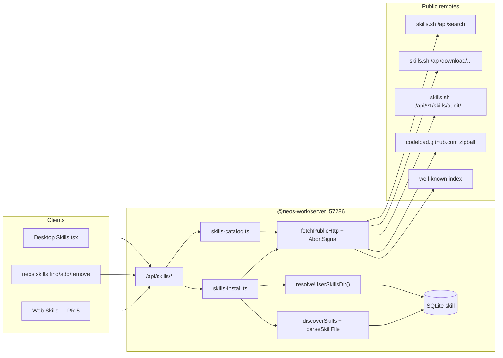
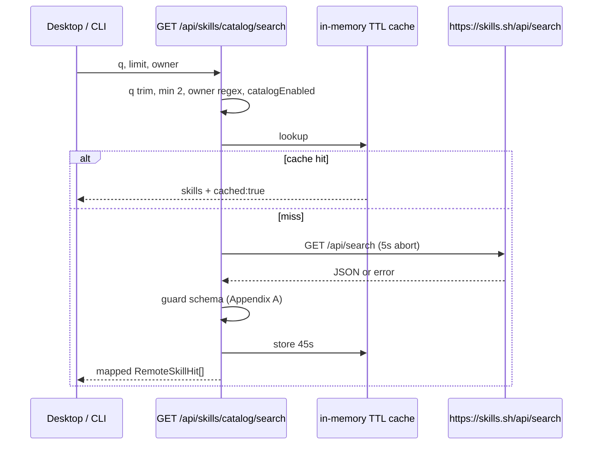
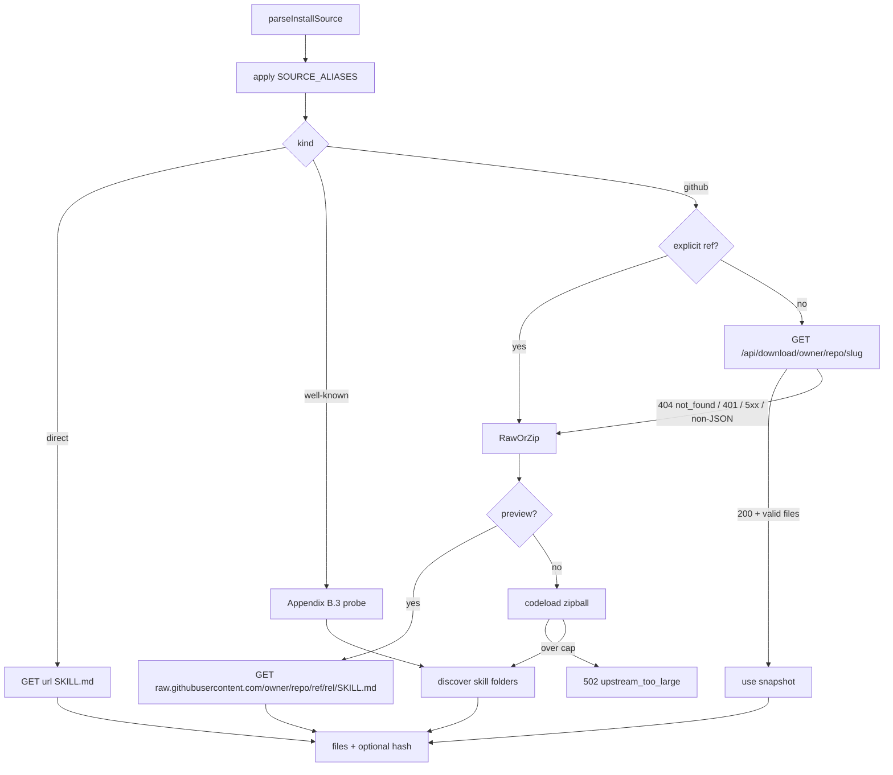
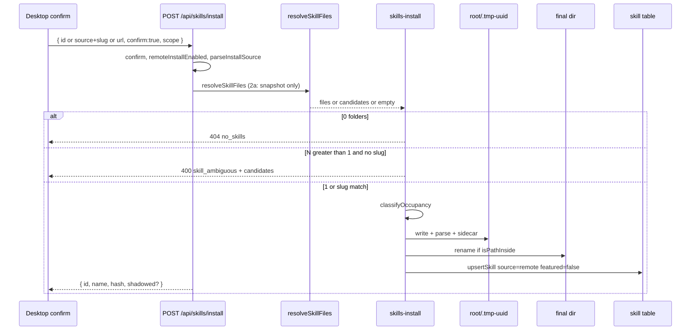

# PLAN: skills.sh / `npx skills` browse–search–install를 NEOS Work로 이식

| 항목 | 값 |
| --- | --- |
| **문서** | `docs/plans/PLAN_SKILLS_SH_MIGRATION.md` |
| **Author** | NEOS Work engineering (draft) |
| **Date** | 2026-09-18 |
| **Revision** | r3 — re-review: snapshot hash 비-하드페일, bak atomic update, isPathInside dual realpath, PR 2a snapshot-only, parseInstallSource |
| **Status** | Draft |
| **구현 범위** | 조사 + 기술 스펙 (이 문서가 구현 계약). 코드 변경은 별도 PR. |
| **선행 조사** | [`_research-skills-sh.md`](./_research-skills-sh.md), [`_research-npx-skills.md`](./_research-npx-skills.md), [`_research-neos-skills-surfaces.md`](./_research-neos-skills-surfaces.md) |

---

## Overview

Vercel의 [skills.sh](https://www.skills.sh/)는 공개 Agent Skills 디렉터리/리더보드이고, `npx skills`(`skills@1.7.0`, MIT, [vercel-labs/skills](https://github.com/vercel-labs/skills))는 그 생태계의 설치기다. NEOS Work는 이미 로컬 `SKILL.md` 패키지 + SQLite `skill` 테이블 + Skills 페이지를 갖고 있지만, **원격 카탈로그를 검색·미리보기·설치하는 경로가 없다.** 기존 `/api/marketplace`는 `neos-marketplace/v1` + `od-plugin/v1` **플러그인** 전용이며, SKILL.md와 타입을 합치면 안 된다.

이 스펙은 npm `skills` 패키지를 라이브러리로 끌어오거나 HTML을 스크래핑하지 않는다. `npx skills find`가 이미 쓰는 공개 검색 API(`GET https://skills.sh/api/search`)로 발견하고, 기존 `parseSkillFile` / `discoverSkills` / `upsertSkill` / `fetchPublicHttp` 패턴으로 **프로세스 내부에서** SKILL.md 패키지를 받아 사용자 글로벌 스킬 루트에 쓴 뒤 `skill` 테이블에 upsert한다. **PR 2a는 preview·install 모두 snapshot-only.** PR 2b부터 K4 폴백(raw preview / zipball / well-known / direct)이 열린다. 스냅샷(`/api/download`)은 일부 레포에만 존재한다. v1 설치 대상은 NEOS만이다. Claude/Cursor/Codex/OpenCode 디렉터리와 에이전트 런타임 프롬프트 주입은 후속 PR이다.

---

## Background & Motivation

### 현재 상태 (검증된 as-is)

| 계층 | 사실 | 근거 |
| --- | --- | --- |
| 발견 | `discoverSkills`는 `{workspace}/.neos-work/skills` → `~/.config/neos-work/skills` → repo `skills/` 만 스캔. `SkillSource`에 `'opencode'`가 있으나 할당하지 않음. | `packages/core/src/skills/discovery.ts` |
| 파서 | `parseSkillFile`은 `key: value` 한 줄 YAML만. nested `metadata:` 미파싱, `triggers`는 콤마 문자열. | `packages/core/src/skills/parser.ts` |
| API | `GET /api/skills`, `POST /api/skills/scan`, `POST /api/skills/:id/toggle`, `DELETE /api/skills/:id`. 본문/설치/파일 삭제 없음. | `apps/server/src/routes/skills.ts` |
| DB | `skill.name` UNIQUE. scan은 `ON CONFLICT(name)`로 description/source/path/version/`manifest_json`만 갱신. body 미저장. `id`/`enabled`/`installed_at` 유지. | `apps/server/src/db/schema.ts` |
| 삭제 | DELETE는 DB row만. Desktop `handleDelete`는 **confirm 없음**. Web은 `Delete this skill?`만. | `deleteSkillById`, `Skills.tsx` |
| Marketplace | 플러그인 JSON만 설치. `SKILL.md` 미작성, `skill` 테이블 미갱신. `dir.startsWith(skillsRoot)`는 sibling-unsafe. | `apps/server/src/lib/marketplace-catalog.ts` |
| 런타임 | `@neos-work/agent-runtime`에 skill 참조 0건. `enabled`는 UI 토글뿐. | 조사 파일 §1 / grep |
| 루트 불일치 | marketplace는 `NEOS_DATA_DIR/skills`, discovery/plugin-store/crystallize는 `~/.config/neos-work/skills`. | 아래 §Data Model |
| CLI | `neos skills list\|scan`만. **`--yes` 헬퍼 없음.** `EXIT.USAGE = 2`. | `apps/cli/src/commands/skills.ts` |
| 테스트 오염 | `plugin-store.test.ts` / `plugins.test.ts` / crystallize가 실제 `~/.config/neos-work/skills`에 씀. 서버 vitest는 `NEOS_DATA_DIR`를 tmp로 두지만 위 코드는 env를 안 봄. | `apps/server/vitest.setup.ts` |

skills.sh 쪽 규모(2026-09-18 조사): sitemap 스킬 URL 20,000(파일 캡), 오너 16,738. 라이브 `/api/v1` `pagination.total`은 OIDC 없이 미취득. 카탈로그 크기를 한 숫자로 단정하지 말 것.

CLI blob 경로(`_research-npx-skills.md` §3.5)는 `vercel`, `vercel-labs`, `heygen-com`, `remotion-dev`, `zapier/connectors`에만 시도된다. `/api/download/...`는 스냅샷이 없으면 `{"error":"not_found"}`. `anthropics/skills/frontend-design`는 그 allowlist 밖이다.

### 고통

1. Skills 페이지는 **이미 설치된** DB row만 검색한다. 공개 SKILL.md 디렉터리를 둘러볼 수 없다.
2. 설치 경로가 crystallize와 수동 파일 복사뿐이다. `npx skills add owner/repo`에 대응하는 NEOS 의미(0/1/N 스킬)가 없다.
3. 원격 설치 후 삭제해도 파일이 남아 scan이 되살린다. 그렇다고 API만 먼저 `rm -rf`하면 기존 Desktop/Web Delete가 침묵 파괴가 된다.
4. 플러그인 마켓과 스킬 카탈로그가 같은 디렉터리 네임스페이스를 쓰게 되면 타입이 섞인다.

---

## Goals & Non-Goals

### Goals (v1)

1. Desktop Skills 페이지에서 skills.sh 카탈로그를 **검색**하고, SKILL.md(또는 summary)를 **미리보기**하고, NEOS 스킬 루트에 **설치 / 업데이트 / 파일+DB 삭제**한다.
2. 엔진 API + `neos skills find|add|remove|update`가 같은 계약을 공유한다. CLI는 데몬 HTTP만 호출하고 `npx skills`를 spawn하지 않는다.
3. 설치는 in-process ingest: SSRF 가드, 크기 캡, symlink 거부, id sanitize, 선택적 sha256, provenance sidecar, **tmp+rename 원자 쓰기**.
4. `resolveUserSkillsDir()`로 discovery / crystallize / plugin-store / marketplace / 신규 install이 **같은 글로벌 루트**를 쓴다 (`NEOS_DATA_DIR` 존중). **상수 스냅샷 없음.**
5. 신규 설치 테스트는 temp dir / `NEOS_DATA_DIR`로 격리한다. PR 1이 홈을 쓰는 기존 테스트를 먼저 고친다.
6. 신규 Skills marketplace chrome은 `packages/ui` ko/en locale 패리티.

### Non-Goals (v1에서 명시적으로 제외)

| 항목 | 이유 |
| --- | --- |
| npm `skills`를 런타임 의존성/라이브러리로 사용 | `package.json`에 `exports`/`main` 없음. `dist/cli.d.mts`는 `export { };`. Node `>=22.20.0` 강제. |
| `npx skills add …` 셸 아웃 (find만 HTTP + add는 npx인 하이브리드 포함) | 설치 루트/락/텔레메트리/멀티에이전트와 충돌. 대안 B. |
| skills.sh HTML / `/search` 스크래핑 | `robots.txt`가 `/api/`, `/search` Disallow. Terms는 공식 API 캐시는 허용, 남용 스크래핑은 금지. |
| Vercel OIDC 필수 | NEOS는 로컬 데몬 + Bearer. 사용자 Vercel 계정 없음. |
| 자체 카탈로그 스냅샷 호스팅 | 재라이선스 + 신선도 + 멀웨어. |
| 플러그인 marketplace 재설계 | 타입/스키마/UI 분리 유지. SSRF 재사용만. `startsWith` 버그는 스킬 경로에서만 고침 (플러그인 PR이 아님). |
| Claude/Cursor/Codex/OpenCode/`.agents/skills` 설치 | v1은 NEOS only. |
| Packs (`https://skills.sh/p/<id>`), Notion, `experimental_sync` | 다른 프로토콜/로그인. |
| 리더보드 all-time/trending/hot 전체 덤프 | 공식 `GET /api/v1/skills?view=`는 OIDC 401. |
| `add-skill.vercel.sh` 텔레메트리 기본 송신 | 기본 off. |
| agent-runtime이 enabled SKILL.md를 프롬프트에 주입 | **오늘 존재하지 않음.** 별도 follow-up PR. |
| `enabled`를 실행 게이트로 승격 | 주입이 생긴 뒤에야 의미 있음. |
| 스킬 스크립트 실행 | 설치는 파일 복사만. |
| `--full-depth` / Claude `marketplace.json` 발견 | v1은 알려진 컨테이너 + 루트 `SKILL.md`만. |
| 사용자 대면 `catalogBaseUrl` | 테스트는 `fetchImpl`. 미러 URL은 allowlist와 모순. |
| 파서를 “ecosystem complete”로 선언 | 골든 픽스처 6개만 계약. 멀티라인 `\|`는 name만 보장. |

---

## Key Decisions

| # | 결정 | 근거 |
| --- | --- | --- |
| K1 | **대안 A**: in-process 재구현. `skills` npm을 import/spawn하지 않음. | 라이브러리 surface 없음. 설치 루트/락/텔레메트리가 NEOS 모델과 충돌. |
| K2 | 발견 백엔드 v1 = **`GET https://skills.sh/api/search`**. OIDC `/api/v1`은 업그레이드 경로. **가드 없이 “잠금”하지 않음** — Appendix A 계약 + 401/403=unavailable. | 라이브 무인증. `robots.txt` Disallow. 언제든 닫힐 수 있음. |
| K3 | v1 browse는 **search-first**. 빈 상태 = 검색창 + curated try-list 3. | 비공식 리더보드 JSON 없음. HTML 스크래핑 금지. |
| K4 | **v1 완성(PR 2b+) 폴백**: snapshot → (GitHub) `raw.githubusercontent.com` SKILL.md 미리보기 / zipball 설치 → well-known → 직접 `SKILL.md`. **PR 2a는 preview·install 모두 snapshot-only.** 스냅샷 존재는 보장되지 않음. `ref`가 있으면 snapshot skip. git clone/SSH 제외. | CLI blob은 소수 owner만. 2a에서 zipball을 열면 계약이 흔들림. |
| K5 | `SkillSource`에 **`'remote'`**. scan은 sidecar를 읽어 `'global'`로 덮어쓰지 않음. 파서 화이트리스트에도 `'remote'`를 넣음(방어). | sidecar 없으면 다음 scan이 `'global'`로 붕괴. |
| K6 | Provenance는 **`neos-skill-source.json`**. `neos-remote.json` 재사용 금지. | 플러그인 인벤토리 오염 방지. |
| K7 | 기본 설치 스코프 = **user global**. 다른 스코프에 같은 `name`이 있으면 workspace 설치 **항상 409**. 같은 `remoteId` 스코프 이동은 **v1 없음** (먼저 기존 쪽 삭제). | `name` UNIQUE. 글로벌+워크스페이스 복제본 불가. |
| K8 | 플래그 분리: `skills.remoteCatalogEnabled`(search/preview/audit)와 `skills.remoteInstallEnabled`(모든 원격 ingest). 둘 다 **행 부재 시 true**. | 카탈로그를 꺼도 GitHub URL 붙여넣기 설치는 가능하게. |
| K9 | 첫 출하 UI = **Desktop Skills**. Web 카탈로그는 PR 5. | dual-surface Q29. |
| K10 | 플러그인 marketplace 코드/라우트/UI **무변경** (루트 resolver 호출부만). | 타입 붕괴 금지. |
| K11 | 텔레메트리 기본 **off**. opt-in 시 fire-and-forget GET, 2s abort, 쿼리 allowlist. 실패는 설치를 막지 않음. | Appendix E. |
| K12 | 파일 삭제 조건: `source === 'remote'` **AND** 유효 sidecar **AND** `isPathInside`. OR sidecar 금지. **PR 3에서 confirm 카피와 같이 출하.** PR 2a/2b DELETE는 오늘과 같이 registry-only. | Desktop은 현재 confirm 없음. 침묵 `rm -rf` 금지. |
| K13 | 파서는 Appendix C 알고리즘 + 골든 픽스처 6. metadata 값은 stringify (`true` → `"true"`). **ecosystem complete가 아님.** | `parseSimpleYaml` 드롭인 불가. |
| K14 | 런타임 주입은 범위 밖 follow-up. | 존재하지 않음. |
| K15 | `owner/repo`에 slug 없음: 발견 0 → **404**; 1 → 그 폴더 설치; N → **400** + `candidates`. 루트 `SKILL.md`는 화이트리스트만 복사. | `npx skills add owner/repo`의 NEOS 의미. |
| K16 | 원격 ingest는 frontmatter `featured`를 **무시하고 `false`**. | Desktop이 featured를 맨 위에 둠. 제3자가 핀할 수 없음. |
| K17 | `isPathInside`: 존재하는 쪽은 **root와 candidate 둘 다** `realpath`. 한쪽만 있으면 lexical `resolve` **그리고** 존재하는 쪽의 realpath vs resolve dual-check (`validateWorkspacePath` / `underHomeDir`과 동일). `startsWith(skillsRoot)` 금지. | macOS `/var` vs `/private/var`. vitest `NEOS_DATA_DIR`는 `os.tmpdir()`. |
| K18 | 원자 쓰기: `tmp`에 기록 → `final`이 있으면 `rename(final → .bak-{uuid})` → `rename(tmp → final)` → upsert → 성공 시 `rm(bak)`, 실패 시 `rm(final)+rename(bak → final)`. POSIX/Windows 동일. 모든 경로 `isPathInside`. | POSIX `rename` onto non-empty dir는 `ENOTEMPTY`. `rm(final)` 후 upsert 실패는 기존 트리를 지움. |
| K19 | `resolveUserSkillsDir()` **함수만** export. `GLOBAL_SKILL_DIR` 상수/모듈로드 스냅샷 없음. | `NEOS_DATA_DIR`를 import 시점에 얼리면 테스트가 홈을 씀. |
| K20 | 사용자 대면 `skills.catalogBaseUrl` **없음**. 테스트는 `fetchImpl`. | allowlist와 모순. |
| K21 | `neos skills update` 인자 없음 → **설치된 remote 전부**. 이름/id가 있으면 그것만. | `npx skills update`와 대응. |
| K22 | fetch timeout: search 5s, snapshot 10s, zipball 20s, well-known 5s, audit 3s, telemetry 2s. 프로세스당 upstream budget (Appendix A). | `fetchPublicHttp`는 기본 timeout 없음. 로컬 데몬 hang 방지. |

---

## Proposed Design

### 1. 아키텍처



Host mode는 기존과 같이 `http://127.0.0.1:57286` + daemon Bearer (`GET /api/auth/local`은 loopback 전용). 신규 라우트도 `isAuthExemptPath`에 넣지 않는다.

### 2. 모듈 배치

| 새 파일 | 역할 |
| --- | --- |
| `packages/core/src/skills/paths.ts` | `resolveUserSkillsDir`, `resolveWorkspaceSkillsDir`, `sanitizeSkillDirName`, `isPathInside` (core 쪽 순수 함수; 서버도 재export) |
| `packages/core/src/skills/provenance.ts` | `neos-skill-source.json` read/write/validate |
| `packages/shared/src/types/skill.ts` | `SkillSource` + 원격 DTO |
| `apps/server/src/lib/skills-catalog.ts` | search/preview/audit + 캐시 + Appendix A 가드 |
| `apps/server/src/lib/skills-install.ts` | ingest, occupancy, atomic write, upsert |
| `apps/server/src/lib/skills-archive.ts` | zip 추출 + snapshot path 규칙 (symlink/`..` 거부) |
| `apps/server/src/lib/skills-source.ts` | `parseInstallSource`, `SOURCE_ALIASES`, 스킬 폴더 발견 (0/1/N) |
| `apps/server/src/routes/skills.ts` | 라우트 추가 |

`packages/core`는 네트워크를 갖지 않는다. HTTP는 서버 라이브러리.

서버 `isPathInside`는 `apps/server/src/lib/path-safety.ts`의 `underHomeDir`과 같은 비교(`abs === root \|\| abs.startsWith(root + sep)`)를 **export**하고, 스킬 루트에도 쓴다. `marketplace-catalog.ts`의 `startsWith`는 이 스펙에서 고치지 않는다(K10). 새 스킬 코드는 그 줄을 복사하지 않는다.

### 3. 스킬 루트 단일화

오늘:

```ts
// discovery.ts — 모듈 로드 상수
const GLOBAL_SKILL_DIR = join(homedir(), '.config', 'neos-work', 'skills');

// marketplace-catalog.ts — NEOS_DATA_DIR 존중
// plugin-store.ts / routines.ts — os.homedir() 하드코딩
```

교체 (상수 export 없음):

```ts
// packages/core/src/skills/paths.ts
export function resolveUserSkillsDir(
  env: NodeJS.ProcessEnv = process.env,
  home: () => string = homedir,
): string {
  const raw = env.NEOS_DATA_DIR;
  if (typeof raw === 'string' && !/[\0\r\n]/.test(raw) && raw.trim()) {
    return join(resolve(raw.trim()), 'skills');
  }
  return join(home(), '.config', 'neos-work', 'skills');
}

export function resolveWorkspaceSkillsDir(workspacePath: string): string {
  return resolve(workspacePath, '.neos-work', 'skills');
}

/** Sibling-safe. Same dual-check idea as validateWorkspacePath / underHomeDir. */
export function isPathInside(root: string, candidate: string): boolean {
  const rootLex = resolve(root);
  const candLex = resolve(candidate);
  let rootReal: string | null = null;
  let candReal: string | null = null;
  try { if (existsSync(rootLex)) rootReal = realpathSync(rootLex); } catch { /* ignore */ }
  try { if (existsSync(candLex)) candReal = realpathSync(candLex); } catch { /* ignore */ }
  const inside = (abs: string, rootAbs: string) => {
    const prefix = rootAbs.endsWith(sep) ? rootAbs : rootAbs + sep;
    return abs === rootAbs || abs.startsWith(prefix);
  };
  // Lexical candidate must sit under lexical root OR realpath(root) (macOS /var)
  if (!inside(candLex, rootLex) && !(rootReal && inside(candLex, rootReal))) return false;
  // If candidate exists, its realpath must stay under realpath(root) (or lexical if root missing)
  if (candReal) {
    const bound = rootReal ?? rootLex;
    if (!inside(candReal, bound)) return false;
  }
  return true;
}
```

조상 `lstat`이 심볼릭이고 realpath가 루트 밖이면 거부. **단위 테스트:** `os.tmpdir()` 아래 디렉터리를 만들고 (`/var/folders` vs `/private/var/folders`) lexical root와 realpath candidate가 달라도 `true`.

호출부 (전부 **함수 호출**, 모듈 상수 없음):

- `discoverSkills` global 루트 — 매 호출마다 `resolveUserSkillsDir()`
- `plugin-store.ts` — `SKILLS_DIR` 상수 삭제, 함수로 대체
- `marketplace-catalog.ts` `userSkillsDir()` → 위임
- `routines.ts` crystallize
- 신규 install / delete / content

`GLOBAL_SKILL_DIR`를 re-export하지 않는다. 기존 import가 있으면 PR 1에서 함수 호출로 바꾼다.

**호환:** `NEOS_DATA_DIR`가 없는 데스크톱 기본값은 오늘과 동일. Docker/vitest/e2e만 합쳐진다.

**테스트 순서:** PR 1은 resolver를 켜기 **전에** `plugin-store.test.ts` / `plugins.test.ts` / `routines.test.ts` crystallize를 `NEOS_DATA_DIR` tmp + `afterEach` 파일·row 정리로 옮긴다. 그렇지 않으면 CI가 `$HOME`을 계속 오염한다.

### 4. 검색 시퀀스



세부 계약은 **Appendix A**. 요약:

- `q` 최소 2자. `limit` 기본 20 최대 50. `owner` = `^[a-z0-9](?:[a-z0-9-]{0,38})$`.
- UA: `neos-work-skills/${NEOS_VERSION}` (`packages/shared`의 `NEOS_VERSION`, 현재 `0.27.0`). marketplace UA `neos-work-marketplace/0.7.1`을 하드코딩하지 않음.
- Origin 고정: `https://skills.sh`. `www`로의 308 1홉은 `fetchPublicHttp`가 따름. **두 번째 홉 또는 allowlist 밖 Location → 실패.**
- Allowlist 호스트: `skills.sh`, `www.skills.sh` (카탈로그). zipball은 `codeload.github.com`, `github.com`. well-known은 사용자가 준 URL의 호스트 (`fetchPublicHttp` + DNS).
- 페이지 로드 시 빈 쿼리 search 금지.

`skills.remoteCatalogEnabled`가 false(명시 문자열 `'false'`)이면 search/preview/audit는 403. **행 부재 = true.**

### 5. Preview / 설치 — 소스 폴백

**스냅샷 존재는 보장되지 않는다.**

**PR 2a 잠금 (이 문장 하나만):** preview와 install은 **둘 다 snapshot-only**. 스냅샷이 없으면 preview는 502 `upstream_unavailable` (`fetchPath` omit). install도 스냅샷이 아니면 422 `install_source_unsupported`. zipball / raw / well-known / direct는 **PR 2b**. `frontend-design` 2a 테스트는 mocked 502 (또는 2b로 이관). 501/503/`snapshot_unavailable` 문구는 쓰지 않음.

**PR 2b+ (K4 완성):**



Preview는 디스크에 쓰지 않는다. 스냅샷 없는 GitHub 단일 스킬 preview는 **레포 zip 전체가 아니라** `raw.githubusercontent.com/{owner}/{repo}/{ref}/{rel}/SKILL.md` (`ref` 기본 `main`, 404면 `master`; `rel`은 slug로 `skills/{slug}` 또는 루트 `SKILL.md` 추정, 둘 다 404면 502). zipball 설치는 전체 아카이브. preview를 위해 25MiB zip을 풀지 않음.

`/api/download` 구분:

| 업스트림 | NEOS |
| --- | --- |
| HTTP 200 + `{ files: [...], hash? }` | 사용 |
| HTTP 200 + `{ error: "not_found" }` 또는 404 | **스냅샷 없음** → 다음 폴백. 이 자체는 사용자 404가 아님 |
| HTTP 401 / 403 | catalog/snapshot unavailable. github면 zipball로 폴백 가능. 폴백도 실패하면 502 `upstream_unavailable` |
| 비JSON / HTML 200 | 스냅샷 무효 → 폴백 |
| timeout / 5xx | 폴백 1회 후 실패 |

Install mermaid (원자 쓰기 포함):



설치 후 전체 scan을 돌리지 않는다. ingest가 해당 패키지만 upsert.

### 6. 패키지 레이아웃 · 디렉터리 이름 · 루트 화이트리스트

```
{userSkillsDir}/
  find-skills/
    SKILL.md
    references/
    assets/
    scripts/               # 복사만. discovery 목록/실행 없음
    examples/
    neos-skill-source.json
  .tmp-<uuid>/             # scan이 '.' 접두어를 건너뜀
```

디렉터리 이름 = `sanitizeSkillDirName(frontmatter.name || slug)`:

- 소문자, 공백/`_` → `-`, `[^a-z0-9-]` 제거, 연속 하이픈 축약, 앞뒤 `-` 제거, 1–64자.
- 비면 거부.
- occupancy가 `occupied_remote`(다른 remoteId)이면 `sanitize(source)--sanitize(slug)`로 한 번 재시도. 그래도 충돌이면 409.

**루트 `SKILL.md` 레포** (폴더 하나에 레포 루트 `SKILL.md`): 아래만 복사.

- `SKILL.md`
- `references/`
- `assets/`
- `scripts/`
- `examples/`

복사하지 않음: `.git`, `node_modules`, `LICENSE*`, `README*`, 기타 루트 파일, 숨김 디렉터리. CLI처럼 레포 전체를 복사하지 않는다.

워크스페이스 스코프: `{workspace}/.neos-work/skills/<dir>/`. workspacePath = `listWorkspaces()[0].path`. NULL이면 400 `no_workspace_path`.

### 7. Desktop UX (Skills 페이지)

홈은 **Plugins가 아니라 Skills**.

1. **Catalog** (원격, `remoteCatalogEnabled`가 false가 아니면 펼침)
   - 검색 250ms debounce, 최소 2자. 선택적 owner.
   - 행: name, source, installs, skills.sh 링크, Install.
   - 빈 상태: 카피 + try-list 3 (딥링크). preview 실패 시 그 행 숨김 + 에러.
   - Preview drawer: SKILL.md ≤32KiB, `license` 또는 i18n `skills.licenseUnknown`, hash, audits, repo 링크, `skills.thirdPartyDisclaimer`.
   - Install → **항상** `window.confirm` (`skills.installConfirm`).
   - 400 `skill_ambiguous` → `candidates` 목록을 보여 주고 사용자가 고른 `slug`로 `POST /install` 재호출 (`skills.skillAmbiguous`). 피커 없이 에러만 내지 않음.
2. **Installed**
   - `remote` badge. Update. provenance.
   - remote 삭제: **`window.confirm`** (`skills.deleteRemoteFilesConfirm` — 파일이 지워짐을 명시). PR 3에서 파일 삭제와 같이 출하.
   - bundled/local/crystallize 삭제: 기존처럼 registry-only. Desktop은 지금 confirm이 없지만, remote가 아닌 삭제도 PR 3에서 confirm을 넣는다 (`skills.deleteRegistryConfirm`). 침묵 삭제를 남기지 않음.
   - `shadowed === 'bundled'` 설치 결과 → 토스트 `skills.shadowedBundled`.

Curated try-list:

| id | snapshot? | 출하 |
| --- | --- | --- |
| `vercel-labs/skills/find-skills` | 있음 (조사 라이브) | PR 2a 픽스처 + PR 3 try-list |
| `vercel-labs/agent-skills/vercel-react-best-practices` | 있음 | PR 2a 픽스처 + PR 3 try-list |
| `anthropics/skills/frontend-design` | **없음** | **2a try-list/픽스처에서 제외.** 2b preview는 raw.githubusercontent.com. 설치는 zipball, 캡 초과 시 502 `upstream_too_large` |

i18n: `packages/ui/src/i18n/locales/{en,ko}/skills.json`을 페이지가 **실제로** 읽는다. OpenPackage 키 폐기. en/ko 키 락스텝 (locale parity 테스트).

필수 새 키 (en 초안):

| key | en |
| --- | --- |
| `licenseUnknown` | License not specified by the author |
| `thirdPartyDisclaimer` | Third-party skill. Review SKILL.md and the source repo before install. skills.sh does not relicense this content. Agent prompt injection is not enabled yet. |
| `installConfirm` | Install this third-party skill into your NEOS library? |
| `deleteRemoteFilesConfirm` | Delete this remote skill and its files from disk? This cannot be undone. |
| `deleteRegistryConfirm` | Remove this skill from the library list? Files on disk will remain. |
| `shadowedBundled` | Installed over the bundled skill of the same name. Removing the remote copy will restore the bundled entry. |
| `catalogDisabled` | Remote catalog is turned off in Settings. |
| `skillAmbiguous` | This repo contains multiple skills. Choose one. |

### 8. 설정

`setting` 테이블. **행이 없으면 기본값.** 민감 정보 아님.

| key | 행 부재 시 | 의미 |
| --- | --- | --- |
| `skills.remoteCatalogEnabled` | `true` | false면 search/preview/audit 403. GitHub/well-known **install은 막지 않음** |
| `skills.remoteInstallEnabled` | `true` | false면 모든 원격 ingest 403 (붙여넣기 URL 포함) |
| `skills.telemetryOptIn` | `false` | true여야만 Appendix E GET |
| `skills.defaultInstallScope` | `global` | `global` \| `workspace` |

`skills.catalogBaseUrl` **없음** (K20).

토글 위치: Desktop Settings는 오늘 플러그인 catalog URL이 Plugins 페이지에 있다. 스킬 플래그는 **PR 3에서 Desktop Settings에 새 섹션**으로 추가 (한 줄 hook이 아님). Web은 PR 5에서 같은 두 토글(catalog/install)을 Settings에 둔다. 텔레메트리는 desktop-only footnote + web Settings에도 같은 키를 쓸 수 있음 (값만).

### 9. 캐시 / 부하 / 지연

| 데이터 | TTL | 상한 |
| --- | --- | --- |
| search `(q,limit,owner)` | 45s | 64 |
| preview files | 5min | 16, 엔트리당 2MiB |
| audit | 5min | 32 |
| stale search fallback | 10min | search와 동일 키 |

동시 search 인플라이트 1 (coalesce). UI debounce 250ms.

목표: cache hit < 20ms; search p95 < 1.0s; snapshot install p95 < 5s; zipball install p95 < 20s.

Upstream budget · timeout은 Appendix A/E.

### 10. 파서

Appendix C. `scripts/`는 쓰되 `scanSkillRoot` 목록에 넣지 않음.

원격 ingest 후 `manifest.featured = false` (K16). 디스크 SKILL.md 원문은 수정하지 않고, upsert `manifest_json`과 파서 결과만 강제.

### 11. Discovery가 `'remote'`를 유지

```ts
const skill = parseSkillFile(content, skillMd, sourceFromRoot); // global/local/bundled
const prov = await readSkillProvenance(packageDir);
if (prov) skill.source = 'remote';
```

파서 화이트리스트에 `'remote'`를 넣는다. 알고리즘상 scan은 `'global'`을 넘긴 뒤 sidecar로 덮지만, install/테스트가 `'remote'`를 직접 넘길 수 있다. 없으면 `'local'`로 붕괴.

scan prune:

- `source === 'remote'` **AND** 유효 sidecar **AND** `path` 파일이 없음 → row 삭제. 그 이름이 bundled/local 디스크에 있으면 즉시 그 소스로 re-upsert.
- `NEOS_DATA_DIR`가 바뀌어 stale `path`가 루트 밖이 되면 prune하지 않고 `path`를 무시 + 다음 전체 scan에서 sidecar로 재발견. **잘못된 path만으로 remote row를 drop하지 않음** (데이터 디렉터리 이동 보호). prune은 `isPathInside(현재 루트, path)` 이고 파일이 없을 때만.
- bundled/local/crystallize는 기존처럼 prune 안 함.

### 12. 삭제 / 업데이트

**파일 삭제 출하 전 (PR 2a/2b):** `DELETE /api/skills/:id`는 오늘과 동일 — DB row만. `filesRemoved: false`를 응답에 넣어도 된다 (하위 호환: 필드 없으면 클라이언트는 false로 간주).

**파일 삭제 출하 (PR 3, desktop+web+CLI 카피와 동일 PR):**

조건 전부 참일 때만 `rm(packageDir, { recursive: true })`:

1. DB `source === 'remote'`
2. `packageDir`에 **유효한** `neos-skill-source.json`
3. `isPathInside(resolveUserSkillsDir() 또는 workspace skills dir, packageDir)`
4. 조상 symlink escape 아님

하나라도 거짓 → registry-only. 심어 넣은 sidecar만으로 crystallize/plugin을 지우지 않음.

파일 삭제 후:

- 같은 `name`의 bundled(또는 다음 우선순위 local) 패키지가 디스크에 있으면 **row를 삭제하지 않고** 그 소스로 re-upsert (`shadowed` 복구).
- 없으면 row DELETE.

응답: `{ ok: true, data: { filesRemoved: boolean, restored?: 'bundled' | 'local' } }`.

Desktop: `filesRemoved`가 될 remote는 `deleteRemoteFilesConfirm`. Web: 같은 카피 (카탈로그 UI 전에도 PR 3에서 Delete 문구를 바꿈). CLI: `--yes` 필수, 문구에 files.

**POST `/api/skills/:id/update`:** sidecar의 id/url/ref로 ingest 재실행. hash 같으면 `{ unchanged: true }`. 다르면 atomic overwrite. `enabled`/`installed_at` 유지. sidecar 없으면 400 `not_remote`.

### 13. CLI

`apps/cli`에 **`--yes`는 신규**다. 기존 패턴이 아니다.

```
neos skills list|ls
neos skills scan
neos skills find <query> [--owner <owner>]
neos skills add <owner/repo|url> [--skill <slug>] [--scope global|workspace] [--yes]
neos skills update [name-or-id] [--yes]
neos skills remove|rm <name-or-id> [--yes]
```

- 데몬 API만. `npx` spawn 금지.
- add/remove/update: `--yes`가 없으면 **TTY 여부와 관계없이** exit 2 + `pass --yes to confirm` (v1에 인터랙티브 프롬프트 없음).
- `--json` = 기존 `ctx.json`.
- `update` 인자 없음 = 설치된 remote 전부 (K21). remote가 0이면 0 updates, exit 0.
- add 파서: `parseInstallSource` (Appendix B). Pack/Notion/SSH/로컬 path → usage + out of scope.
- N 스킬 (`skill_ambiguous`) → **exit 14** (`EXIT.VALIDATION`). candidate 목록 + `--skill` 안내. usage(2)가 아님.

### 14. 테스트 격리

- 모든 신규 테스트: `NEOS_DATA_DIR` tmp (서버 vitest.setup이 이미 설정 — **코드가 읽어야** 함).
- `fetchImpl` 목킹. 실네트워크 CI 테스트 없음.
- 픽스처: find-skills snapshot + 골든 hash hex; 2a frontend-design은 **mocked 502** (zipball 없음); 2b에 raw preview + zip/too-large; 다중 SKILL.md zip; 루트 SKILL.md zip; symlink zip; `../` snapshot path; plugin-only dir occupancy; orphan dir; bak rollback; `os.tmpdir()` isPathInside; 골든 파서 6.
- **수동 live probe 체크리스트** (CI 아님) — PR Plan.

---

## API / Interface Changes

인증: daemon Bearer. envelope `{ ok, data?, error? }`. 정적 경로를 `/:id`보다 먼저.

`safeRouteId` (max 100)는 **UUID skill id 라우트 전용**. 카탈로그 `id`에는 `safeCatalogId`만.

```ts
/** Printable ASCII, 1–200, no '..'. */
function safeCatalogId(raw: unknown): string {
  if (typeof raw !== 'string' || /[\0\r\n]/.test(raw)) return '';
  const id = raw.trim();
  if (!id || id.length > 200) return '';
  if (id.includes('..')) return '';
  if (!/^[a-zA-Z0-9._/-]+$/.test(id)) return '';
  return id;
}
```

### 에러 코드 테이블 (install / preview / search)

| HTTP | `error` code | 언제 |
| --- | --- | --- |
| 400 | `query_too_short` | q < 2 |
| 400 | `invalid_id` | safeCatalogId 실패 |
| 400 | `confirm_required` | `confirm !== true` |
| 400 | `skill_ambiguous` | N>1, slug 없음. `candidates` 동봉 |
| 400 | `not_remote` | update on non-remote |
| 400 | `no_workspace_path` | scope=workspace, path NULL |
| 400 | `invalid_source` | parseInstallSource 실패 |
| 422 | `install_source_unsupported` | PR 2a: snapshot이 아닌 소스. 2b에서 제거 |
| 403 | `catalog_disabled` | search/preview/audit + catalog flag false |
| 403 | `install_disabled` | 원격 ingest + install flag false |
| 404 | `not_found` | DB id 없음 |
| 404 | `no_skills` | 레포/인덱스에서 SKILL.md 0개 |
| 404 | `skill_not_in_source` | slug가 candidates에 없음 |
| 409 | `occupied_remote` / `occupied_skill` / `occupied_plugin` / `occupied_crystallize` / `occupied_unknown` | occupancy |
| 409 | `name_conflict` | 다른 스코프/다른 remoteId가 같은 name |
| 502 | `upstream_unavailable` | 401/403/5xx/timeout 후 폴백 실패 |
| 502 | `hash_mismatch` | well-known v0.2.0 **다운로드 바이트** digest 불일치 (요청한 slug). 스냅샷 `hash` mismatch는 v1에서 이 코드가 **아님** (Appendix A.2) |
| 502 | `upstream_too_large` | zipball HTTP 또는 해제 합이 캡 초과 |
| 502 | `ssrf_blocked` | `SsrfError` |
| 502 | `invalid_upstream` | 비JSON, 스키마 가드 실패 |
| 429/502 | `rate_limited` | 업스트림 429 또는 로컬 budget. `retryAfterSec` |

### `GET /api/skills/catalog/search`

Query: `q`, `limit?`, `owner?`.

200:

```ts
{
  ok: true,
  data: {
    query: string;
    searchType: 'fuzzy' | 'semantic' | string;
    count: number;
    cached?: boolean;
    stale?: boolean;
    skills: RemoteSkillHit[];
  }
}

interface RemoteSkillHit {
  id: string;
  slug: string;            // skillId 또는 id 마지막 세그먼트
  name: string;
  source: string;
  installs: number;        // 비가수면 0
  sourceType: 'github' | 'well-known' | 'unknown';
  installUrl: string | null;
  url: string;
  installed: boolean;      // 아래 규칙
}

// installed === true iff
//   row.manifest_json.provenance.id === hit.id
//   OR (provenance 없음 && row.name === hit.slug, 대소문자 무시)
// shadowed bundled 행(같은 name, source가 remote로 갱신됨)도 installed.
```

`sourceType`은 **`source` 필드로** 분류한다. `id`의 `/` 개수로 분류하지 않는다 (`open.feishu.cn/lark-doc`의 source는 `open.feishu.cn` → well-known). 규칙: Appendix A.

### `GET /api/skills/catalog/preview`

Query: `id` (`safeCatalogId`) 또는 `url` (직접/well-known).

PR 2a: snapshot-only. 스냅샷 없으면 502 `upstream_unavailable`, `fetchPath` 필드 생략.  
PR 2b+: §5 폴백. `fetchPath` 포함. 디스크 없음.

```ts
{
  ok: true,
  data: {
    id: string;
    slug: string;
    name: string;
    description: string;
    license?: string;          // 없으면 필드 omit — UI는 licenseUnknown
    hash: string | null;
    fileCount: number;
    files: Array<{ path: string; bytes: number }>;
    skillMd: string;           // ≤ 32_000
    truncated: boolean;
    trust: 'unverified';       // v1 유일한 값. official 키를 보내지 않음
    audits?: RemoteSkillAudit[];
    sourceUrl: string | null;
    skillsShUrl: string;
    fetchPath: 'snapshot' | 'zipball' | 'well-known' | 'direct';
  }
}

interface RemoteSkillAudit {
  provider: string;
  slug: string;
  status: 'pass' | 'warn' | 'fail';
  summary?: string;
  riskLevel?: string;        // NONE | LOW | MEDIUM | HIGH | CRITICAL | SAFE | …
  auditedAt?: string;
}
```

### `GET /api/skills/catalog/audit`

Query: `id` (`safeCatalogId`).

업스트림: `GET {origin}/api/v1/skills/audit/{id}` 에서 `id`는 **`site/` 접두어 없는** `{source}/{slug}` (`open.feishu.cn/lark-doc`, `vercel-labs/skills/find-skills`). 3s abort. 실패 → 200 `{ audits: [], unavailable: true }`. 설치/preview를 막지 않음.

### `POST /api/skills/install`

```ts
{
  id?: string;
  source?: string;
  slug?: string;
  url?: string;
  ref?: string;                 // 있으면 snapshot skip
  scope?: 'global' | 'workspace';
  confirm: true;
  includeInternal?: boolean;
}
```

200:

```ts
{
  ok: true,
  data: {
    id: string;                 // DB UUID
    name: string;
    source: 'remote';
    version: string | null;
    hash: string | null;
    scope: 'global' | 'workspace';
    path: string;               // publicPathTail
    fetchPath: 'snapshot' | 'zipball' | 'well-known' | 'direct';
    shadowed?: 'bundled';
  }
}
```

`force` 없음. orphan은 occupancy가 reusable.

### `POST /api/skills/:id/update`

`:id` = `safeRouteId` (UUID). 

### `GET /api/skills/:id/content`

`:id` = `safeRouteId` (UUID, max 100). DB `path`를 읽기 전에 `isPathInside` + 조상 symlink 검사. 실패 시 404 (경로 누설 없음). body ≤32KiB. **런타임 주입 아님.**

### `DELETE /api/skills/:id`

PR 2: `{ filesRemoved: false }` (registry only).  
PR 3+: 위 §12.

### `GET /api/skills`

추가 필드 (없으면 omit). **`trust`는 v1에서 보내지 않음** (official 배지 누수 방지).

```ts
{
  remoteId?: string;
  remoteSource?: string;
  remoteHash?: string;
  skillsShUrl?: string;
  license?: string;
}
```

### 라우트 등록

```ts
skills.get('/catalog/search', ...);
skills.get('/catalog/preview', ...);
skills.get('/catalog/audit', ...);
skills.post('/install', ...);
skills.post('/scan', ...);
skills.get('/', ...);
skills.get('/:id/content', ...);
skills.post('/:id/update', ...);
skills.post('/:id/toggle', ...);
skills.delete('/:id', ...);
```

### 클라이언트 (출하 PR)

| 클라이언트 | 메서드 | 출하 |
| --- | --- | --- |
| `EngineMediaClient` | `searchSkillCatalog`, `previewRemoteSkill`, `installRemoteSkill`, `updateSkill`, `getSkillContent` | PR 3 |
| `NeosApiClient` | `findSkills`, `addSkill`, `removeSkill`, `updateSkill` | PR 4 |
| `WebApiClient` | 동일 카탈로그 메서드 | **PR 5만** (엔진과 같이 넣지 않음) |

### Shared types

```ts
export type SkillSource = 'local' | 'global' | 'bundled' | 'opencode' | 'remote';

export interface SkillProvenance {
  schemaVersion: 'neos-skill-source/v1';
  origin: 'skills.sh' | 'github' | 'well-known';
  id: string;
  source: string;
  slug: string;
  installUrl?: string;
  ref?: string;
  hash?: string;
  trust: 'unverified';     // v1 리터럴. official/community 유니온을 sidecar에 두지 않음
  installedAt: string;
  updatedAt?: string;
}
```

`SkillTrust`에 `official | community`를 **지금 넣지 않는다.** OIDC curated PR에서 확장.

---

## Data Model Changes

**SQLite 마이그레이션 없음.** `source` TEXT에 `'remote'`. provenance는 sidecar + `manifest_json`.

`manifest_json.featured`는 원격에서 항상 `false`. `provenance.trust`는 `'unverified'`.

### name UNIQUE + 섀도잉

| 상황 | 동작 |
| --- | --- |
| 이름 없음 | insert |
| 같은 `remoteId` | upsert + 파일 atomic overwrite |
| bundled 같은 name | **허용.** 같은 UUID row를 `remote`로 갱신. 응답 `shadowed: 'bundled'`. DELETE remote 후 bundled 파일이 있으면 re-upsert |
| 다른 remoteId 같은 name | 409 `name_conflict` |
| crystallize / local / 다른 스코프 같은 name | 409 `name_conflict` |
| workspace 설치, 글로벌에 같은 name (다른 remoteId) | 409 |
| workspace 설치, 같은 remoteId 글로벌 | 409 `name_conflict`. **명시 move v1 없음** — 먼저 글로벌 삭제 |
| plugin-only / crystallize **디렉터리** | 409 occupancy (아래) |

한 테이블이므로 글로벌+워크스페이스 동시 복제본은 불가.

### Occupancy (쓰기 전 대상 dir)

`classifyOccupancy(dir)`:

| 상태 | 판정 | 같은 remoteId install | 다른 신규 |
| --- | --- | --- | --- |
| 없음 / 빈 디렉터리 | `empty` | write | write |
| SKILL.md 없음 + sidecar 없음 (부분 쓰기 orphan) | `orphan` | 재사용 | 재사용 |
| skill + sidecar 같은 remoteId | `same_remote` | update | — |
| skill + sidecar 다른 remoteId | `occupied_remote` | 409 | 409 |
| skill, sidecar 없음 (손수 global) | `occupied_skill` | 409 | 409 |
| `open-design.json` 있고 SKILL.md 없음 | `occupied_plugin` | 409 | 409 |
| crystallize (DB source 또는 frontmatter `source: crystallize`) | `occupied_crystallize` | 409 | 409 |
| 그 외 파일 | `occupied_unknown` | 409 | 409 |

원격 설치는 `open-design.json`을 만들거나 지우지 않는다. `upgradeSkillToPlugin`은 PR 1에서 같은 resolver를 쓰고, 테스트: remote 설치가 기존 `open-design.json`을 덮지 않음 (occupancy가 plugin이면 409라 도달하지 않음; 스킬+플러그인 공존은 upgrade 후에만 — 그때는 이미 SKILL.md가 있으므로 `same_remote`/`occupied_skill`).

upgrade 후 같은 폴더에 `open-design.json` + `SKILL.md` + sidecar: 이후 update는 스킬 파일만 덮고 `open-design.json`을 유지.

`upgradeSkillToPlugin` sanitizer(`[^a-zA-Z0-9_-]` → `_`)와 스킬 kebab은 다를 수 있다. occupancy는 **실제 디렉터리 경로**로 판정하므로, 다른 sanitize 결과가 같은 폴더로 떨어지면 409로 막힌다.

---

## Mapping table

| skills.sh / `npx skills` | NEOS API | UI | CLI | v1 |
| --- | --- | --- | --- | --- |
| 리더보드 `/`, `/trending`, `/hot` | — | 없음 | — | out of scope |
| `/official`, curated | — | try-list 3 | — | 부분 |
| `/search` UI | `GET /api/skills/catalog/search` | Catalog 검색 | `neos skills find` | yes |
| `npx skills find` | 동일 | 동일 | `find` | yes |
| 스킬 상세 | `GET .../preview` (2a snapshot-only; 2b+ raw/zip/WK) | Preview drawer | URL | yes |
| 보안 감사 | `GET .../audit` | advisory | — | best-effort |
| `add owner/repo --skill s` | `POST /install` | Install | `add --skill` | yes |
| `add owner/repo` (N 스킬) | 400 `skill_ambiguous` | candidate 선택 후 재호출 | 목록 + `--skill` | yes |
| `add owner/repo` (1 스킬) | 그 폴더 설치 | Install | add | yes |
| blob `/api/download` | ingest/preview 1순위 | — | — | yes, 없으면 폴백 |
| git clone fallback | — | — | — | out of scope |
| `add -g` / project | `scope` | 토글 | `--scope` | NEOS 루트 의미 |
| `--copy` / multi-agent / `-a` | — | — | — | out of scope |
| `--full-depth` / marketplace.json | — | — | — | out of scope |
| pack URL / Notion / SSH | — | — | — | out of scope |
| well-known URL | install `url` | 붙여넣기 | `add <url>` | yes |
| `npx skills list` | `GET /api/skills` | Installed | `list` | NEOS DB |
| `npx skills update` | `POST /:id/update` | Update | `update` [all remotes] | yes |
| `npx skills remove` | `DELETE /:id` | Delete + confirm | `remove --yes` | PR 3부터 파일 삭제 |
| `npx skills use` / `init` | — | 로컬 Try prompt만 | — | 원격 use 없음 |
| lockfiles | sidecar만 | provenance | — | 포맷 다름 |
| 텔레메트리 | opt-in GET | Settings | 설정만 | default off |
| Badge / `skills.sh.json` | — | — | — | out of scope |
| 플러그인 marketplace | `/api/marketplace/*` | Plugins | — | **무변경** |

---

## Compatibility

| 항목 | Spec / CLI | NEOS today | v1 |
| --- | --- | --- | --- |
| frontmatter | 필수 | 없으면 `null` | 설치 abort |
| `name` | 1–64 kebab | 최대 200 | 파서 관대. dir는 sanitize |
| `description` | 1–1024 | 최대 4000, 없어도 '' | 수용. 빈 값 → UI 경고 |
| `license` | optional | scalar | 표시. 없으면 `licenseUnknown` |
| `metadata` | string map | 미설정 | Appendix C. stringify |
| `metadata.internal` | CLI 숨김 | 없음 | stringify 후 `=== 'true'` 면 거부 unless `includeInternal` |
| YAML bool `true` | — | — | `"true"`로 저장. `yaml` 패키지 전환 시에도 게이트는 문자열 |
| `triggers` | OD 확장 | 콤마 | 콤마 유지 + YAML list |
| `featured` | NEOS | `=== 'true'` | **원격 ingest는 false 강제** |
| 멀티라인 `\|` | 흔함 | 한 줄만 | name만 보장. description `''` 가능. 설치 비차단 |
| `scripts/` | 권장 | 미스캔 | 복사, 목록/실행 없음 |
| 루트 SKILL.md | 레포 전체 복사 | package dir | **화이트리스트만** |
| symlink | dereference | lstat 거부 | 거부 (스냅샷 path 포함) |
| `---js` | CLI 미사용 | JS engine 없음 | 유지 |

파일 캡: snapshot HTTP 5MiB; zipball 10MiB; 해제 합 25MiB; 파일 1000; 텍스트 1MiB; assets 2MiB; 파서 body 500_000; preview 32_000.

경로 거부 (아카이브 **와** `files[].path`): `..`, 절대경로, `^[A-Za-z]:`, NUL, 컨트롤, symlink 타입. `__MACOSX/`, `.git/`, `node_modules/` 스킵. 단일 최상위 폴더 unwrap.

`SOURCE_ALIASES` (parseInstallSource, HTTP 전):

```
coinbase/agentWallet      → coinbase/agentic-wallet-skills
vercel-labs/vercel-skills → vercel-labs/agent-skills
```

---

## Alternatives Considered

### A) In-process 재구현 (채택)

장점: 루트/provenance/SSRF/테스트 소유. Node 22 강제 없음. 텔레메트리 기본 off.

단점: clone/Notion/에이전트 매트릭스는 안 만듦 — v1이 범위를 좁힘.

### B) `npx skills add -y --json --copy` 후 `.agents/skills` import

기각. programmatic API 없음, `.agents` 충돌, Node 22, 텔레메트리 기본 on, well-known `--json` 미지원. **find만 HTTP + add만 npx** 하이브리드도 같은 이유로 기각 (설치 경로가 다시 NEOS 밖으로 나감).

### C) Vercel OIDC + `/api/v1`만

기각 (v1). 로컬 데몬에 Vercel 프로젝트가 없음. 어댑터 `SkillCatalogBackend`는 미리 나눔. `VERCEL_OIDC_TOKEN`이 있으면 이후 PR에서 search/leaderboard 전환.

### D) 자체 카탈로그 스냅샷 호스팅

기각. 재라이선스 + 신선도. 허용 캐시는 메타데이터 TTL 메모리뿐.

---

## Security & Privacy Considerations

| 위협 | 심각도 | 완화 |
| --- | --- | --- |
| SSRF | High | `fetchPublicHttp` + `checkDns` + 1 redirect + allowlist + timeout |
| Zip slip / snapshot path slip | High | 동일 path 규칙. `isPathInside`. 조상 symlink |
| `startsWith` sibling escape | High | `isPathInside` only |
| 침묵 `rm -rf` | High | AND 조건 + PR 3 confirm. PR 2는 registry-only |
| 스크립트 실행 | High | 실행 경로 없음 |
| name squat / featured pin | High | owner/repo 표시. `featured: false`. 409 |
| 부분 쓰기 409 데드락 | Med | tmp+rename, orphan 재사용 |
| 플러그인 dir 오염 | Med | occupancy matrix |
| 텔레메트리 유출 | Med | 기본 off. allowlist 쿼리. 2s. 실패 무시 |
| hung socket DoS | Med | K22 timeouts + budget |
| 대량 미러 | Med | on-demand, 캐시 상한 |
| `---js` RCE | Low | JS engine 없음 |
| Official 배지 위조 | Low | trust 필드 v1 omit / `unverified`만 |

Desktop 설치 confirm 항상. Web PR 5도 confirm — Plugins 웹이 unverified를 안 묻는 실수를 복사하지 않음 (테스트 요구사항).

라이선스: 표시 전용. 본문은 사용자 디스크 + 짧은 preview. 재배포 없음.

---

## Observability

절대 홈 경로 / 검색 쿼리 원문을 로그하지 않음 (`q_len`만).

- `skills-catalog search q_len=… count=… ms=… cached=… fetchPath=…`
- `skills-install id=… origin=… fetchPath=… files=… ms=… shadowed=…`
- `skills-install-denied reason=ssrf|hash|symlink|parse|collision|occupancy`
- `skills-catalog upstream status=429 retryAfter=…`

알림: 페이지 배너. 연속 업스트림 실패 → catalog unavailable.

---

## Rollout Plan

1. **PR 1** — 네트워크 없이 루트/파서/테스트 격리. 플래그 없음.
2. **PR 2a** — search/preview(폴백 포함) + **snapshot-only** install. DELETE 불변.
3. **PR 2b** — zipball/well-known/direct + multi-skill + occupancy + atomic write. DELETE 여전히 registry-only.
4. **PR 3** — Desktop UX + **파일 삭제 + desktop/web/CLI confirm 카피** + Settings 토글. `remoteCatalogEnabled` 기본 true (행 부재).
5. **PR 4** — CLI (`--yes` 신규).
6. **PR 5** — Web thin catalog + Settings 토글 + `dual-surface.md` Skills 행.
7. Rollback: 두 플래그 false. 이미 설치한 파일은 사용자 자산. list/scan/toggle는 기존 핸들러.

---

## Risks

| 리스크 | 심각도 | 완화 |
| --- | --- | --- |
| `/api/search`·`/api/download` 폐쇄/OIDC화 | High | Appendix A 가드. zipball 폴백. unavailable UI. 수동 live probe. |
| 파서가 유효 SKILL.md drop | Med | 골든 6 + find-skills / metadata 픽스처. complete 주장 안 함. |
| scan이 remote를 덮어씀 | High | sidecar → `'remote'`. 회귀 테스트. |
| 인기 slug 충돌 | Med | 409 + `source--slug` 1회. |
| GitHub zipball 60/hr | Med | snapshot 우선. budget. |
| 사용자가 런타임 주입을 오해 | Med | `thirdPartyDisclaimer`. |
| PR 2만 머지된 채 Desktop 구 Delete | High (완화됨) | 파일 삭제를 PR 3으로 옮김. |

---

## Open Questions

제품 기본값은 잠금. 차단 이슈는 해소.

| # | 질문 | 권장 기본 | 잠금? |
| --- | --- | --- | --- |
| Q1 | 원격 카탈로그 기본 ON? | ON. 설치는 confirm. | yes |
| Q2 | 기본 설치 위치? | global | yes |
| Q3 | 웹 UI 첫 슬라이스? | 아니오 (PR 5) | yes |
| Q4 | 리더보드 v1? | 아니오 | yes |
| Q5 | 텔레메트리? | off | yes |
| Q6 | 비공식 `/api/search`·`/api/download`? | 가드와 함께 사용. 보장 없음. 401/403=unavailable | yes (가드 전제) |
| Q7 | `yaml` 패키지? | v1 아니오. 픽스처 실패가 설치를 막으면 재검토 | default no |
| Q8 | official trust? | v1 no | yes |

**PR 1은 즉시 착수 가능. PR 2a는 snapshot-only + Appendix A(해시 비-하드페일)·C. PR 2b는 Appendix B·D.**

---

## References

- 조사: [`docs/plans/_research-skills-sh.md`](./_research-skills-sh.md), [`_research-npx-skills.md`](./_research-npx-skills.md), [`_research-neos-skills-surfaces.md`](./_research-neos-skills-surfaces.md)
- 사이트: https://www.skills.sh/ docs, terms, privacy
- CLI: https://github.com/vercel-labs/skills (v1.7.0 / `7407f38`)
- 포맷: https://agentskills.io/specification
- Well-known: https://github.com/vercel-labs/skills-handler
- NEOS: `packages/core/src/skills/{parser,discovery}.ts`, `packages/shared/src/types/skill.ts`, `packages/shared/src/version.ts` (`NEOS_VERSION`), `apps/server/src/routes/skills.ts`, `apps/server/src/lib/{marketplace-catalog,plugin-store,ssrf,project-archive,path-safety}.ts`, `apps/desktop/src/pages/Skills.tsx`, `apps/web/src/pages/Skills.tsx`, `apps/cli/src/commands/skills.ts`, `docs/reference/dual-surface.md`

---

## Appendix A — Legacy catalog contract

비공식, `robots.txt` Disallow. 스키마는 2026-09-18 라이브 + CLI `find.ts`/`blob.ts` 기준. 언제든 변경·차단될 수 있다.

### A.1 Search

```
GET https://skills.sh/api/search?q={q}&limit={limit}[&owner={owner}]
```

- Auth: 없음. 쿠키/헤더 없음. `Authorization`을 보내지 않음.
- 401 또는 403 또는 body `{ error: "authentication_required" }` → **catalog unavailable** (OIDC를 요구하지 않음. 재시도로 고치지 않음).
- Timeout: **5s** `AbortSignal`.
- Redirect: 1홉. Location 호스트가 `skills.sh`/`www.skills.sh`가 아니면 실패.

요청 가드: `q` trim, 길이 2–200, 컨트롤 거부. `limit` 1–50. `owner` 정규식.

업스트림 200 JSON (라이브):

```ts
{
  query: string;
  searchType: string;          // "fuzzy" | "semantic"
  searchVersion?: string;      // "legacy"
  skills: Array<{
    id: string;
    skillId?: string;
    name: string;
    installs?: number;
    source: string;
  }>;
  count: number;
  duration_ms?: number;
}
```

가드: object, `skills`가 배열. 각 항목에 `id`와 `source` 문자열 필수. 없으면 그 행 drop. `skills` 누락/비아레이/HTML → `invalid_upstream`. `installs` 비가수 → 0. 추가 필드는 무시.

`sourceType` (`source`만 사용):

```
if (/^[a-z0-9](?:[a-z0-9-]{0,38})\/[A-Za-z0-9._-]+$/.test(source)) github
else if (/^[a-z0-9.-]+\.[a-z]{2,}$/i.test(source)) well-known
else unknown
```

`installUrl`: github → `https://github.com/${source}`. well-known → null (페이지 `url`만).  
`url`: github → `https://skills.sh/${id}`. well-known → `https://skills.sh/site/${source}/${slug}`.  
`slug`: `skillId` 또는 `id`의 마지막 `/` 세그먼트.

에러 맵: 400 query → 400 `query_too_short`. 401/403 → 502 `upstream_unavailable`. **HTTP 404 → 502 `upstream_unavailable`** (엔드포인트 없음). **200 + `skills: []` → 200 `count: 0`**. 429 → `rate_limited` + `Retry-After`. 5xx/timeout/비JSON → stale 있으면 `stale: true`, 없으면 502.

### A.2 Download snapshot

```
GET https://skills.sh/api/download/{owner}/{repo}/{slug}
```

Timeout **10s**. 200:

```ts
{
  files: Array<{ path: string; contents: string }>;
  hash?: string;   // 64 hex SHA-256
}
```

- `contents`는 **UTF-8 텍스트**로 취급 (라이브 SKILL.md/JSON). 바이너리가 필요하면 zipball 폴백. base64 필드 없음.
- `files` 비아레이 / 빈 / path·contents 비문자 → 스냅샷 무효 → 폴백(2b) 또는 2a에서는 502 `invalid_upstream`.
- 각 `path`에 Compatibility 경로 규칙 적용 **후** 메모리에만 올림.
- `{ error: "not_found" }` 또는 HTTP 404 → 2a: preview/install 실패(502 `upstream_unavailable` / 422). 2b: 다음 폴백. 사용자 404 `no_skills`가 아님.

**Hash 알고리즘** — CLI `vercel-labs/skills@1.7.0` `src/local-lock.ts` `computeSkillFolderHash`를 **그대로** 복사한다 (NUL 구분자 없음). 조사 문서의 “path + bytes”만 있고 세부는 이 루프가 SSOT.

```ts
// exact loop from local-lock.ts (v1.7.0)
files.sort((a, b) => a.relativePath.localeCompare(b.relativePath));
const hash = createHash('sha256');
for (const file of files) {
  hash.update(file.relativePath); // POSIX, '\\' → '/'
  hash.update(file.content);      // Buffer / raw bytes
}
return hash.digest('hex');
```

`collectFiles`: `.git` / `node_modules` 디렉터리 스킵. 상대 경로는 `relative(baseDir, fullPath).split('\\').join('/')`.

**골든:** 라이브 `GET /api/download/vercel-labs/skills/find-skills` 의 `hash` =

`b146008599c31057cef1c145774cea5d5afb30e8f43fa802e47a4b461419aaaf`

PR 2a 픽스처에 이 hex를 박는다. 구현이 픽스처 바이트로 이 값을 재현하면 `hashVerified: true`로 sidecar에 기록.

**v1 정책 (이 세션에서 라이브 바이트로 루프를 재현하지 못함):** 스냅샷 `hash`가 없거나, 계산값과 달라도 **502하지 않는다.** 설치는 계속하고 `hash`는 업스트림 값을 저장, `trust`는 unverified. 2b에서는 mismatch/missing이어도 zipball 폴백을 시도할 수 있다. PR 2a의 유일한 성공 경로(`find-skills`)를 추측 알고리즘으로 막지 않음.

연구: CLI는 스냅샷 `hash`를 쓰기 전 trusted digest로 비교하지 않는다 (`_research-npx-skills.md` §9). well-known v0.2.0 **다운로드 바이트** digest만 하드 페일 (Appendix B.3, `hash_mismatch`).

### A.3 Rate budget (프로세스당)

| 업스트림 | 분당 최대 | in-flight |
| --- | --- | --- |
| `/api/search` | 20 | 1 (coalesce) |
| `/api/download` | 10 | 2 |
| zipball | 6 | 1 |
| well-known index | 10 | 2 |
| audit | 10 | 2 |

초과 시 로컬 429 `rate_limited` (업스트림을 치지 않음). 공식 v1 600/min은 OIDC 이후. Terms per-IP — 이 budget이 더 보수적.

### A.4 Timeouts 요약

| 호출 | abort |
| --- | --- |
| search | 5s |
| snapshot | 10s |
| zipball | 20s |
| well-known index / file | 5s |
| audit | 3s |
| telemetry | 2s |
| direct SKILL.md | 5s |

---

## Appendix B — Ingest: parseInstallSource · well-known · zipball · aliases

### B.0 `parseInstallSource` 결과

HTTP보다 먼저 `SOURCE_ALIASES`를 적용한 뒤:

```ts
type InstallSource = {
  kind: 'github' | 'well-known' | 'direct';
  owner?: string;
  repo?: string;
  slug?: string;
  ref?: string;
  url?: string;          // well-known base or direct SKILL.md URL
};
```

판정 순서:

1. `owner/repo`, `owner/repo@slug`, `github:owner/repo`, `https://github.com/owner/repo` (`/tree/<ref>/…`, `#ref`) → `kind: 'github'`.
2. URL path가 `SKILL.md`로 끝남 (대소문자 무시) → `kind: 'direct'`. GET 그 URL, 단일 파일 패키지로 wrap.
3. 그 외 http(s)이면서 github/gitlab/raw/codeload/`*.git`이 아님 → `kind: 'well-known'`.
4. 그 외 → 400 `invalid_source`.

### B.1 Zipball (PR 2b, github + well-known `type:archive`)

- 템플릿: `https://codeload.github.com/{owner}/{repo}/zip/{ref}`
- `ref` 없음: `main` → 404면 `master` → 둘 다 실패면 502 `upstream_unavailable` (메시지 `Could not fetch repository archive`).
- `api.github.com/.../zipball` / `github.com/.../archive/` HTML 사용 안 함.
- **명시 ref면 snapshot skip.**
- HTTP 또는 해제 합이 캡 초과 → **502 `upstream_too_large`**. 부분 설치 없음.
- 추출: `unzipper.Open.buffer` (`skills-archive.ts`).
- 스냅샷 없는 GitHub **preview**는 zip을 받지 않고 `raw.githubusercontent.com/{owner}/{repo}/{ref}/{rel}/SKILL.md`.

### B.2 스킬 폴더 발견 (zip / well-known 파일 트리)

v1 (CLI 전체 워크가 아님):

1. 루트 `SKILL.md` → 스킬 1개, 경로 `.` (화이트리스트 복사).
2. 깊이 ≤ 3: `skills/`, `skills/.curated/`, `skills/.experimental/`, `skills/.system/` 아래 각 자식의 `SKILL.md`.
3. `--full-depth` / `.claude-plugin/marketplace.json` / 에이전트 홈 디렉터리 **없음**.
4. slug 필터: frontmatter `name` 또는 디렉터리 basename, 대소문자 무시.

결과: 0 / 1 / N (K15).

### B.3 Well-known

입력 URL이 github/gitlab/raw/codeload/`*.git`이 아니면 well-known.

Probe 순서 (CLI `wellknown.ts`와 동일). 각 GET 5s:

1. `{url-path}/.well-known/agent-skills/index.json`
2. `{origin}/.well-known/agent-skills/index.json` — **scoped URL** (`pathname`이 `/`가 아님)이면 이 origin fallback을 **하지 않음**. `WellKnownScopeNotFound` → 사용자 404. 호스트 전체 카탈로그 침묵 설치 금지.
3. `{url-path}/.well-known/skills/index.json`
4. `{origin}/.well-known/skills/index.json` — 역시 scoped면 skip.

스키마:

- `$schema === "https://schemas.agentskills.io/discovery/0.2.0/schema.json"` → v0.2.0. 엔트리 `{ name, type: 'skill-md'|'archive', description, url, digest: 'sha256:<64 hex>' }`.
  - `type: 'skill-md'` (또는 생략): `url`을 SKILL.md로 GET.
  - `type: 'archive'`: `url`을 zip으로 GET, B.1과 같은 추출 규칙. **digest는 다운로드한 바이트 전체** (`sha256:${createHash('sha256').update(bytes).digest('hex')}`, CLI `wellknown.ts`). 요청한 slug의 digest 불일치 → **502 `hash_mismatch`**. 인덱스 다른 엔트리는 drop.
  - digest 없거나 형식 불명이면 그 엔트리 거부.
- `$schema` 없음 → legacy `{ name, description, files: string[] }`. `SKILL.md` 필수. 콘텐츠 hash 없음.
- 그 외 `$schema` → 그 인덱스 **무시**, 다음 probe.

---

## Appendix C — Parser algorithm and golden fixtures

`parseSimpleYaml`를 그대로 확장하지 않는다. 새 `parseSkillFrontmatter(yaml: string)`:

```
indentOf(line): leading space count; tab = 2 spaces. mix 허용.
isListItem(line): /^(\s*)-\s+(.*)$/
isKey(line): /^(\s*)([^:#\s][^:]*)\s*:\s*(.*)$/  (control-char in key → skip line, do not strip)

parse(yaml):
  map = {}
  i = 0
  while i < lines.length:
    raw = lines[i]
    if raw has \0: reject whole file (existing)
    if isKey(raw) and indent==0:
      key, value = …
      if key=="metadata" and value=="":
        meta = {}
        i++
        while i < n and indent(lines[i]) > 0:
          if isKey(child) and indent==2-level (any >0, no grandchild):
            if childValue=="" and next line indent deeper:
              skip the nested object block (do not copy into meta)
            else:
              meta[childKey] = stringifyScalar(childValue)
          else if indent deeper: skip
          else: break
        map.metadata = meta
        continue
      if key=="triggers" and value=="":
        list = []
        i++
        while i < n and isListItem(lines[i]) and indent>0:
          list.push(item.trim())
          i++
        map.triggersList = list
        continue
      if value=="" and next line indent>0 and not (metadata|triggers):
        skip nested block (do not poison later top-level keys)
        continue
      map[key] = unquote(value)   // existing quote strip
    i++
  return map

stringifyScalar(v):
  trim, strip matching quotes
  YAML true/false/yes/no/on/off (case) → "true" / "false"
  otherwise the string as-is (numbers stay "1.0.0" / "1")
```

이후 기존 `parseSkillFile` 필드 캡/컨트롤 규칙. `triggers`: `triggersList`가 있으면 사용, 없으면 콤마 split. `metadata.internal === 'true'` (문자열). 컨트롤 문자 키는 계속 drop — `parser.test.ts` 회귀 유지.

**골든 픽스처 6 (PR 1에 코드로 고정):**

1. **flat** — 오늘 hello 픽스처. name/description/version/featured/comma triggers.
2. **nested string metadata** — `metadata:\n  version: "1.0.0"\n  internal: true` → `metadata.version==="1.0.0"`, `metadata.internal==="true"`.
3. **nested object dropped** — `metadata:\n  extra:\n    foo: bar\n  version: 2` → `extra` 없음, `version==="2"`.
4. **YAML list triggers** — `triggers:\n  - hi\n  - hello` → `['hi','hello']`.
5. **comma triggers unchanged** — `triggers: hi, hello` → 동일.
6. **multiline description** — `description: |\n  line1\n  line2` + `name: x` → `name==='x'`, description은 `''`이거나 `|` 찌꺼기여도 **null 아님**. 설치 가능.

이 6개가 통과할 때까지 파서를 “대다수 패키지 충분”이라고 부르지 않는다.

---

## Appendix D — Path safety and atomic install

`isPathInside`는 §3 함수. 요약:

- root·candidate가 **둘 다 존재** → 둘 다 `realpath` 후 `sep` prefix 비교.
- 한쪽만 존재 → lexical `resolve` dual-check + 존재하는 쪽의 realpath vs resolve (`validateWorkspacePath`: `underHomeDir(resolved, realpath(home)) || underHomeDir(resolved, resolve(home))`).
- `os.tmpdir()` 단위 테스트 필수 (`/var` vs `/private/var`).

적용: install 최종 dir, tmp, bak, zip/snapshot dest, DELETE, update, content의 DB `path`.

**원자 설치 / 업데이트 (POSIX = Windows):**

```
tmp  = {root}/.tmp-{uuid}
bak  = {root}/.bak-{uuid}     // final이 이미 있을 때만
```

1. occupancy. 거부면 디스크 변경 없음.
2. `mkdir(tmp)`, 파일+sidecar 쓰기, `parseSkillFile`. 전부 `isPathInside`.
3. `final`이 있으면 `rename(final, bak)` (`isPathInside` 양쪽).
4. `rename(tmp, final)`.
5. `upsertSkill`.
   - 성공: `bak` 있으면 `rm(bak, { recursive: true })`.
   - 실패: `rm(final)` 후 `bak`가 있으면 `rename(bak, final)`. 기존 SKILL.md가 남음.
6. crash 후 `.tmp-*` / 고아 `.bak-*`는 scan이 `.` 접두어로 무시. install 시작 시 24h+ 청소(PR 2b).

**PR 2b 테스트:** `same_remote` update, mocked `upsertSkill` throw → `final/SKILL.md` 내용이 업데이트 전 본문과 동일.

orphan = SKILL.md 없음 + sidecar 없음 → 재사용 (빈 dir면 3–5와 동일, bak 없음).

---

## Appendix E — Telemetry (opt-in only)

`skills.telemetryOptIn === true` (문자열, 행 부재 = false)일 때만.

```
GET https://add-skill.vercel.sh/t?event=install&source={source}&skills={slug}&v={NEOS_VERSION}
```

Allowlist 쿼리: `event`, `source`, `skills`, `v`.  
보내지 않음: `agents`, `skillFiles`, `installUrl`, `metadata`, `ci`, `global`, 경로, 토큰, 프롬프트.

`fetchPublicHttp` + `checkDns` + 2s abort. 실패/timeout **삼킴**. 설치 응답을 지연·실패시키지 않음 (`void` fire-and-forget).

---

## PR Plan

각 PR은 독립 리뷰/머지 가능. 첫 PR은 UI가 아니라 격리 + 파서.

### PR 1 — Unify skills root + parser + provenance + isolated tests

- **Title:** `skills: unify user skills dir, parse metadata, provenance sidecar`
- **Files:** `packages/core/src/skills/{paths,provenance,discovery,parser,index}.ts` + tests; `packages/shared/src/types/skill.ts`; `plugin-store.ts` (상수 제거); `marketplace-catalog.ts` 위임; `routines.ts` crystallize; **먼저** `plugin-store.test.ts` / `plugins.test.ts` / `routines.test.ts`를 `NEOS_DATA_DIR` tmp + afterEach 정리; `upgradeSkillToPlugin` resolver.
- **Depends on:** 없음
- **Description:** 함수만 export (`GLOBAL_SKILL_DIR` 상수 없음). Appendix C 골든 6. sidecar read/write. 네트워크/UI 없음. marketplace 동작 변경 없음. remote 설치가 `open-design.json`을 안 덮는 occupancy 단위 테스트의 기반.

### PR 2a — Catalog search/preview + snapshot-only install

- **Title:** `skills: catalog search/preview and snapshot install`
- **Files:** `skills-catalog.ts`, `skills-source.ts` (`parseInstallSource` + aliases), `skills-install.ts` (snapshot만, bak atomic write, occupancy), `routes/skills.ts` (search/preview/audit/install/content; **DELETE 불변**). **`skills-archive.ts` 없음.** 픽스처: find-skills snapshot + 골든 hash hex. frontend-design preview 테스트 = **mocked 502 `upstream_unavailable`** (2b로 이관 가능).
- **Depends on:** PR 1
- **Description:** **preview와 install 모두 snapshot-only.** 스냅샷 없는 preview → 502 `upstream_unavailable`, `fetchPath` omit. 비-snapshot install → 422 `install_source_unsupported`. 스냅샷 hash mismatch는 설치를 막지 않음 (A.2). Desktop 없음. DELETE registry-only.

### PR 2b — Zipball / well-known / multi-skill ingest

- **Title:** `skills: zipball and well-known ingest`
- **Files:** `skills-archive.ts`, `skills-install.ts` 확장, `skills-source.ts` 발견 0/1/N, Appendix B 테스트 (scoped well-known, v0.2.0 `type:archive` digest, raw preview, `upstream_too_large`, main/master, 루트 화이트리스트, N candidates, occupancy, bak rollback on mocked upsert throw, orphan).
- **Depends on:** PR 2a
- **Description:** K4 나머지 경로. 422 제거. GitHub preview는 raw.githubusercontent.com. **파일 삭제 없음.** scan prune + bundled re-upsert. frontend-design은 여기 try-list/픽스처.

### PR 3 — Desktop catalog UX + file delete with confirm

- **Title:** `skills: desktop catalog UX and remote file delete`
- **Files:** `engine-media.ts`, `Skills.tsx` (+ panel), tests; `locales/en|ko/skills.json`; Desktop Settings 새 섹션 (catalog/install/telemetry); `routes/skills.ts` DELETE 강화; **`apps/web/src/pages/Skills.tsx` Delete 문구 + confirm** (카탈로그 없이); `docs/reference/dual-surface.md` Skills 행에 “remote delete removes files”.
- **Depends on:** PR 2b (2a만으로도 catalog UX는 가능하나 zipball 없는 Install이 반쪽이므로 2b 후)
- **Description:** search/preview/install/update. 설치 confirm. remote 삭제 confirm + 파일 삭제 AND 조건. bundled restore. i18n 키. Web Delete가 파일 삭제를 침묵으로 하지 않도록 **같은 PR에서** 카피 변경.

### PR 4 — `neos skills find|add|remove|update`

- **Title:** `cli: skills find/add/remove/update via daemon`
- **Files:** `apps/cli/src/commands/skills.ts`, `client.ts`, `cli.ts` HELP, tests.
- **Depends on:** PR 2b (PR 3과 병렬 가능). 파일 삭제를 쓰려면 PR 3 후 remove가 files를 지움. PR 3 전이면 remove=registry — 문서화.
- **Description:** `--yes`는 **신규**. 없으면 항상 usage. `update` 무인자 = 전 remote. spawn 금지.

### PR 5 — Web thin catalog + settings

- **Title:** `web: thin skills catalog search and install`
- **Files:** `apps/web/src/lib/api.ts` (이때 카탈로그 메서드 추가), `pages/Skills.tsx`, Settings 토글 2개, tests, `dual-surface.md` (Skills catalog + stale “plugins still desktop-only” 삭제).
- **Depends on:** PR 2b, PR 3 (file-delete 카피 이미 있음)
- **Description:** 검색 + preview + install + **confirm 테스트 필수** (Plugins 웹 unverified 실수 비복사). detail/Try/upgrade 없음. plugin-run SSE desktop.

### PR 6 (optional, 스펙 밖)

- **Title:** `agent-runtime: inject enabled SKILL.md into prompts`
- **Depends on:** PR 1–3
- **Description:** v1과 함께 출하하지 않음.

### PR 7 (optional)

- **Title:** `skills: official /api/v1 backend when VERCEL_OIDC_TOKEN present`
- **Depends on:** PR 2a–3

### PR 8 (optional)

- **Title:** `skills: also install to other agents via documented npx skills add -y --copy`
- **Depends on:** 명시 옵트인. 기본 경로에 spawn 없음.

### Manual live probe (CI 아님, PR 2a/2b 머지 전 체크리스트)

1. `GET https://skills.sh/api/search?q=react&limit=3` — JSON `skills[]`.
2. `GET https://skills.sh/api/download/vercel-labs/skills/find-skills` — files+hash.
3. `GET https://skills.sh/api/download/anthropics/skills/frontend-design` — `not_found`. **2a 기대: preview 502.** 2b: raw SKILL.md preview, zipball install 또는 `upstream_too_large`.
4. `GET https://skills.sh/api/v1/skills` — 401 `authentication_required` (가드가 unavailable로 매핑하는지).
5. `GET https://skills.sh/api/v1/skills/audit/vercel-labs/skills/find-skills` — audits 또는 401.
6. 기록: 날짜, HTTP, `searchVersion`. 드리프트 시 Appendix A를 고친다.
