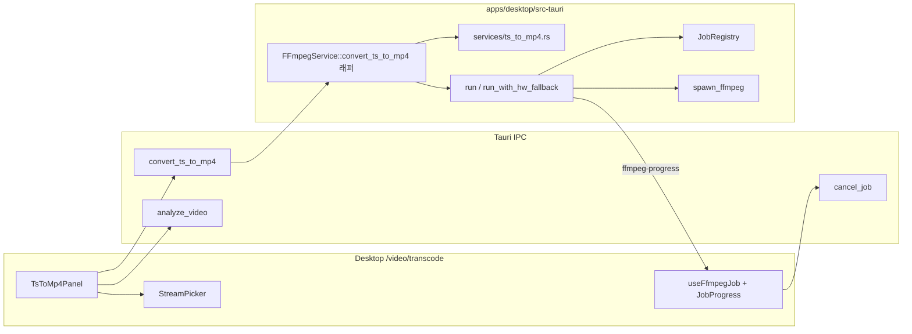
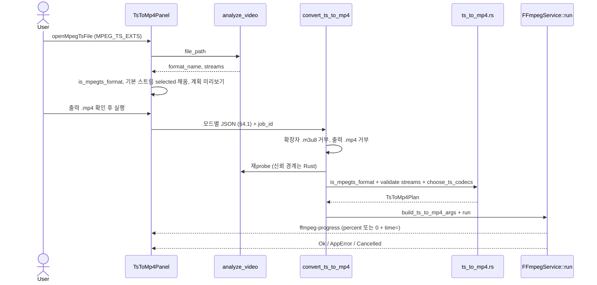

# PLAN: MPEG-TS (.ts / .m2ts / .mts) → MP4 변환 (Desktop Video Studio)

| 항목 | 값 |
| --- | --- |
| **문서** | `docs/plans/PLAN_TS_TO_MP4.md` |
| **Author** | NEOS Work engineering (draft) |
| **Date** | 2026-09-20 |
| **Revision** | r3 — 구현 반영: force_copy 복사 불가 시 `planCopyBlocked`; `video-studio.md` 섹션; 문서 트래킹 |
| **Status** | Implemented (main, PRs #16–#19) |
| **구현 범위** | v1 구현 완료. 이 문서가 구현 계약. |
| **대상 표면** | Desktop `/video` only. Web / CLI / engine / agent skill 없음. |

---

## Overview

한국 방송 녹화·캠코더에서 흔한 MPEG transport stream(`.ts` / `.m2ts` / `.mts`)을 Desktop Video Studio에서 **MP4로 바꾸는 전용 경로**를 추가한다. 기존 변환 탭(`TranscodePage` → `transcode_video`)은 스트림 복사 시 Annex-B/ADTS 비트스트림 필터와 PCR/PTS 불연속 플래그를 넣지 않으며, 파일 선택 필터에 MPEG-TS 확장자도 없다.

v1은 새 FFmpeg 서비스·새 crate를 만들지 않는다. 정책/인자 빌더는 **`services/ts_to_mp4.rs` 모듈**에 두고, 실행은 기존 `FFmpegCommandBuilder` + `FFmpegService::run` / `run_with_hw_fallback` + `JobRegistry` + `ffmpeg-progress`를 재사용한다. UI는 `/video/transcode`의 **세 번째 탭**이고, IPC는 기존 `transcode_video`를 오염시키지 않는 **`convert_ts_to_mp4`** 한 개다. 코덱이 MP4에 들어가면 스트림 복사, 아니면 기존 transcode와 같은 libx264/AAC(+ HW는 force_encode에서만)로 재인코딩한다.

v1은 **디인터레이스하지 않는다** (변환 탭과 동일). 1080i MPEG-2 재인코딩의 combing은 수용한다. HEVC copy에는 muxer 태그 `-tag:v hvc1`을 붙인다.

---

## Background & Motivation

### 현재 상태 (검증된 as-is)

r2 재확인. **K17 r1의 “duration 없어도 JobProgress가 time= 메시지를 보여 준다”는 거짓** — Issue 1 / 아래 K17 r2. 그 외 as-is 행은 코드와 일치한다.

| 계층 | 사실 | 근거 |
| --- | --- | --- |
| 라우트 | Video studio는 `App.tsx` `/video/*`. 엔진 연결 불필요. 타임라인 export는 라이선스 게이트 없음. | `apps/desktop/src/App.tsx`, `docs/implementation/video-studio.md` |
| 변환 UI | `TranscodePage` 탭 2개: `transcode` / `mux`. 기본 코덱 `libx264` + `aac`, CRF `"23"`, 자막 copy/burn/none. | `TranscodePage.tsx` ~63–67, 85–88 |
| IPC | `transcode_video` / `mux_video`. `#[tauri::command(rename_all = "snake_case")]` + `options` 객체. | `commands/transcode.rs`, `lib/tauri/commands.ts` |
| 인자 빌더 | `build_transcode_args`는 `-y -hide_banner` + 선택적 `-hwaccel` + `-i` + `-c:v`/`-c:a` + CRF 매핑. **비트스트림 필터·genpts·avoid_negative_ts 없음.** | `ffmpeg.rs` `build_transcode_args` ~950–996 |
| copy 제약 | 자막 burn은 `video_codec == "copy"` 거부. | `FFmpegService::transcode` ~734–737, UI `tc.burnNeedEncode` |
| 파일 선택 | `VIDEO_EXTS = ["mp4","mkv","mov","avi","webm","flv","wmv","m4v"]` (export 안 됨). **`ts` / `m2ts` / `mts` 없음.** 경로를 직접 붙이면 probe는 가능. `openVideoFile` / `openVideoFiles`가 이 리스트를 공유. | `commands.ts` ~178–210, ~294–298 |
| Probe | `analyze_video` → `FFprobeService::probe` (`-show_format -show_streams`). `format_name` / `codec_name` 제공. **program/PID/`field_order` 필드 없음.** | `commands/probe.rs`, `models/video_info.rs` |
| Job | `useFfmpegJob` → `JobRegistry` + 이벤트 `ffmpeg-progress` + localStorage `neos-video:job-history`. 취소 `cancel_job`. `jobReplay.withJobId`는 `args.options.job_id`를 패치. | `hooks/useFfmpegJob.ts`, `jobReplay.ts`, `services/job.rs` |
| Progress emit | `parse_progress_percent`는 `total_secs`가 `None`/`<=0`이면 `None`. `FFmpegService::run`은 그 `Some`일 때만 `ffmpeg-progress`를 emit. duration 없는 TS는 **이벤트가 0건** → `useProgress`는 `{ percent: 0, message: "" }`. `JobProgress`는 항상 `{percent.toFixed(0)}%`를 찍음. | `ffmpeg.rs` ~1027–1030, ~612–614; `JobProgress.tsx` ~26 |
| i18n | Video island 자체 `LocaleProvider` ko/en, 기본 ko. `t(key, vars)`는 `{name}`을 `replaceAll`. `packages/ui` common.json과 분리. | `lib/i18n.tsx` ~1056–1063 |
| HW | `checkEnvironment().hw_encoders`. `hwaccel_for_codec("copy") == None`. 실패 시 `software_fallback_codec`. `.mp4` 자막 코덱은 `mov_text`. | `encoders.rs` |
| Home/nav | HomePage **feature 카드 18개**. VideoLayout **nav 19항목** (Home 포함). | `HomePage.tsx` `features`, `VideoLayout.tsx` `GROUPS` |
| 테스트 | `ffmpeg.rs` 단위 테스트가 인자 벡터를 고정. UI는 IPC mock (`ProbePage.test.tsx`). 실파일 smoke는 `VIDEO_RS_SMOKE=1`일 때만. 픽스처는 git 바이너리가 아니라 lavfi로 합성 (`smoke/fixtures.rs` `create_fixtures`). | `smoke/mod.rs`, `smoke/fixtures.rs` |

### 고통

1. `.ts`를 파일 대화상자에서 고를 수 없다. 방송 녹화·캠코더 `.m2ts`도 동일.
2. 기존 변환 탭에서 `copy`를 골라도 MPEG-TS → MP4에 필요한 ADTS→ASC, PTS 재생성, 음수 DTS 보정이 없다. 결과는 재생 불가·싱크 붕괴·FFmpeg 에러로 나타난다.
3. 방송 TS는 비디오 H.264 + 오디오 MP2처럼 **트랙별로 호환성이 갈린다.** 전부 copy 또는 전부 재인코딩만 있는 현재 UI로는 한 번에 처리할 수 없다.
4. `h264_mp4toannexb`를 실수로 넣으면(인터넷 레시피의 반대 방향) MP4 muxer가 깨진다. 전용 빌더와 단위 테스트가 필요하다.

---

## Goals & Non-Goals

### Goals (v1)

1. Desktop `/video/transcode`에서 **단일 MPEG-TS 파일**을 MP4로 변환한다.
2. Probe(`analyze_video` / `FFprobeService::probe`)로 `format_name`과 코덱을 읽은 뒤, 스트림별로 copy vs 재인코딩을 고른다.
3. 복사 경로에 올바른 비트스트림 필터·타임스탬프 플래그·HEVC `hvc1` 태그를 넣는다. **`h264_mp4toannexb` / `hevc_mp4toannexb`는 금지.**
4. 재인코딩은 기존 transcode 스택만 사용한다: `libx264`/`libx265`/`aac`, CRF, `KNOWN_HW_ENCODERS`, `run_with_hw_fallback`. HW는 **force_encode에서만**.
5. 진행률·취소·작업 이력·replay가 다른 도구와 같다. duration 없는 TS도 `ffmpeg-progress`가 나온다 (K17).
6. TS 탭 전용 파일 필터가 MPEG-TS를 **MPEG transport stream**으로 명시한다 (TypeScript `.ts`와 구분). **전역 `VIDEO_EXTS`는 바꾸지 않는다.**
7. ko/en 문자열 패리티는 video island `i18n.tsx`만. `packages/ui`는 건드리지 않는다.

### Non-Goals (v1에서 명시적으로 제외)

| 항목 | 이유 |
| --- | --- |
| Web / CLI / `@neos-work/server` 라우트 | FFmpeg는 desktop sidecar 전용. |
| agent skill / `skills/video-analyze` 확장 | 엔진·에이전트 경로. 스튜디오 UI와 무관. |
| 전용 `/video/ts-to-mp4` 페이지·nav 항목·HomePage 카드 | 변환 그룹에 Transcode가 있음. 카드 18 / nav 19를 늘리지 않음. |
| 기존 `transcode_video`에 입력 포맷 마법 삽입 | 일반 변환 시맨틱 오염. 자막 burn/copy와 충돌. |
| 전역 `VIDEO_EXTS`에 `ts`/`m2ts`/`mts` 추가 | Probe/Viewer/Concat/기존 변환 탭에 깨진 copy 경로를 연다. v1은 TS 탭 전용 피커. |
| `.m3u8` / HLS 플레이리스트 / 번호 붙은 세그먼트 폴더 | concat demuxer·플레이리스트 파서 필요. Concat 탭은 별 계약. |
| `.tsv` / `.m2t` 확장자 | `.tsv`는 스프레드시트 충돌. `.m2t`는 별칭이지만 v1 필터/문서에 넣지 않음 (후속). |
| 프로그램/서비스(PMT) 피커, 다중 프로그램 동시 mux | `StreamInfo`에 program_id 없음. 후속. |
| 이 탭의 자막 copy/burn / 텔레텍스트 / DVB / PGS | v1 IPC에서 자막 필드 없음. 항상 `-sn`. 필요하면 기존 변환 탭. |
| 디인터레이스 (`yadif`/`bwdif`) / `field_order` probe 확장 | 변환 탭과 패리티. 1080i combing 수용 (K19). |
| 암호화된 BDAV (AACS) 해제 | 키/DRM. FFmpeg 에러를 그대로 보여 줌. |
| 두 번째 FFmpeg 서비스·새 crate | `FFmpegService` + sidecar만. 정책은 **모듈** `ts_to_mp4.rs`. |
| 실시간 튜너/UDP MPEG-TS | 파일 입력만. |
| 출력 컨테이너 MKV/MOV | v1 출력은 `.mp4`만. Rust가 확장자 거부. |
| CI 기본 잡에서 라이브 FFmpeg | 단위 테스트는 인자 벡터. smoke는 `VIDEO_RS_SMOKE=1` + lavfi 합성. |
| auto 모드에서 HW 인코더 자동 선택 | 변환 탭과 동일. MPEG-2 장시간 파일은 force_encode로 VT를 고른다 (그 경우 H.264도 재인코딩). |

---

## Key Decisions

| # | 결정 | 근거 |
| --- | --- | --- |
| K1 | **UI = 대안 B**: `TranscodePage` 세 번째 탭 `TS → MP4`. 전용 페이지(A) 없음. | 변환 작업의 집. HomePage 카드 18개 / nav 19항목을 늘리지 않음. Mux와 같은 패턴. |
| K2 | **IPC = 대안 D의 명령**: 신규 `convert_ts_to_mp4`. 기존 `transcode_video`에 TS 플래그를 심지 않음 (대안 C 거부). | `build_transcode_args`는 genpts/bsf/per-stream copy가 없음. |
| K3 | **스트림별 copy/encode.** 전부가 아니라 비디오·오디오를 독립 판정. | 방송 TS는 흔히 H.264 + MP2. 비디오 copy + 오디오 AAC가 기본 이득. |
| K4 | copy 비디오 = **정확 매칭** `h264` \| `avc` \| `hevc` \| `h265`. copy 오디오 = **정확 매칭 `aac`만**. `aac_latm`은 재인코딩. `pcm_*`는 `starts_with("pcm")` → AAC. `starts_with("aac")` **금지**. | LATM에 `aac_adtstoasc`를 붙이면 깨짐. AC-3-in-MP4는 Safari/QuickTime이 갈림. |
| K5 | 재인코딩 기본: 비디오 `libx264` CRF 23, 오디오 **`aac`만**. HW는 **force_encode에서 사용자가 고른 경우만**. auto는 표 + 소프트웨어. 실패 시 `software_fallback_codec`. | TranscodePanel 기본값. auto에 HW를 넣으면 “copy 가능 H.264까지 재인코딩”과 섞인다. |
| K6 | 입력 플래그: `-fflags +genpts+discardcorrupt`. 출력: `-avoid_negative_ts make_zero`. **`-copyts` 없음.** | 방송/HLS 조각의 PCR/PTS 불연속. |
| K7 | AAC copy(`codec_name == "aac"`)일 때만 `-bsf:a aac_adtstoasc`. 비디오 copy에는 **어떤 `-bsf:v`도 없음.** 테스트가 `h264_mp4toannexb` / `hevc_mp4toannexb`를 copy·encode 경로 모두 assert-not. | Annex-B → AVCC는 MP4 muxer 책임. `*_mp4toannexb`는 MP4→TS. |
| K8 | v1 입력 = **파일 하나.** `.m3u8`/`.m3u`는 **probe 전에** 확장자로 `InvalidArgument`. 세그먼트 디렉터리 없음. | HLS `format_name`은 보통 `hls`라 `is_mpegts_format`도 실패하지만, 확장자 게이트를 명시. |
| K9 | 기본 맵: **index가 가장 작은** video 스트림 + 가장 작은 audio 스트림 (MuxPanel과 동일, 피커 `selected`를 채움). 데이터 PID는 항상 drop (`-dn`). 자막는 항상 `-sn` (IPC 필드 없음). | `StreamInfo`에 PID/program 없음. DVB/teletext는 MP4에서 실패율이 높음. |
| K10 | 출력 제안 경로 = Concat과 같은 치환: `input.replace(/\.[^.]+$/, "") + ".mp4"` (`file.m2ts` → `file.mp4`). 저장 대화상자로 변경 가능. **Rust가 출력 확장자 `.mp4`가 아니면 거부.** | dialog filter는 경로 Input을 막지 않음. `-movflags +faststart`는 MP4 전용. |
| K11 | **전역 `VIDEO_EXTS` 불변.** v1 피커는 `MPEG_TS_EXTS = ["ts","m2ts","mts"]` + `openMpegTsFile()`을 **TS 탭만** 사용 (PR 3). 필터 이름 `"MPEG transport stream"`. | PR 2에서 전역에 `.ts`를 넣으면 변환 탭 copy가 더 쉽게 깨지고 Viewer는 `video/mp2t`를 재생하지 못함. |
| K12 | **게이트 두 층.** (1) 확장자 `.m3u8`/`.m3u` → probe 전 거부. (2) probe 후 `format_name` 토큰에 `mpegts` 필수 — 확장자가 `.ts`여도 format이 아니면 거부. `has_mpegts_extension`은 **UI 전용** (피커·remembered seed·출력 stem). convert IPC는 format_name이 SoT. | TypeScript `.ts` / 잘못된 컨테이너. `.m2t`는 v1 밖. |
| K13 | 자막 burn/copy는 이 탭·이 IPC에 없음. 필요하면 기존 변환 탭. | `subtitle_mode` dead field를 남기지 않음. |
| K14 | 엔진 연결·라이선스 게이트 없음. | video-studio.md. |
| K15 | 새 crate 없음. 정책+인자+단위 테스트는 **`services/ts_to_mp4.rs`**. `FFmpegService::convert_ts_to_mp4`는 `ffmpeg.rs`의 얇은 래퍼 (probe → plan → `run`). | `ffmpeg.rs` ~1425줄 kitchen sink에 테스트를 더 쌓지 않음. 빌더는 재사용. |
| K16 | `-movflags +faststart`를 TS→MP4 출력에만 넣음. | 웹/플레이어 호환. 일반 transcode 불변. |
| K17 | duration 없는 입력: **`run()` emit 게이트를 바꿈.** `progress_event_from_stderr(line, total)` — percent를 계산할 수 있으면 그 값, `time=`만 있고 total이 없으면 **`percent=0` + stderr trim**. packet scan 없음. `JobProgress`는 오늘처럼 `0%` + `message`. | 오늘 `run()`은 percent `Some`일 때만 emit → 메시지 자체가 안 나옴. 이 변경은 모든 FFmpeg 도구에 이득. |
| K18 | `aac_latm` → auto/force_encode에서 오디오 `aac` 재인코딩, **BSF 없음**. force_copy + `aac_latm` → `InvalidArgument`. | 한국 DTV/IPTV가 LATM을 씀. ADTS BSF는 LATM에 잘못. |
| K19 | **v1 디인터레이스 없음.** `yadif`/`bwdif`/`-vf` 없음. `analyze_video`에 `field_order` 추가 없음. 1080i MPEG-2 → libx264 combing은 **변환 탭과 같이 수용**. | Non-Goals이 스키마를 얼림. 성공 척도를 “방송 원본 화질”로 올리면 범위가 폭발. |
| K20 | HEVC/H.265 **copy** 경로에 `-tag:v hvc1` (muxer 태그, BSF 아님). encode 경로에는 넣지 않음. Safari/QuickTime HEVC 주장은 이 태그를 전제로 함. | `hev1`(in-band VPS/SPS/PPS) vs `hvc1`. |
| K21 | `mode`는 Rust enum. 잘못된 문자열 `"foo"` → `InvalidArgument`. auto는 사용자가 보낸 `video_codec`/`audio_codec`/`crf`를 **무시**. | UI가 필드를 퍼뜨려도 auto가 덮이지 않음. |
| K22 | force_encode 오디오 코덱 UI/IPC = **`aac`만**. `mp3`/`libopus` 없음 (MP3-in-MP4가 K4 Safari 이야기와 충돌). | 변환 탭 `AUDIO_CODECS`를 그대로 빼서 쓰지 않음. |
| K23 | TS 탭은 `useRememberedFile`을 **MPEG-TS 확장자일 때만** 시드. remembered `.mp4`면 입력을 비움 (탭이 영구 `notMpegts`가 되지 않게). | TranscodePanel은 아무 영상이나 시드함. |
| K24 | 인자 순서 고정: `new()` → `-fflags` → 선택적 `-hwaccel` → `-i` → maps → codecs → 선택적 `-bsf:a` → 선택적 `-tag:v hvc1` → quality → `-dn -sn` → `-avoid_negative_ts` → `-movflags` → output. | `-hwaccel`/`-fflags`는 `-i` 앞 (`ffmpeg.rs` hwaccel 주석). |
| K25 | 스트림 인덱스는 재probe 후 `codec_type` 검증 (video 인덱스가 audio이면 `InvalidArgument`). 패턴은 `validate_extract_audio`. | mux의 맹목적 `0:{i}`를 복사하지 않음. |
| K26 | PR은 **스택, 순서대로 머지.** “독립적으로 쓸모 있음”이 아님. PR 2는 IPC만 (필터 없음). | CI `build-and-test`는 main만. |

---

## Proposed Design

### 1. 아키텍처



실행 시퀀스:



신뢰 경계: Rust가 다시 probe한다. auto는 UI가 `video_codec`을 보내도 표를 따른다. force_copy는 비호환이면 `InvalidArgument`이지 승격하지 않는다.

### 2. 표면 선택 근거 (A/B/C/D)

| 대안 | 내용 | 채택? |
| --- | --- | --- |
| A | 전용 Convert TS 페이지 | 거부. nav 비대화. |
| B | Transcode 탭 프리셋/서브탭 | **채택 (UI).** |
| C | 입력이 mpegts면 기존 transcode가 자동 분기 | 거부. 기본 `libx264`로 항상 재인코딩. genpts/bsf를 일반 경로에 넣으면 MP4→MP4 copy에도 영향. |
| D | 신규 IPC + 얇은 UI | **채택 (IPC).** UI는 B의 탭. |

이름: `convert_ts_to_mp4`이지 `remux_ts_to_mp4`가 아니다. remux는 copy-only를 암시하고, v1은 재인코딩을 포함한다.

### 3. MPEG-TS 인식과 게이트

`services/ts_to_mp4.rs`:

```rust
pub fn is_mpegts_format(format_name: &str) -> bool {
    format_name
        .split(',')
        .any(|p| p.trim().eq_ignore_ascii_case("mpegts"))
}

pub fn has_mpegts_extension(path: &str) -> bool {
    matches!(
        path.rsplit('.').next().unwrap_or("").to_ascii_lowercase().as_str(),
        "ts" | "m2ts" | "mts"
    )
}

pub fn is_hls_playlist_path(path: &str) -> bool {
    matches!(
        path.rsplit('.').next().unwrap_or("").to_ascii_lowercase().as_str(),
        "m3u8" | "m3u"
    )
}

pub fn output_is_mp4(path: &str) -> bool {
    path.rsplit('.')
        .next()
        .unwrap_or("")
        .eq_ignore_ascii_case("mp4")
        && path.rsplit('.').next().is_some()
        && path.contains('.')
}
```

**Convert 게이트 (Rust, 순서 고정):**

1. `input_path`/`output_path` 비면 `InvalidArgument`.
2. `is_hls_playlist_path(input)` → `InvalidArgument` ("HLS playlists are not supported; use a single MPEG-TS file"). **probe 전.**
3. `output_is_mp4(output)`가 false → `InvalidArgument` ("output_path must end with .mp4").
4. `FFprobeService::probe`. 실패는 `AppError::Ffprobe` (TypeScript `.ts` 텍스트 등).
5. `is_mpegts_format(&info.format.format_name)`가 false → `InvalidArgument` ("input is not MPEG-TS"). **확장자가 `.ts`여도 이 검사 통과 못 하면 거부.**
6. 선택 스트림 `codec_type` 검증 (K25). 비디오 0개 → `InvalidArgument` ("input has no video stream").

`has_mpegts_extension`은 convert가 호출하지 않는다. UI: 피커 필터, remembered seed, 출력 stem 힌트.

`.m2t`는 v1 필터·헬퍼에 **넣지 않음**. 사용자가 경로를 붙여 넣고 format이 mpegts면 (5)를 통과해 변환된다 (확장자 화이트리스트가 convert SoT가 아님).

### 4. 코덱 정책 (`choose_ts_codecs`)

```rust
pub enum TsConvertMode {
    Auto,
    ForceCopy,
    ForceEncode,
}

impl TsConvertMode {
    pub fn parse(raw: Option<&str>) -> Result<Self, AppError> {
        match raw.map(str::trim).filter(|s| !s.is_empty()).unwrap_or("auto") {
            "auto" => Ok(Self::Auto),
            "force_copy" => Ok(Self::ForceCopy),
            "force_encode" => Ok(Self::ForceEncode),
            other => Err(AppError::InvalidArgument(format!(
                "mode must be auto, force_copy, or force_encode (got {other})"
            ))),
        }
    }
}
```

매칭 규칙 (소문자로 비교):

| 함수 | 규칙 |
| --- | --- |
| `video_copy_compatible` | `== "h264" \|\| == "avc" \|\| == "hevc" \|\| == "h265"` |
| `audio_copy_compatible` | `== "aac"` **만**. `aac_latm` false. **`starts_with("aac")` 금지.** |
| `audio_is_pcm` | `starts_with("pcm")` → 재인코딩 AAC. copy 아님. |

auto 표:

| 소스 `codec_name` | auto 비디오 | auto 오디오 |
| --- | --- | --- |
| `h264`, `avc` | copy | — |
| `hevc`, `h265` | copy + 나중에 `-tag:v hvc1` | — |
| `mpeg1video`, `mpeg2video`, `vc1`, `vp8`, `vp9`, `av1`, 기타 | `libx264` CRF 23 (소프트웨어) | — |
| `aac` | — | copy + `aac_adtstoasc` |
| `aac_latm` | — | `aac` 재인코딩, BSF 없음 |
| `mp2`, `mp3`, `ac3`, `eac3`, `dts`, `dca`, `truehd`, `starts_with("pcm")`, 기타 | — | `aac`, BSF 없음 |
| 오디오 스트림 없음 | — | `audio_codec = None` (맵 생략) |

모드:

- **`auto`:** 위 표. 혼합 허용 (copy 비디오 + encode 오디오, 또는 encode 비디오 + copy 오디오). **사용자 `video_codec`/`audio_codec`/`crf` 무시.** HW 없음.
- **`force_copy`:** 두 트랙 모두 copy. 비디오/오디오가 copy-incompatible이면 `InvalidArgument` (승격 없음). `aac`일 때만 BSF. HEVC면 `hvc1` 태그.
- **`force_encode`:** 사용자 `video_codec`(필수, 기본 UI `libx264`) + `audio_codec`(생략 시 `aac`, **`aac`만 허용**) + `crf`(생략 시 23). `copy` 값 거부. HEVC 소스를 재인코딩해도 기본은 `libx264`. HW 이름은 여기만.

auto에서 MPEG-2 장시간 파일에 VideoToolbox를 쓰려면 사용자가 **force_encode**로 전환해야 하고, 그때는 copy 가능했던 H.264도 재인코딩된다. UI `tc.ts.hwHint`로 적는다.

### 4.1 UI가 보내는 JSON (모드별)

필드가 목록에 없으면 **키 자체를 omit** (null로 채워 퍼뜨리지 않음). `job_id`는 `useFfmpegJob`이 넣음.

**auto**

```json
{
  "input_path": "/rec/clip.ts",
  "output_path": "/rec/clip.mp4",
  "mode": "auto",
  "video_stream_index": 0,
  "audio_stream_index": 1,
  "job_id": "<uuid>"
}
```

오디오 없으면 `audio_stream_index` omit. `video_codec` / `audio_codec` / `crf` **없음**. Rust에 오더라도 auto는 무시 (K21).

**force_copy**

```json
{
  "input_path": "/rec/clip.ts",
  "output_path": "/rec/clip.mp4",
  "mode": "force_copy",
  "video_stream_index": 0,
  "audio_stream_index": 1,
  "job_id": "<uuid>"
}
```

코덱 필드 없음.

**force_encode**

```json
{
  "input_path": "/rec/broadcast.ts",
  "output_path": "/rec/broadcast.mp4",
  "mode": "force_encode",
  "video_codec": "libx264",
  "audio_codec": "aac",
  "crf": 23,
  "video_stream_index": 0,
  "audio_stream_index": 1,
  "job_id": "<uuid>"
}
```

`video_codec`은 소프트웨어 목록(`libx264`, `libx265`, `libvpx-vp9`) 또는 `hwEncoders` 항목. `audio_codec`은 항상 `"aac"`.

**보내지 않는 키 (v1):** `subtitle_mode`, `subtitle_stream_index`, `subtitle_input`.

### 5. 비트스트림 필터와 HEVC 태그

| 조건 | 플래그 | 종류 |
| --- | --- | --- |
| 비디오 copy H.264 | 없음 | — |
| 비디오 copy HEVC/H.265 | `-tag:v hvc1` | **muxer 태그, BSF 아님** |
| 오디오 copy `aac` (정확 매칭) | `-bsf:a aac_adtstoasc` | BSF |
| `aac_latm` / 기타 오디오 재인코딩 | 없음 | — |
| 비디오 재인코딩 | 태그/BSF 없음 | — |
| 어떤 경우에도 금지 | `h264_mp4toannexb`, `hevc_mp4toannexb` | 반대 방향 |

명시적 `-bsf:a aac_adtstoasc`는 FFmpeg 자동 삽입보다 테스트를 결정적으로 만든다.

### 6. 타임스탬프

`FFmpegCommandBuilder::new()`는 `-y -hide_banner`. 그 다음, **`-i` 앞**:

```
-fflags +genpts+discardcorrupt
```

HW encode일 때만 그 다음 `-hwaccel …` (역시 `-i` 앞).

`-i` 뒤, 출력 경로 직전:

```
-avoid_negative_ts make_zero
```

넣지 않는 것:

| 플래그 | 이유 |
| --- | --- |
| `-copyts` | 불연속 PCR을 그대로 옮김. K6. |
| `-start_at_zero` | `-copyts` 전제. |
| `-enc_time_base` / 수동 DTS 재작성 | 과도. |
| `-muxpreload` / `-muxdelay` | mpegts **muxer** 옵션. 출력은 mp4. |
| `yadif` / `bwdif` / interlaced x264 | K19. |

DTS 리오더 실패 시 FFmpeg stderr를 `AppError::Ffmpeg`로 보여 줌. v1에서 `-max_muxing_queue_size` 없음.

### 7. 맵 / PID / 자막 / 데이터

기본 (인덱스 `None`): `-map 0:v:0` + 오디오 있으면 `-map 0:a:0?`. 구현은 “첫 타입”이 아니라 **호출부가 고른 절대 인덱스**를 넘기는 쪽을 선호한다. UI가 항상 첫 video/audio index를 채워 보내면 Rust는 `0:{index}`로 맵한다. 오디오 키 omit이면 오디오 맵/`-c:a` 없음.

`video_stream_index`가 가리키는 스트림의 `codec_type != "video"` → `InvalidArgument` ("stream {i} is not a video track"). 오디오도 동일 (`validate_extract_audio` 패턴).

항상 `-dn -sn`. 자막 피커 없음.

다중 프로그램: 가장 작은 index의 video/audio가 UI 기본. 프로그램 테이블 없음.

### 8. FFmpeg 인자

**순서 계약 (K24) — 테스트가 위치까지 검사:**

```
-y -hide_banner
-fflags +genpts+discardcorrupt
[-hwaccel <name>]          # force_encode + HW일 때만, -i 앞
-i <input>
-map 0:{v}  [-map 0:{a}]
-c:v <vcodec>  [-c:a <acodec>]
[-bsf:a aac_adtstoasc]     # audio copy aac만
[-tag:v hvc1]              # video copy hevc/h265만
[-crf 23 | HW quality]     # video copy가 아닐 때
-dn -sn
-avoid_negative_ts make_zero
-movflags +faststart
<output.mp4>
```

**복사 (H.264 + AAC):**

```
-y -hide_banner
-fflags +genpts+discardcorrupt
-i /path/clip.ts
-map 0:0 -map 0:1
-c:v copy -c:a copy
-bsf:a aac_adtstoasc
-dn -sn
-avoid_negative_ts make_zero
-movflags +faststart
/path/clip.mp4
```

(`-hwaccel` 없음. `h264_mp4toannexb` 없음. `-tag:v` 없음.)

**HEVC copy + AAC copy:** 위와 같으나 `-c:v copy -tag:v hvc1`. `hevc_mp4toannexb` 없음.

**혼합 (H.264 + MP2 또는 aac_latm):** `-c:v copy -c:a aac`, **`-bsf:a` 없음**, `-crf` 없음.

**혼합 (MPEG-2 + AAC):** `-c:v libx264 -crf 23 -c:a copy -bsf:a aac_adtstoasc`. `-vf` 없음 (K19).

**재인코딩 (MPEG-2 + MP2), 소프트웨어:** `-c:v libx264 -c:a aac -crf 23`. BSF 없음. `-tag:v` 없음. `h264_mp4toannexb` 없음.

**force_encode + VideoToolbox:** `-hwaccel videotoolbox`가 `-fflags`와 `-i` 사이. `-c:v h264_videotoolbox -q:v … -allow_sw 1`. 실패 시 `libx264`로 같은 job_id (`run_with_hw_fallback`).

순수 함수:

```rust
pub struct TsToMp4Plan {
    pub video_codec: String,
    pub audio_codec: Option<String>,
    pub audio_bsf: Option<String>,      // Some("aac_adtstoasc")
    pub video_tag: Option<String>,      // Some("hvc1")
    pub crf: Option<u8>,
}

pub fn choose_ts_codecs(
    video_codec_name: &str,
    audio_codec_name: Option<&str>,
    mode: TsConvertMode,
    user_video_codec: Option<&str>,
    user_audio_codec: Option<&str>,
    user_crf: Option<u8>,
) -> Result<TsToMp4Plan, AppError>;

pub fn build_ts_to_mp4_args(
    input: &str,
    output: &str,
    plan: &TsToMp4Plan,
    video_stream: u32,           // 절대 인덱스 (필수)
    audio_stream: Option<u32>,
) -> Vec<String>;
```

`FFmpegService::convert_ts_to_mp4` (얇은 래퍼): 게이트 1–6 → `choose_ts_codecs` (auto면 user 코덱 `None`으로 전달) → `resolve_duration` → `build_ts_to_mp4_args` → HW면 `run_with_hw_fallback` 아니면 `run`.

### 9. UI (`TsToMp4Panel`)

파일: `apps/desktop/src/video/pages/TranscodePage.tsx` 내부. 새 라우트 없음.

```
Tabs:  변환 | 합치기 | TS → MP4
```

1. 입력 `PathRow` — **`openMpegTsFile()`** (`MPEG_TS_EXTS`만). 전역 `openVideoFile` 쓰지 않음.
2. Remembered seed: `useRememberedFile` 값이 `has_mpegts_extension`이면 시드, **아니면 빈 입력** (K23). `.mp4` remembered로 `notMpegts`에 갇히지 않음.
3. 입력 변경 시 `analyzeVideo`. 첫 `codec_type=="video"` / `=="audio"`의 **index로 `selected`를 채움** (MuxPanel ~341–342와 동일). 라디오가 전부 비선택이면 안 됨.
4. Probe 카드: `format_name`, 코덱, 계획 한 줄 — 4분기, **실행될 작업만** 적는다:
   - 둘 다 copy → `tc.ts.planCopy`
   - 비디오 copy + 오디오 encode → `tc.ts.planMix`
   - 비디오 encode + 오디오 copy → `tc.ts.planMixVideo` (`{vcodec}` 필수)
   - 둘 다 encode → `tc.ts.planEncode` (`{vcodec}` `{acodec}` 필수)
   - **force_copy에서 복사 불가 코덱이면 `planCopy`를 쓰지 않는다.** `tc.ts.planCopyBlocked` (`{codec}` 필수) + `tc.ts.copyIncompatible` + Run 비활성. (auto는 mix/encode로 바꾸고, force_copy는 업그레이드하지 않음.)
5. `!is_mpegts_format` → 경고 `tc.ts.notMpegts` (`{format}` 필수) + Run 비활성.
6. `StreamPicker` 비디오 단일 `name="ts-video"`, 오디오 단일 `name="ts-audio"`.
7. 모드: auto / force_copy / force_encode. **코덱+CRF+HW Select는 force_encode일 때만.** 비디오: `libx264`/`libx265`/`libvpx-vp9` + `hwEncoders` (`copy` 없음). 오디오: **`aac` 고정 라벨**, 셀렉트 없음. `tc.ts.hwHint` 표시.
8. 출력: 입력 고르면 `input.replace(/\.[^.]+$/, "") + ".mp4"`. Browse는 `saveFile(stem + ".mp4", ["mp4"])`.
9. `JobProgress` + `useFfmpegJob("TS to MP4")`. duration 없으면 0% + stderr `time=` (K17). 패널에 `tc.ts.progressUnknown`.
10. Run → 모드별 JSON (§4.1). 성공 `toastJobDone`, 취소 `common.cancelled`.

자막 컨트롤 없음. `tc.ts.subHint`만.

HomePage: 새 카드 없음. `home.feat.transcodeDesc`에 MPEG-TS 한 구절.

Nav: 불변. `VideoLayout.test.tsx` 유지.

### 10. 파일 대화상자 (PR 3만)

`commands.ts` — **기존 `VIDEO_EXTS`에 ts를 넣지 않음.** export해서 테스트 가능하게:

```ts
export const VIDEO_EXTS = ["mp4", "mkv", "mov", "avi", "webm", "flv", "wmv", "m4v"];
export const MPEG_TS_EXTS = ["ts", "m2ts", "mts"];

export async function openMpegTsFile(): Promise<string | null> {
  const { open } = await import("@tauri-apps/plugin-dialog");
  const result = await open({
    multiple: false,
    filters: [{ name: "MPEG transport stream", extensions: MPEG_TS_EXTS }],
  });
  return typeof result === "string" ? result : null;
}
```

본문 카피 `tc.ts.inputHint`: TypeScript가 아님을 한국어로. dialog `name`은 기존 `"Video"`처럼 영어 고정.

Concat/Timeline/Viewer/기존 변환 탭은 오늘과 같이 MPEG-TS를 필터에 안 보여 줌. 경로 붙여넣기는 여전함.

### 11. Progress / cancel / history

파이프는 transcode와 동일:

```
useFfmpegJob("TS to MP4")
  → recordJobStart(..., replay: { command: "convert_ts_to_mp4", args: { options } })
  → FFmpegService::run(..., job_id)
  → emit "ffmpeg-progress" { job_id, percent, message }
  → cancel_job(job_id)
```

`jobReplay.withJobId`는 `args.options.job_id`를 덮어쓰므로 `transcodeVideo`처럼 `options`로 래핑.

**K17 구현 계약** (`ffmpeg.rs`, 모든 도구):

```rust
/// time= 이 있고 total이 유효하면 (percent, line).
/// time= 이 있고 total이 없거나 <=0 이면 (0.0, line).
/// time= 이 없으면 None (emit 안 함).
pub(crate) fn progress_event_from_stderr(
    line: &str,
    total_secs: Option<f64>,
) -> Option<(f64, String)> { ... }
```

`FFmpegService::run`의 emit 루프는 `parse_progress_percent` 직접 대신 이 헬퍼를 쓴다. `parse_progress_percent` 시맨틱( total 없으면 `None`)은 **유지** — 기존 단위 테스트 불변. 새 테스트는 헬퍼에.

`JobProgress` 불변: `0%` 숫자 + `message`(stderr). indeterminate 바 없음. 새 packet scan 없음. duration 추정(`size*8/bit_rate`) 없음.

i18n: `job.TS to MP4`. `tc.ts.progressUnknown`.

덮어쓰기: `-y`. 추가 confirm 없음.

### 12. i18n 키 (ko / en 동시, video island만)

`t(key, vars)` — `{format}` 등을 넘기지 않으면 중괄호가 그대로 보인다. UI 테스트가 vars를 넘겨 치환 결과를 assert.

| key | ko | en |
| --- | --- | --- |
| `tc.tab.tsToMp4` | TS → MP4 | TS → MP4 |
| `tc.ts.blurb` | MPEG 전송 스트림을 MP4로 바꿉니다. 가능한 트랙은 복사하고, 아니면 다시 인코딩합니다. | Convert an MPEG transport stream to MP4. Compatible tracks are copied; others are re-encoded. |
| `tc.ts.inputHint` | MPEG 전송 스트림 (.ts, .m2ts, .mts) — TypeScript 소스 파일이 아닙니다 | MPEG transport stream (.ts, .m2ts, .mts) — not a TypeScript source file |
| `tc.ts.notMpegts` | 이 파일은 MPEG-TS가 아닙니다 (format={format}) | This file is not MPEG-TS (format={format}) |
| `tc.ts.mode` | 변환 방식 | Conversion mode |
| `tc.ts.mode.auto` | 자동 (가능한 트랙 복사) | Auto (copy when possible) |
| `tc.ts.mode.copy` | 모두 복사 | Force stream copy |
| `tc.ts.mode.encode` | 모두 다시 인코딩 | Force re-encode |
| `tc.ts.planCopy` | 비디오·오디오 스트림 복사 | Stream-copy video and audio |
| `tc.ts.planCopyBlocked` | 스트림 복사 불가 ({codec}). 자동 또는 다시 인코딩을 쓰세요 | Cannot stream-copy ({codec}). Use Auto or Force re-encode |
| `tc.ts.planMix` | 비디오 복사, 오디오 AAC로 인코딩 | Copy video, encode audio to AAC |
| `tc.ts.planMixVideo` | 비디오 {vcodec}로 인코딩, 오디오 복사 | Encode video {vcodec}, copy audio |
| `tc.ts.planEncode` | 비디오 {vcodec} / 오디오 {acodec}로 인코딩 | Encode video {vcodec} / audio {acodec} |
| `tc.ts.hwHint` | 하드웨어 인코더는 ‘모두 다시 인코딩’에서만 고를 수 있습니다. 복사 가능한 트랙도 다시 인코딩됩니다. | Hardware encoders are only available in Force re-encode; copyable tracks are re-encoded too. |
| `tc.ts.progressUnknown` | 원본 길이를 모르면 진행률은 0%이고 처리 시간만 갱신됩니다. | If duration is unknown, progress stays at 0% and only the elapsed time updates. |
| `tc.ts.run` | MP4로 변환 | Convert to MP4 |
| `tc.ts.running` | 변환 중… | Converting… |
| `tc.ts.done` | MP4 변환 완료 | Converted to MP4 |
| `tc.ts.failed` | MP4 변환 실패 | Conversion failed |
| `tc.ts.noVideo` | 재생 가능한 비디오 스트림이 없습니다 | No playable video stream |
| `tc.ts.copyIncompatible` | 이 코덱은 MP4에 복사할 수 없습니다: {codec} | Codec cannot be copied into MP4: {codec} |
| `tc.ts.subHint` | 자막은 빼 둡니다. 입히기는 변환 탭을 쓰세요. | Subtitles are dropped. Use the Transcode tab to burn them in. |
| `job.TS to MP4` | TS → MP4 | TS → MP4 |
| `home.feat.transcodeDesc` | (기존 문장). MPEG-TS를 MP4로 바꿀 수 있습니다. | (existing). Convert MPEG-TS to MP4. |

`packages/ui` 변경 없음.

---

## API / Interface Changes

### IPC (Rust)

`commands/transcode.rs`에 명령 추가 (mux와 한 파일). 정책 로직은 `services/ts_to_mp4.rs`.

```rust
#[derive(Debug, Deserialize)]
pub struct TsToMp4Options {
    pub input_path: String,
    pub output_path: String,
    /// "auto" | "force_copy" | "force_encode". omit / null = auto
    pub mode: Option<String>,
    /// force_encode only; auto/force_copy ignore even if present
    pub video_codec: Option<String>,
    pub audio_codec: Option<String>,
    pub crf: Option<u8>,
    pub video_stream_index: Option<u32>,
    pub audio_stream_index: Option<u32>,
    pub duration_secs: Option<f64>,
    pub job_id: Option<String>,
}

#[tauri::command(rename_all = "snake_case")]
pub async fn convert_ts_to_mp4(
    app: AppHandle,
    options: TsToMp4Options,
) -> Result<(), AppError>
```

**v1에 자막 필드 없음.** 등록: `lib.rs` `generate_handler!`에 `commands::transcode::convert_ts_to_mp4`.

`video_stream_index` omit → 재probe 후 첫 video index. `audio_stream_index` omit → 첫 audio 또는 없음.

### IPC (TS)

```ts
export interface TsToMp4Options {
  input_path: string;
  output_path: string;
  mode?: "auto" | "force_copy" | "force_encode";
  video_codec?: string;
  audio_codec?: string;
  crf?: number;
  video_stream_index?: number;
  audio_stream_index?: number;
  duration_secs?: number;
  job_id?: string;
}

export function convertTsToMp4(options: TsToMp4Options): Promise<void> {
  return invoke<void>("convert_ts_to_mp4", {
    options: {
      input_path: options.input_path,
      output_path: options.output_path,
      mode: options.mode ?? null,
      video_codec: options.video_codec ?? null,
      audio_codec: options.audio_codec ?? null,
      crf: options.crf ?? null,
      video_stream_index: options.video_stream_index ?? null,
      audio_stream_index: options.audio_stream_index ?? null,
      duration_secs: options.duration_secs ?? null,
      job_id: options.job_id ?? null,
    },
  });
}
```

UI auto/force_copy는 `video_codec`/`audio_codec`/`crf`를 객체에 넣지 않음 (§4.1).

### 바꾸지 않는 API

- `transcode_video` / `mux_video` / `build_transcode_args` 시맨틱 불변.
- `analyze_video` 스키마 불변 (`program_id` / `field_order` 추가 없음).
- `VIDEO_EXTS` 멤버십 불변.
- Web/CLI/engine HTTP 없음.

---

## Data Model Changes

DB/스키마 없음. `neos-video:job-history`에 라벨 `TS to MP4` 레코드만 추가.

마이그레이션 없음. `job.TS to MP4` 키는 UI PR(3)과 같이 넣는다.

디스크: 출력 1파일. 임시 concat 리스트 없음.

---

## Alternatives Considered

### 1. 기존 `transcode_video`에 입력 포맷 자동 분기 (대안 C)

- 장점: IPC 0개.
- 단점: 기본 UI 코덱이 `libx264`라 TS를 골라도 항상 재인코딩. bsf/genpts가 모든 copy에 붙거나 숨은 분기.
- **기각.**

### 2. 전용 페이지 `/video/ts-to-mp4` (대안 A)

- 장점: 카피/교육에 명확.
- 단점: 라우트·nav·카드 증가.
- **기각.**

### 3. copy-only remux 명령

- 단점: 국내 방송 TS의 MP2/AC-3/MPEG-2에서 쓸모 없음.
- **기각.** per-stream auto.

### 4. UI에서 코덱을 판정하고 `transcode_video`에 copy/libx264를 넘김

- 단점: bsf/genpts를 transcode에 넣어야 함. 신뢰 경계가 렌더러.
- **기각.**

### 5. HLS `.m3u8` + 세그먼트 concat을 v1에 포함

- **기각.** Non-goal.

### 6. duration을 `size*8/bit_rate`로 추정 (progress 대안 b)

- 장점: `run()` 불변.
- 단점: VBR/패딩 TS에서 percent가 100%를 넘거나 일찍 끝남. bit_rate가 없는 방송 TS가 흔함.
- **기각.** K17은 emit 게이트 (대안 a).

### 7. JobProgress indeterminate UI (progress 대안 c)

- 단점: 공용 컴포넌트 변경 + 모든 도구. duration 있는 job과 분기.
- **기각.** 0% + message로 충분.

### 8. 전역 `VIDEO_EXTS`에 ts 추가

- 단점: 변환 탭 copy 사고, Viewer 블랙 프레임, Concat 세그먼트 다량 선택.
- **기각.** `MPEG_TS_EXTS` + TS 탭 전용.

### 9. mpeg2video에 항상 yadif

- 단점: 프로그레시브 MPEG-2까지 필터, 스키마에 `field_order` 없음, 변환 탭과 불일치.
- **기각.** K19.

---

## Security & Privacy Considerations

| 위협 | 심각도 | 완화 |
| --- | --- | --- |
| 임의 경로 FFmpeg 입력 | Med | 로컬 파일만. 네트워크 URL 없음. |
| 출력 `-y` 덮어쓰기 | Med | 경로를 UI에 표시. 추가 confirm 없음 (기존 패리티). |
| TypeScript `.ts`를 영상으로 실행 | Low | probe 실패 또는 `is_mpegts_format` 거부. 전용 필터 라벨. |
| 경로/파일명 로그 | Low | 기존 `eprintln!("ffmpeg source={} job={}", …)`만. |
| 엔진/클라우드 유출 | n/a | 엔진 호출 없음. |
| 악의적 TS | Low | sidecar 프로세스. JobRegistry가 kill. |
| 자막 필터 경로 이스케이프 | n/a | 이 탭은 `subtitles=`를 쓰지 않음. |

인증·라이선스: 해당 없음.

---

## Observability

새 메트릭 백엔드 없음.

- `run`의 `eprintln!("ffmpeg source={} job={}", …)` 유지.
- HW 폴백 메시지 유지.
- duration 없을 때 progress `percent=0` + stderr `time=` (K17).
- 실패: `AppError::Ffmpeg(stderr_buf)` 전체 토스트. 알림 채널 없음.

---

## Rollout Plan

1. **플래그 없음.**
2. PR은 **스택, 순서대로 main에 머지** (K26). PR 2의 IPC는 UI 없이 dead command — 필터를 바꾸지 않으므로 사용자 동작 변화 없음.
3. 회귀: `build_transcode_args` 테스트 불변. `parse_progress_percent(total=None) == None` 불변. `VIDEO_EXTS` 멤버십 테스트 (PR 3에서 export).
4. Rollback: 탭(PR 3) → 명령(PR 2) → 모듈(PR 1). 이력 replay는 invoke 실패 토스트. 허용.
5. 문서: `docs/implementation/video-studio.md` Tools 한 줄 + **MPEG-TS → MP4** 섹션. 이 스펙은 `docs/plans/PLAN_TS_TO_MP4.md`에 둔다.

---

## Risks

| 리스크 | 심각도 | 완화 |
| --- | --- | --- |
| 잘못된 BSF 방향 | High | K7 + copy/encode 모두 assert-not. |
| `starts_with("aac")`로 LATM copy | High | K18 + 정확 매칭 테스트. |
| 불연속 PTS 드리프트 | High | K6. queue size는 후속. |
| duration 없음 → 막힌 0% (메시지 없음) | Med | K17 emit. `tc.ts.progressUnknown`. |
| 1080i combing | Med | K19로 명시적 수용. 후속 디인터레이스 스펙. |
| HEVC가 Safari에서 `hev1`로 실패 | Med | K20 `-tag:v hvc1`. |
| AC-3 copy 재생 실패 | Med | auto에서 AAC. force_copy는 사전 거부. |
| 10-bit HEVC copy vs libx264 force_encode 픽셀 포맷 | Med | auto는 copy. force_encode 실패는 FFmpeg 에러. |
| 다중 프로그램 A/V 불일치 | Med | StreamPicker. 기본 최소 index. |
| 암호화 m2ts | Low | 복호화 없음. |
| Concat이 HLS 세그먼트를 다량 선택 | n/a (v1) | 전역 `VIDEO_EXTS` 불변. |
| 일반 transcode 회귀 | High | `build_transcode_args` 불변. `run()` emit만 확장 (time= 없는 줄은 여전히 무이벤트). |
| `run()` 변경이 다른 도구에 이벤트 스팸 | Low | `time=` 있는 stderr만. ffmpeg는 주기적으로 time=를 찍음 — 오늘 duration 있는 job과 같은 빈도. |

예상 부하: 로컬 1 job. 복사 ≈ I/O 0.1–0.3× 실시간. 재인코딩 ≈ 기존 transcode.

---

## Open Questions

제품 기본값 잠금. 구현 차단 이슈 없음.

| # | 질문 | 권장 기본 | 잠금? |
| --- | --- | --- | --- |
| Q1 | 전용 페이지 vs 탭 vs transcode 마법? | 탭 + `convert_ts_to_mp4` (B+D) | yes |
| Q2 | HLS / 세그먼트 폴더 v1? | 아니오 | yes |
| Q3 | AC-3 copy 허용? | 아니오 (auto에서 AAC) | yes |
| Q4 | 자막 기본? | 이 탭에서 필드 없음, 항상 빼기 | yes |
| Q5 | HW 인코더 자동 선택? | 아니오. auto는 libx264. HW는 force_encode | yes |
| Q6 | `.tsv` / `.m2t`? | v1 아니오 | yes |
| Q7 | `faststart`? | TS→MP4만 yes | yes |
| Q8 | duration 없는 TS를 packet scan / bitrate 추정? | 아니오. K17 emit | yes |
| Q9 | Web/CLI? | v1 아니오 | yes |
| Q10 | 디인터레이스? | v1 아니오, combing 수용 | yes |
| Q11 | HEVC `hvc1` 태그? | copy 경로 yes | yes |
| Q12 | 전역 `VIDEO_EXTS`에 ts? | v1 아니오. `MPEG_TS_EXTS` | yes |

---

## Tests

CI 기본 = 인자 벡터 + UI mock. 라이브 FFmpeg는 `VIDEO_RS_SMOKE=1`.

### Rust unit — `services/ts_to_mp4.rs`

1. `is_mpegts_format("mpegts")` true; `"mov,mp4,m4a"` false; `"mpegts,mpegts"` true; `"MPEGTS"` true; `" mpegts "` (콤마 토큰 trim) true.
2. `is_hls_playlist_path("a.m3u8")` / `"a.M3U"` true; `"a.ts"` false.
3. `output_is_mp4("out.mp4")` true; `"out.MP4"` true; `"out.mkv"` false; `"out"` false.
4. `has_mpegts_extension("a.m2ts")` true; `"a.mp4"` false; `"a.m2t"` false (v1).
5. **copy H.264+AAC:** `-c:v copy`, `-c:a copy`, `-bsf:a aac_adtstoasc`, `-dn`, `-sn`, `-movflags`, `+faststart`. **`h264_mp4toannexb` 없음.** `-hwaccel` 없음. `-tag:v` 없음. `-fflags` 인덱스가 `-i`보다 작음. `-avoid_negative_ts` 인덱스가 `-i`보다 큼.
6. **혼합 H.264+mp2:** `-c:v copy`, `-c:a aac`, `-bsf:a` 없음, `-crf` 없음.
7. **H.264 + `aac_latm` auto:** 오디오 `aac`, `audio_bsf = None`. args에 `-bsf:a` 없음.
8. **force_copy + `aac_latm`:** `choose_ts_codecs` Err.
9. **mpeg2+mp2 auto:** `-c:v libx264`, `-c:a aac`, `-crf 23`, BSF 없음, **`-vf` 없음** (K19). encode 경로에도 `h264_mp4toannexb` 없음.
10. **mpeg2 + aac auto:** video encode + audio copy + BSF. (planMixVideo 매트릭스)
11. **HEVC copy:** `-c:v copy`, `-tag:v hvc1`, `hevc_mp4toannexb` 없음.
12. **force_copy + mp2:** Err. **force_copy + H.264 + AAC:** Ok, copy+BSF.
13. **force_encode + `copy`:** Err. force_encode + `mp3` 오디오: Err. force_encode 기본 오디오 `aac`.
14. **force_encode + videotoolbox:** `-hwaccel`이 `-fflags`와 `-i` 사이. `-q:v` 있음. `-crf` 없음.
15. **절대 인덱스:** `video_stream=2` → `-map 0:2`.
16. **오디오 없음:** `-map 0:a` 없음, `-c:a` 없음.
17. **`pcm_s16le` / `pcm_bluray`:** audio encode `aac`, BSF 없음. copy 아님.
18. **auto + 사용자 `video_codec=h264_videotoolbox`:** 무시, 표대로 (H.264면 copy, mpeg2면 libx264). HW 없음.
19. **잘못된 mode `"foo"`:** `TsConvertMode::parse` Err.

### Rust unit — `services/ffmpeg.rs`

20. `progress_event_from_stderr(line_with_time, Some(40.0))` → percent 25.
21. `progress_event_from_stderr(line_with_time, None)` → `Some((0.0, _))`.
22. `progress_event_from_stderr(line_with_time, Some(0.0))` → `Some((0.0, _))`.
23. `progress_event_from_stderr("frame=1 fps=1", None)` → `None` (`time=` 없음).
24. 기존 `parse_progress_percent(line, None) == None` **불변**.
25. 기존 `build_transcode_args` 테스트 **불변**.

### 스트림 타입 검증 (모듈 또는 래퍼 테스트)

26. video index가 audio 스트림 → Err `"is not a video track"`.
27. 없는 index → Err.

### TS unit

- PR 3: `import { VIDEO_EXTS, MPEG_TS_EXTS } from commands` — `VIDEO_EXTS`에 `ts` **없음**, `MPEG_TS_EXTS`는 `ts`/`m2ts`/`mts`.
- `TsToMp4Options` / `convertTsToMp4` 컴파일.

### UI (`TranscodePage.test.tsx`)

- mock: `analyzeVideo`, `convertTsToMp4`, `openMpegTsFile`, `saveFile`, `checkEnvironment`.
- 탭 `TS → MP4` (locale ko).
- mpegts probe 후 `planMix` 또는 해당 키 **치환된 문자열** (`{vcodec}` 리터럴 없음).
- force_copy + mp2: `planCopyBlocked` 치환, `planCopy` 문구 없음, Run 비활성. force_copy + H.264/AAC: `planCopy`, Run 활성.
- 비-mpegts: Run 비활성, `format=` 치환.
- Run auto: payload에 `mode: "auto"`, `video_codec` 키 없음.
- remembered `.mp4`로 마운트해도 TS 탭 입력이 비어 있음 (시드 안 함).
- en 패리티: 탭 라벨 키 존재.

### Smoke (PR 4, `VIDEO_RS_SMOKE=1`)

`smoke/fixtures.rs` `create_fixtures()`에 lavfi로 **git 바이너리 없이** 합성:

```
in_ts_copy:  testsrc + sine, -c:v libx264 -c:a aac -f mpegts  (2s, 320x240)
in_ts_mpeg2: testsrc + sine, -c:v mpeg2video -c:a mp2 -f mpegts
```

테스트 (`smoke/tools.rs`, `skip_unless_smoke`):

- copy 경로: `build_ts_to_mp4_args` + `run_ffmpeg` → probe `format_name`에 `mp4`, 오디오 `aac`.
- encode 경로 (mpeg2+mp2): 출력 `mp4`, 비디오 존재, 오디오 `aac`.

픽스처 없으면 skip이 아니라, smoke가 켜지면 `create_fixtures`가 만든다 (기존 `in_av.mp4`와 동일). CI 기본 잡은 이 테스트를 실행하지 않음.

---

## References

- 구현 가이드: [`docs/implementation/video-studio.md`](../implementation/video-studio.md)
- FFmpeg 실행: `apps/desktop/src-tauri/src/services/ffmpeg.rs` (`build_transcode_args`, `FFmpegService::transcode`, `run`, `run_with_hw_fallback`)
- 신규 모듈: `apps/desktop/src-tauri/src/services/ts_to_mp4.rs` (PR 1)
- 명령: `apps/desktop/src-tauri/src/commands/transcode.rs`
- HW/자막: `apps/desktop/src-tauri/src/services/encoders.rs`
- Probe: `ffprobe.rs`, `commands/probe.rs`
- UI: `TranscodePage.tsx`, `JobProgress.tsx`, `StreamPicker.tsx`
- IPC/필터: `lib/tauri/commands.ts`
- Smoke 픽스처 패턴: `src-tauri/src/smoke/fixtures.rs` (`run_ffmpeg_raw` + lavfi)
- FFmpeg BSF: https://ffmpeg.org/ffmpeg-bitstream-filters.html
- FFmpeg 플래그: https://ffmpeg.org/ffmpeg.html (`-fflags genpts`, `-avoid_negative_ts`)

---

## PR Plan

스택. **순서대로 머지.** “각 PR이 사용자에게 독립적으로 쓸모 있음”이 아님. 베이스는 직전 PR이 들어간 `main`. CI `build-and-test`는 main만.

### PR 1 — 정책 모듈 + progress emit 헬퍼 (IPC/UI 없음)

- **제목:** `feat(video): MPEG-TS→MP4 policy module and duration-less progress emit`
- **파일:**
  - `apps/desktop/src-tauri/src/services/ts_to_mp4.rs` (**신규**: `is_mpegts_format`, `has_mpegts_extension`, `is_hls_playlist_path`, `output_is_mp4`, `TsConvertMode`, `choose_ts_codecs`, `build_ts_to_mp4_args`, 스트림 타입 검증 헬퍼, 단위 테스트 1–19·26–27)
  - `apps/desktop/src-tauri/src/services/mod.rs` (`pub mod ts_to_mp4`)
  - `apps/desktop/src-tauri/src/services/ffmpeg.rs` (`progress_event_from_stderr`, `run()`이 헬퍼 사용, 테스트 20–25; `FFmpegCommandBuilder`에 `no_data()`가 필요하면 여기. **`convert_ts_to_mp4` 서비스 메서드는 PR 2.**)
- **의존:** 없음
- **내용:** 순수 함수 + `run()`이 duration 없어도 `time=` 줄을 emit. sidecar spawn 없음. `build_transcode_args` 불변.

### PR 2 — IPC only (필터·탭 없음)

- **제목:** `feat(video): convert_ts_to_mp4 Tauri command`
- **파일:**
  - `apps/desktop/src-tauri/src/commands/transcode.rs` (`TsToMp4Options`, `convert_ts_to_mp4`)
  - `apps/desktop/src-tauri/src/services/ffmpeg.rs` (`FFmpegService::convert_ts_to_mp4` 얇은 래퍼)
  - `apps/desktop/src-tauri/src/lib.rs` (handler)
  - `apps/desktop/src/video/lib/types/video.ts` (`TsToMp4Options`)
  - `apps/desktop/src/video/lib/tauri/commands.ts` (`convertTsToMp4`만. **`VIDEO_EXTS` 변경 없음. `openMpegTsFile` 없음.**)
- **의존:** PR 1
- **내용:** 게이트 + probe + plan + run. 빈 경로 / HLS 확장자 / 비-mp4 출력 / 비-mpegts / 비디오 없음 / 잘못된 mode / force_copy 비호환 / 잘못된 스트림 타입 → `InvalidArgument`. 사용자 대면 동작 변화 없음 (dead IPC).

### PR 3 — 탭 + 전용 필터 + i18n + 문서

- **제목:** `feat(video): TS → MP4 tab on TranscodePage`
- **파일:**
  - `apps/desktop/src/video/lib/tauri/commands.ts` (`export VIDEO_EXTS`, `MPEG_TS_EXTS`, `openMpegTsFile`)
  - `apps/desktop/src/video/pages/TranscodePage.tsx` (`TsToMp4Panel`)
  - `apps/desktop/src/video/pages/TranscodePage.test.tsx`
  - `apps/desktop/src/video/lib/i18n.tsx`
  - `docs/implementation/video-studio.md`
- **의존:** PR 2
- **내용:** 세 번째 탭, 전용 피커, remembered MPEG-TS만 시드, 기본 스트림 선택, 모드별 JSON, `{stem}.mp4`. **전역 Video 필터는 그대로.**

### PR 4 — lavfi MPEG-TS smoke

- **제목:** `test(video): lavfi MPEG-TS to MP4 smoke fixtures`
- **파일:**
  - `apps/desktop/src-tauri/src/smoke/fixtures.rs` (`in_ts_copy`, `in_ts_mpeg2`를 `create_fixtures`에서 합성)
  - `apps/desktop/src-tauri/src/smoke/tools.rs` (copy/encode 두 테스트, `skip_unless_smoke`)
- **의존:** PR 1 (빌더). 실명령은 PR 2 래퍼 없이도 `build_ts_to_mp4_args` + `run_ffmpeg`로 가능. PR 2 이후여도 됨.
- **내용:** git에 `.ts` 바이너리 없음. `VIDEO_RS_SMOKE=1`에서만. CI 기본 잡은 단위 테스트만.

**착수:** PR 1 즉시. 제품 질문은 K/Q 표로 잠금.
