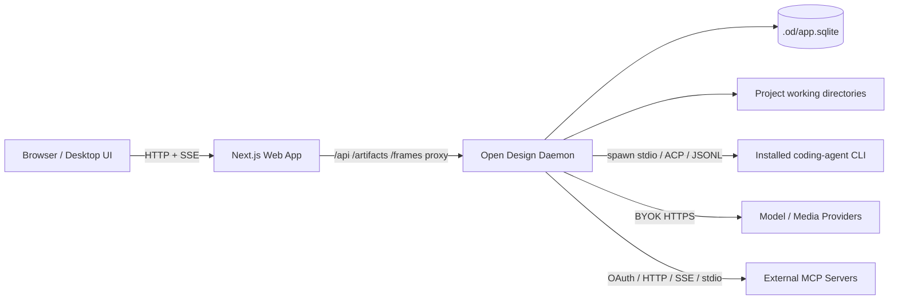
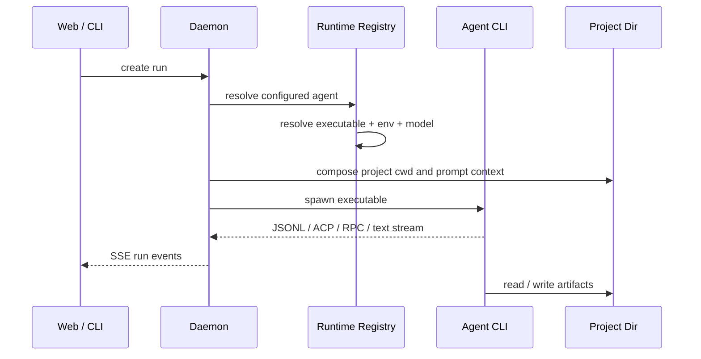
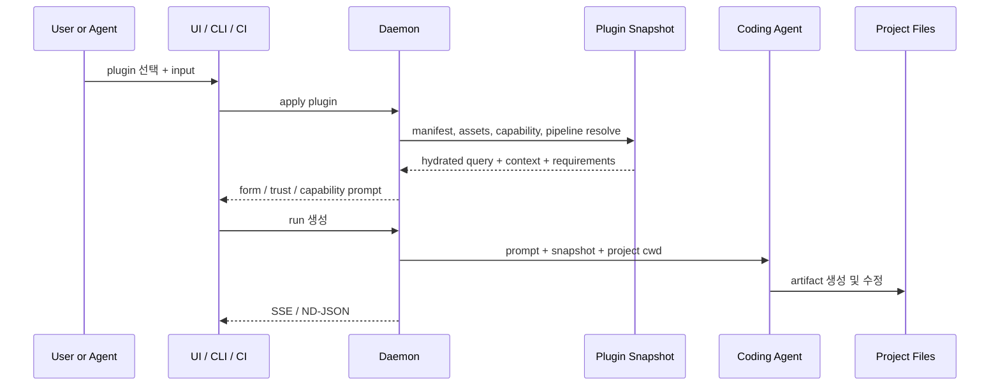

# Open Design 리포지토리 분석 및 구현 스펙

> 대상 리포지토리: [`nexu-io/open-design`](https://github.com/nexu-io/open-design)  
> 분석 기준: `main` 브랜치, 2026-05-30 정적 코드 리딩  
> 작성 목적: 신규 개발자, 유지보수 담당자, 코딩 에이전트가 프로젝트의 구조와 실행 모델을 빠르게 이해할 수 있도록 현재 구현을 중심으로 정리  
> 주의: 이 문서는 코드를 직접 실행하여 검증한 테스트 리포트가 아니라, 리포지토리의 소스 코드·설정 파일·README·내부 스펙 문서를 교차 검토한 정적 분석 문서이다. 문서와 코드가 충돌하는 경우에는 현재 구현 코드를 우선한다.

---

## 0. Executive Summary

Open Design은 단순한 “프롬프트를 입력하면 HTML을 만들어 주는 웹앱”이 아니다. 핵심은 **로컬 또는 셀프호스팅 daemon을 중심으로 기존 코딩 에이전트 CLI를 오케스트레이션하고, 디자인 산출물을 파일로 생성·미리보기·수정·배포하는 디자인 에이전트 substrate**이다.

이 프로젝트가 Claude Design류 제품과 구분되는 지점은 다음과 같다.

1. **모델 루프를 직접 소유하지 않는 것을 기본 원칙으로 한다.**
   - Claude Code, Codex, Devin, Gemini CLI, Cursor Agent, OpenCode 등 사용자가 이미 설치한 CLI를 실행 엔진으로 재사용한다.
   - CLI가 없는 경우 BYOK API 경로를 제공한다.
   - Open Design은 agent loop 자체보다는 context 조립, 실행 수명주기, 파일 작업공간, 미리보기, 확장 프로토콜을 담당한다.

2. **브라우저 UI와 권한이 필요한 로컬 작업을 분리한다.**
   - `apps/web`: Next.js 기반 UI.
   - `apps/daemon`: Express 기반 권한 프로세스. 파일시스템 접근, 에이전트 spawn, SQLite, 미디어 API, MCP, 배포 API를 소유한다.
   - `apps/desktop`, `apps/packaged`: Electron shell 및 패키징 진입점.
   - 개발 환경에서는 Next.js가 `/api/*`, `/artifacts/*`, `/frames/*`를 daemon으로 proxy한다.
   - daemon-only production에서는 daemon이 빌드된 정적 웹앱까지 함께 제공할 수 있다.

3. **확장 단위가 파일 기반이다.**
   - Skill: `SKILL.md`를 중심으로 한 에이전트 실행 지침.
   - Design System: `DESIGN.md` 및 선택적 manifest, token, component preview 파일.
   - Plugin: `SKILL.md`를 유지하면서 `open-design.json` sidecar를 추가해 마켓플레이스, typed input, GenUI, atom pipeline, trust/capability metadata를 부여한다.
   - Memory: Markdown 트리.
   - 실제 산출물: 프로젝트 폴더 아래의 HTML, JSX, 이미지, 영상, 오디오, Markdown 등의 일반 파일.

4. **UI와 headless CLI를 동등한 1급 진입점으로 취급한다.**
   - `od` CLI는 daemon을 시작하는 launcher이면서, media, MCP, plugin, automation, memory, project, files, run 등 daemon 기능의 agent-facing wrapper이다.
   - 외부 코딩 에이전트가 UI 없이도 Open Design을 호출할 수 있다.

5. **현재 구현은 초기 MVP 수준을 넘어선 기능 폭을 가진다.**
   - 프로젝트 및 대화 관리
   - SSE 기반 run stream
   - 에이전트 CLI 자동 감지 및 spawn
   - BYOK provider proxy
   - 미디어 생성
   - Claude Design ZIP 및 로컬 폴더 import
   - Vercel / Cloudflare Pages 배포
   - MCP 연결 및 OAuth
   - plugin / marketplace / atom pipeline
   - routine automation
   - Markdown memory
   - live artifact
   - desktop / packaged sidecar
   - telemetry 및 privacy control

다만 기능이 빠르게 증가한 흔적도 분명하다. 특히 `apps/daemon/src/server.ts`는 매우 큰 조립 파일이며 일부 코드에는 `@ts-nocheck`가 남아 있다. 내부 문서 중 일부는 현재 구현보다 오래되어 desktop, marketplace, SQLite, 지원 에이전트 수 등의 설명이 상충한다.

---

## 1. 제품 정의

### 1.1 한 문장 정의

**Open Design은 기존 코딩 에이전트 CLI와 BYOK 모델 API를 실행 엔진으로 사용하여, 자연어 브리프를 파일 기반 디자인 산출물로 변환하고 브라우저에서 미리보기·수정·배포할 수 있게 하는 local-first 디자인 에이전트 플랫폼이다.**

### 1.2 주요 사용자

- 코딩 에이전트 구독을 이미 보유한 개발자 및 디자이너
- HTML/JSX 기반 프로토타입, 랜딩 페이지, 덱을 빠르게 생성하려는 팀
- 브랜드 규칙을 `DESIGN.md` 형태로 버전 관리하려는 팀
- 사내 디자인 작업 흐름을 plugin, routine, connector로 자동화하려는 팀
- Electron만으로 제한되지 않는 웹·Docker·셀프호스팅 배포를 원하는 사용자
- UI 없이 CLI 또는 CI에서 디자인 작업을 실행하려는 에이전트 중심 워크플로 사용자

### 1.3 핵심 설계 원칙

| 원칙 | 구현 해석 |
|---|---|
| Agent loop 재사용 | 가능한 경우 기존 CLI를 spawn하며, Open Design이 별도 범용 agent framework를 재구현하지 않는다. |
| File-first | 산출물, skill, design system, memory가 일반 파일로 남는다. |
| Local-first | daemon이 로컬 파일시스템과 CLI를 소유한다. |
| Web-deployable | UI는 Next.js이고 daemon은 정적 export도 서빙할 수 있다. |
| UI / CLI parity | 기능은 UI뿐 아니라 `od` CLI에서도 접근할 수 있어야 한다. |
| Portable extensions | `SKILL.md` 호환성을 유지하고 OD 전용 정보는 sidecar로 추가한다. |
| Defense in depth | 프로젝트 경로, symlink, BYOK base URL, asset URL, desktop import token 등을 다층 검증한다. |

---

## 2. 모노레포 구조

### 2.1 워크스페이스

루트는 pnpm workspace이다.

```yaml
packages:
  - packages/*
  - apps/*
  - tools/*
  - e2e
```

루트 `package.json`의 핵심 정보:

| 항목 | 값 |
|---|---|
| 패키지명 | `open-design` |
| 버전 | `0.8.1` |
| 모듈 형식 | ESM |
| Node.js | `~24` |
| pnpm | `10.33.2` |
| CLI binary | `od` → `apps/daemon/dist/cli.js` |
| 라이선스 | Apache-2.0 |

### 2.2 상위 디렉터리 지도

```text
open-design/
├── apps/                       # 실제 제품 런타임
│   ├── web/                    # Next.js UI
│   ├── daemon/                 # Express daemon + od CLI
│   ├── desktop/                # Electron host
│   ├── packaged/               # 번들된 daemon/web sidecar를 실행하는 패키지 진입점
│   ├── landing-page/           # 제품 랜딩 페이지
│   └── telemetry-worker/       # telemetry 관련 런타임
├── packages/                   # 공유 계약 및 런타임 프리미티브
│   ├── contracts/
│   ├── host/
│   ├── sidecar-proto/
│   ├── sidecar/
│   ├── platform/
│   ├── plugin-runtime/
│   ├── registry-protocol/
│   ├── diagnostics/
│   ├── download/
│   └── agui-adapter/
├── tools/                      # 개발, 서빙, 패키징 제어면
│   ├── dev/
│   ├── serve/
│   └── pack/
├── skills/                     # 내장 SKILL.md 카탈로그
├── design-systems/             # 내장 DESIGN.md 카탈로그
├── design-templates/           # 디자인 템플릿 카탈로그
├── plugins/
│   ├── _official/              # bundled first-party plugins
│   ├── community/              # 설치 가능하지만 기본 활성화되지 않는 community plugins
│   ├── registry/               # marketplace manifest
│   └── spec/                   # portable plugin spec kit
├── craft/                      # 범용 디자인 craft reference
├── prompt-templates/
├── templates/
├── docs/
├── specs/
├── deploy/                     # Docker 배포
├── charts/open-design/         # Kubernetes Helm chart
├── nix/
├── scripts/
├── mocks/
└── e2e/
```

### 2.3 책임 경계

| 영역 | 책임 | 지켜야 할 경계 |
|---|---|---|
| `apps/web` | 렌더링, UI 상태, daemon 호출, preview orchestration | daemon private source를 직접 import하지 않는다. |
| `apps/daemon` | 파일시스템, DB, 외부 네트워크, agent spawn, REST/SSE, static serving | 권한이 필요한 기능의 단일 소유자이다. |
| `apps/desktop` | Electron host, 네이티브 창 및 OS 통합 | 일반 제품 로직은 daemon/web에 남긴다. |
| `apps/packaged` | 배포 가능한 desktop runtime 조립 | bundled sidecar를 실행하는 얇은 진입점으로 유지한다. |
| `packages/contracts` | web/daemon이 공유하는 API 타입 | Node 전용 의존성 없이 순수 TS 계약으로 유지한다. |
| `packages/sidecar-proto` | sidecar IPC schema, runtime namespace, 상태 계약 | 범용 계약이며 OD 세부 구현을 과도하게 담지 않는다. |
| `packages/sidecar` | sidecar launch, IPC, runtime file helper | 제품별 하드코딩을 피한다. |
| `packages/platform` | OS process, PATH, toolchain 탐색 | daemon과 packaged runtime이 공유한다. |
| `packages/plugin-runtime` | plugin sidecar schema 및 처리 | `SKILL.md` portability를 훼손하지 않는다. |
| `tools/dev` | 로컬 프로세스 lifecycle | 개발 실행의 단일 진입점이다. |
| `tools/pack` | installer 및 sourcemap 처리 | runtime 코드와 패키징 코드를 분리한다. |

---

## 3. 런타임 아키텍처

### 3.1 기본 로컬 구성



### 3.2 제품 형태별 구성

| 형태 | 실행 구조 | 특징 |
|---|---|---|
| Source dev | `pnpm tools-dev run web` 또는 `pnpm tools-dev` | daemon이 먼저 시작되고 web이 sibling port로 연결된다. |
| Daemon-only production | daemon이 API와 빌드된 Next.js static export를 함께 제공 | nginx 없이 단일 프로세스 제공 가능 |
| Docker | Alpine 기반 단일 이미지 + `.od` volume | 외부 agent CLI는 이미지에 기본 포함되지 않는다. |
| Desktop dev | `tools-dev`가 daemon + web + Electron을 관리 | native dialog, desktop import token 등의 통합 사용 |
| Packaged desktop | `apps/packaged`가 bundled daemon/web sidecar + desktop host를 조립 | Electron runtime을 Node-compatible sidecar로 활용할 수 있다. |
| Remote self-hosting | 인증 reverse proxy, SSH tunnel 또는 VPN을 daemon 앞에 배치 | daemon 자체를 공용 LAN에 직접 노출하면 안 된다. |

### 3.3 Web과 daemon 연결

`apps/web/next.config.ts`는 개발 환경에서 다음 경로를 daemon으로 rewrite한다.

```text
/api/:path*       → http://127.0.0.1:${OD_PORT}/api/:path*
/artifacts/:path* → http://127.0.0.1:${OD_PORT}/artifacts/:path*
/frames/:path*    → http://127.0.0.1:${OD_PORT}/frames/:path*
```

기본 daemon port는 `7456`이다. `tools-dev`가 free port를 탐색한 뒤 `OD_PORT`를 넘길 수 있다.

production build는 기본적으로 static export이다. packaged desktop에서는 `OD_WEB_OUTPUT_MODE=server` 또는 `standalone`을 통해 sidecar-owned Next.js server runtime을 사용할 수 있다.

---

## 4. 핵심 애플리케이션

## 4.1 `apps/web`: 사용자 작업 공간

기술 스택:

| 항목 | 값 |
|---|---|
| Framework | Next.js `16.2.6` |
| UI | React `18.3.1` |
| Styling | Tailwind CSS `4.3.0` |
| Provider SDK | Anthropic SDK, OpenAI SDK |
| Analytics | PostHog |
| Test | Vitest, Testing Library |

`apps/web/src/App.tsx`는 제품의 상위 orchestration shell이다. 현재 import 및 state 구성을 기준으로 다음 UI를 조율한다.

- Entry / Home
- Projects
- Workspace tabs
- Project editor / preview
- Marketplace
- Plugin detail
- Design System creation / detail
- Settings
- Integrations
- Memory toast
- Privacy consent
- iframe keep-alive pool
- daemon health 및 catalog hydration
- agent, skill, design template, design system, prompt template fetch
- provider configuration
- Composio configuration
- project import 및 Claude Design ZIP import
- analytics identity 및 consent 반영

### 주요 UI 상태

| 상태 | 설명 |
|---|---|
| `daemonLive` | daemon health |
| `agents` | 감지된 coding-agent CLI |
| `skills` | Settings → Skills에 노출되는 기능 skill |
| `designTemplates` | Home templates tab에 노출되는 렌더링 카탈로그 |
| `designSystems` | 선택 가능한 디자인 시스템 |
| `projects` | 프로젝트 목록 |
| `templates` | 사용자 프로젝트 템플릿 |
| `promptTemplates` | prompt template |
| `providerModelsCache` | BYOK provider model cache |
| `daemonMediaProviders` | daemon에 저장된 media provider 설정 |
| `petTaskCenter` | 진행 중 / queued / recent task center |

### Preview

기본 디자인 산출물은 브라우저에서 iframe으로 미리 본다. HTML, live artifact, frame 기반 resource에 대응하며 iframe keep-alive pool을 사용한다. URL preview에는 scroll state restore bridge를 삽입할 수 있다.

---

## 4.2 `apps/daemon`: 권한 런타임 및 API 서버

기술 스택:

| 항목 | 값 |
|---|---|
| HTTP | Express `5.1.0` |
| DB | `better-sqlite3` |
| File archive | JSZip |
| File watching | chokidar |
| Upload | multer |
| HTTP client | undici |
| MCP | `@modelcontextprotocol/sdk` |
| Metrics | prom-client |
| Telemetry | OpenTelemetry, PostHog |
| Hash | blake3 |

daemon은 다음 책임을 가진다.

1. agent CLI 탐색 및 spawn
2. REST / SSE API
3. SQLite metadata
4. 프로젝트 파일 작업공간
5. skill / design system / template registry
6. plugin install / apply / snapshot / trust / pipeline
7. 미디어 생성 provider dispatch
8. MCP server 구성 및 OAuth
9. automation routine scheduler
10. memory store
11. import / export / deploy
12. static web serving
13. desktop-specific gate
14. diagnostics 및 telemetry

### Route 모듈 분리 현황

`route-context-contract.ts` 기준으로 다음 route 모듈이 분리되어 있다.

| Route 모듈 | 기능 |
|---|---|
| `active-context-routes.ts` | 현재 작업 context |
| `chat-routes.ts` | chat, run, provider 테스트 |
| `deploy-routes.ts` | Vercel / Cloudflare Pages 배포 |
| `import-export-routes.ts` | import, export, finalize |
| `handoff-routes.ts` | design handoff |
| `live-artifact-routes.ts` | live artifact |
| `mcp-routes.ts` | MCP 설정, 설치, OAuth |
| `media-routes.ts` | 미디어, 앱 설정, Orbit, research |
| `project-routes.ts` | 프로젝트, 파일, artifact, 업로드 |
| `routine-routes.ts` | automation routine |
| `static-resource-routes.ts` | artifacts / frames / static |

단, `server.ts`는 여전히 매우 큰 조립 파일이며 일부 legacy route와 많은 dependency wiring을 포함한다.

---

## 4.3 `apps/desktop`: Electron host

`apps/desktop`은 Electron shell이다.

| 항목 | 값 |
|---|---|
| Electron | `41.3.0` |
| 진입점 | `dist/main/index.js` |
| 공유 패키지 | diagnostics, download, host, platform, sidecar, sidecar-proto |

역할:

- web UI를 desktop window에 제공
- OS-native 기능을 host layer로 연결
- 로컬 폴더 picker와 같은 desktop-only 동작 지원
- packaged runtime과 IPC를 연결
- desktop import token을 사용한 폴더 import gate 지원

---

## 4.4 `apps/packaged`: 배포 가능한 desktop 조립

`apps/packaged`는 daemon, desktop, web package에 의존하며 배포용 Electron runtime을 묶는다.

역할:

- bundled daemon sidecar 실행
- bundled web sidecar 실행
- desktop host 실행
- headless entrypoint 제공
- ephemeral port와 sidecar IPC discovery 지원
- installer 빌드 대상으로 사용

---

## 5. Agent Runtime

### 5.1 설계 철학

Agent adapter 계층은 Open Design의 가장 중요한 경계다.

Open Design은 일반적인 경우 다음을 직접 재구현하지 않는다.

- 모델 호출 loop
- context management
- tool execution loop
- permission prompt
- resume
- cancel
- CLI별 auth

대신 현재 설치된 coding-agent CLI를 실행하고, 입력 context를 조립하며, stdout / JSONL / ACP / RPC event를 UI에 전달한다.

### 5.2 런타임 레지스트리

`apps/daemon/src/runtimes/registry.ts`의 기본 등록 agent:

| # | Agent id 계열 |
|---|---|
| 1 | AMR |
| 2 | Claude |
| 3 | Codex |
| 4 | Devin |
| 5 | Gemini |
| 6 | OpenCode |
| 7 | Hermes |
| 8 | Trae CLI |
| 9 | Grok Build |
| 10 | Kimi |
| 11 | Cursor Agent |
| 12 | Qwen |
| 13 | Qoder |
| 14 | Copilot |
| 15 | Pi |
| 16 | Kiro |
| 17 | Kilo |
| 18 | Vibe |
| 19 | DeepSeek |
| 20 | Aider |
| 21 | Antigravity |
| 22 | Reasonix |

추가로 local profile 파일에서 사용자 정의 agent def를 로딩한다. 따라서 README의 “지원 CLI 개수”는 고정된 제품 계약으로 해석하면 안 되고, 현재 레지스트리 및 로컬 profile을 기준으로 계산해야 한다.

### 5.3 agent facade

`apps/daemon/src/agents.ts`는 facade이며 실제 구현은 `runtimes/*`로 분리되어 있다.

```text
agents.ts
└── runtimes/
    ├── registry.ts
    ├── detection.ts
    ├── executables.ts
    ├── launch.ts
    ├── resolution.ts
    ├── env.ts
    ├── mcp.ts
    ├── prompt-budget.ts
    ├── models.ts
    ├── auth.ts
    └── defs/*.ts
```

### 5.4 탐색 및 실행

핵심 흐름:



### 5.5 Prompt budget 및 Windows 대응

런타임 계층에는 CLI argv budget 검사가 있다. 특히 Windows의 command-line 길이 제한을 고려하고, 긴 prompt는 stdin 전송을 사용하도록 adapter별 launch policy를 구성할 수 있다.

### 5.6 취소

`runs.ts`의 취소 우선순위:

1. ACP / RPC session이 `abort()`를 지원하면 우선 호출
2. grace period 이후에도 child가 살아 있으면 `SIGTERM`
3. daemon shutdown 시 필요하면 `SIGKILL`
4. terminal status 기록 및 SSE 종료

---

## 6. Run, Chat, SSE

### 6.1 Run 상태

```ts
queued | running | succeeded | failed | canceled
```

terminal status:

```ts
succeeded | failed | canceled
```

### 6.2 in-memory run registry

현재 chat run registry는 메모리 기반이다.

각 run은 다음 정보를 가진다.

| 필드 | 의미 |
|---|---|
| `id` | run UUID |
| `projectId` | 연결 프로젝트 |
| `conversationId` | 연결 conversation |
| `assistantMessageId` | 응답 message |
| `clientRequestId` | client idempotency / tracking |
| `agentId` | 실행 agent |
| `pluginId` | 적용 plugin |
| `appliedPluginSnapshotId` | 재현을 위한 고정 snapshot |
| `mediaExecution` | 해당 run의 media 정책 |
| `status` | 상태 |
| `events` | 최근 event ring buffer |
| `eventsLogPath` | 선택적 JSONL 로그 |
| `child` | spawned process |
| `acpSession` | RPC abort 가능한 세션 |
| `clients` | SSE subscriber |
| `waiters` | completion waiter |

기본 event buffer는 최대 2,000개이며, terminal run은 기본 TTL 30분 후 메모리에서 제거된다. 선택적으로 run별 `events.jsonl`을 디스크에 기록해 외부 coding agent가 tail할 수 있다.

### 6.3 주요 chat/run API

| Method | Path | 설명 |
|---|---|---|
| `POST` | `/api/chat` | legacy-compatible chat run 생성 후 즉시 SSE stream |
| `POST` | `/api/runs` | daemon-managed run 생성. plugin snapshot resolution이 필요한 실행의 canonical 경로 |
| `GET` | `/api/runs` | 조건별 run 목록 |
| `GET` | `/api/runs/:id` | run 상태 |
| `GET` | `/api/runs/:id/events` | run event SSE 재연결 |
| `POST` | `/api/runs/:id/cancel` | run 취소 |
| `POST` | `/api/runs/:id/tool-result` | headless agent의 질문 등에 대한 tool result 전달 |
| `POST` | `/api/runs/:id/feedback` | turn 평가 telemetry side channel |
| `POST` | `/api/provider/models` | BYOK provider model 조회 |
| `POST` | `/api/test/connection` | provider / local agent smoke test |

### 6.4 SSE 재연결

`Last-Event-ID` 또는 `after` query를 사용해 이미 받은 event 이후부터 재전송한다. terminal run에 재연결했을 때 cursor가 마지막 event 이상이어도 terminal event를 최소 한 번 보내도록 보완되어 있다.

---

## 7. Project 및 Artifact Store

### 7.1 프로젝트 파일 위치

기본 프로젝트 파일:

```text
<repo>/.od/projects/<projectId>/
```

git-linked 또는 imported folder 프로젝트는 metadata의 `baseDir`을 통해 사용자 소유 폴더를 직접 workspace로 사용할 수 있다.

```text
metadata.baseDir = /absolute/path/to/user/project
```

### 7.2 파일과 metadata의 소유권

| 데이터 | 저장 위치 |
|---|---|
| 프로젝트 실제 산출물 HTML/JSX/image/video/audio/upload | `.od/projects/<id>/` 또는 imported `baseDir` |
| 프로젝트, conversation, message, tab metadata | `.od/app.sqlite` |
| 일회성 save artifact | `.od/artifacts/` |
| live artifact | 프로젝트 디렉터리 내부 관리 파일 |
| memory | `<dataDir>/memory/*.md` |
| MCP token | data dir의 MCP token 파일 |
| runtime config | data dir 및 project root별 JSON 구성 |

### 7.3 파일 registry 주요 동작

- 파일 recursive list
- `index.html` 우선 entry file 감지
- HTML fallback entry 감지
- dotfile 제외
- `.artifact.json` sidecar 제외
- imported repo에서 `node_modules` 같은 build/install dir skip
- 최신 수정 파일 우선 정렬
- ZIP archive 생성
- batch archive
- artifact manifest 읽기
- hidden segment 및 symlink 차단

### 7.4 Archive 보안

archive 경로는 실제 경로를 기준으로 검증한다.

- 프로젝트 외부로 나가는 path traversal 차단
- symlink 경유 외부 파일 유출 차단
- hidden path 제외
- `.artifact.json` 제외
- regular file만 허용
- 빈 archive 및 없는 경로 명시적 오류
- ZIP 생성 시 기본 compression level `6`

### 7.5 주요 프로젝트 API 예시

> 아래 HTTP 표는 코드 리딩을 위한 대표 surface이다. 모든 endpoint를 망라한 OpenAPI 문서는 아니며, 세부 계약은 `packages/contracts`와 각 `*-routes.ts`를 source of truth로 삼는다.

| Method | Path | 설명 |
|---|---|---|
| `GET` | `/api/projects` | 프로젝트와 최신 run 기반 상태 목록 |
| `POST` | `/api/projects` | 신규 프로젝트 및 기본 conversation 생성 |
| `POST` | `/api/import/folder` | 기존 로컬 폴더를 복사 없이 workspace로 연결 |
| `POST` | `/api/projects/:id/working-dir` | 기존 프로젝트 workspace 교체 |
| `POST` | `/api/import/claude-design` | Claude Design ZIP import |
| `GET` | `/api/projects/:id/deployments` | 프로젝트 배포 목록 |
| `POST` | `/api/projects/:id/deploy` | 배포 |
| `POST` | `/api/projects/:id/deploy/preflight` | 배포 preflight |
| `POST` | `/api/projects/:id/deployments/:deploymentId/check-link` | public link 상태 확인 |

프로젝트 route 파일에는 파일 read/write, tab, comment, upload, archive 등 추가 endpoint가 더 존재한다.

---

## 8. SQLite Persistence

### 8.1 DB 파일

```text
.od/app.sqlite
```

연결 시:

```sql
PRAGMA journal_mode = WAL;
PRAGMA foreign_keys = ON;
```

### 8.2 핵심 테이블

| 테이블 | 목적 |
|---|---|
| `projects` | 프로젝트 metadata |
| `templates` | 프로젝트 템플릿 |
| `conversations` | 프로젝트 대화 |
| `messages` | chat message, agent, event, attachments, produced files, feedback |
| `preview_comments` | preview element comment |
| `tabs` | 열린 파일 tab |
| `tabs_state` | tab 갱신 상태 |
| `deployments` | deploy provider, URL, status, metadata |
| `routines` | automation routine |
| `routine_runs` | routine 실행 이력 |
| `routine_schedule_claims` | 중복 스케줄 실행 방지 slot claim |

추가 migration 함수:

```ts
migrateCritique(db)
migrateMediaTasks(db)
migratePlugins(db)
```

즉 critique, media task, plugin 관련 테이블도 DB에 추가된다.

### 8.3 Postgres adapter 현황

`apps/daemon/src/storage/daemon-db.ts`는 향후 multi-replica daemon을 위한 adapter config surface를 정의한다.

지원 설정 형태:

```env
OD_DAEMON_DB=sqlite       # 기본값
OD_DAEMON_DB=postgres
OD_PG_HOST=
OD_PG_PORT=5432
OD_PG_DATABASE=
OD_PG_USER=
OD_PG_SSL_MODE=require
```

하지만 **현재 reachable backend는 SQLite뿐이다.** `OD_DAEMON_DB=postgres`는 설정 surface를 검증하지만 실제 adapter는 stub이며 사용 시 명시적 오류를 내도록 설계되었다.

---

## 9. Skill Protocol

### 9.1 정의

Skill은 에이전트가 실행할 디자인 capability의 최소 단위이다.

기본 폴더:

```text
<skill-root>/
├── SKILL.md
├── assets/
├── references/
└── examples/
```

`SKILL.md`는 YAML frontmatter + Markdown body이다.

### 9.2 기본 호환성

Open Design은 Agent Skills / Claude Code 계열 `SKILL.md` 관례를 유지한다. OD 전용 확장 필드가 없어도 skill을 로딩한다.

### 9.3 현재 구현의 SkillInfo

`skills.ts`의 `SkillInfo` 기준 주요 필드:

| 필드 | 설명 |
|---|---|
| `id` / `name` | skill 식별자 |
| `displayName` | locale별 표시명 |
| `description` / `descriptionI18n` | 설명 |
| `triggers` | 추천 trigger |
| `mode` | image, video, audio, deck, design-system, template, prototype |
| `surface` | web, image, video, audio |
| `source` | user 또는 built-in |
| `craftRequires` | 필요한 craft reference |
| `platform` | desktop, mobile, null |
| `scenario` | 작업 시나리오 |
| `category` | Settings filter용 category |
| `previewType` | preview renderer 선택 |
| `designSystemRequired` | 디자인 시스템 필요 여부 |
| `defaultFor` | default binding |
| `upstream` | 원본 |
| `featured` | featured order |
| `fidelity` | wireframe 또는 high-fidelity |
| `speakerNotes` | deck metadata |
| `animations` | animation metadata |
| `examplePrompt` | 예시 prompt |
| `aggregatesExamples` | 하나의 skill이 여러 example card를 제공하는지 |
| `critiquePolicy` | Critique Theater override |
| `body` | agent prompt body |
| `dir` | 실제 skill root |

### 9.4 Discovery precedence

`listSkills()`는 root를 priority 순서로 받는다. 먼저 발견한 동일 id가 우선한다.

현재 코드 해석:

1. 사용자 writable root
2. bundled root

기존 문서에서는 project-private, committed, global skill root의 상세 precedence도 설명한다. 실제 daemon wiring에서 넘기는 roots를 기준으로 최종 precedence를 확인해야 한다.

### 9.5 Shadowing

사용자 skill은 bundled skill과 같은 id를 사용해 내장 skill을 덮어쓸 수 있다. 내장 파일을 삭제하지 않고 조회 결과에서 사용자 skill이 우선한다.

### 9.6 Derived example card

`examples/<name>.html`이 있으면 하나의 SKILL.md에서 여러 gallery card를 파생할 수 있다.

파생 id:

```text
<parent-skill-id>:<example-key>
```

파생 card는 parent의 mode, platform, surface, scenario, critique policy 및 prompt body를 상속한다.

---

## 10. Design System

### 10.1 정의

디자인 시스템은 브랜드 규칙을 파일로 관리하는 context layer이다.

기본 호환 형식:

```text
<design-system-root>/
└── DESIGN.md
```

확장 package:

```text
<design-system-root>/
├── manifest.json
├── DESIGN.md
├── tokens.css
├── components.html
├── assets/
└── preview/
```

### 10.2 registry

`design-systems.ts`는 디렉터리를 스캔하고 다음 우선순위로 metadata를 해석한다.

- user metadata
- `manifest.json`
- `DESIGN.md` Markdown
- YAML frontmatter
- 폴더명 fallback

### 10.3 surface

```ts
web | image | video | audio
```

### 10.4 source 및 status

```ts
source: built-in | installed | user
status: draft | published
revisionStatus: pending | accepted | rejected
artifactMode: generated | agent-managed
```

### 10.5 Manifest

```ts
{
  schemaVersion: "od-design-system-project/v1",
  id,
  name,
  category,
  description?,
  files: {
    design: "DESIGN.md",
    tokens: "tokens.css",
    components?: "components.html"
  },
  assetsDir?,
  previewDir?,
  usage?,
  componentsManifest?,
  fonts?,
  preview?,
  sourceFiles?,
  importMode?,
  craft?
}
```

### 10.6 Provenance

디자인 시스템은 다음 provenance를 가질 수 있다.

- company blurb
- GitHub URL
- local code files
- fig files
- asset files
- notes
- source notes

### 10.7 9-section DESIGN.md 관례

내부 문서가 채택한 기본 섹션:

1. Visual Theme & Atmosphere
2. Color Palette & Roles
3. Typography Rules
4. Component Stylings
5. Layout Principles
6. Depth & Elevation
7. Do's and Don'ts
8. Responsive Behavior
9. Agent Prompt Guide

---

## 11. Plugin 및 Marketplace

### 11.1 정의

Skill이 단일 capability라면 Plugin은 배포 가능한 workflow bundle이다.

```text
<plugin-root>/
├── SKILL.md
├── open-design.json        # 선택적 OD sidecar
├── assets/
├── references/
├── scripts/
├── examples/
└── preview/
```

`SKILL.md`만 있어도 일반 agent skill로 사용할 수 있다. `open-design.json`을 추가하면 OD product behavior가 활성화된다.

### 11.2 Plugin은 Figma식 UI extension이 아니다

Plugin이 직접 canvas에 panel을 mount하거나 자체 RPC lifecycle을 소유하지 않는다.

Plugin은 다음을 선언한다.

- intent
- query template
- context chip
- input field
- asset
- capability gate
- atom pipeline
- GenUI surface
- trust metadata
- preview
- marketplace metadata

실행 프로세스는 daemon이 선택한 coding agent이다.

### 11.3 Plugin 적용 흐름



### 11.4 Atom pipeline

Plugin은 장기 작업을 stage로 쪼갠다.

예시 reference pipeline:

```text
discovery → plan → generate → critique
```

기본 atom 예시:

- discovery question form
- direction picker
- todo write
- file read/write
- research search
- media image
- live artifact
- critique theater
- code import
- design extract
- rewrite plan
- diff review
- figma extract
- token map
- patch edit
- handoff
- build test

### 11.5 시나리오

| taskKind | 사용 사례 | 대표 흐름 |
|---|---|---|
| `new-generation` | 자연어로 새 결과물 생성 | discovery → direction → generate → critique |
| `code-migration` | 기존 코드 기반 리디자인 | code import → design extract → rewrite plan → generate → diff review |
| `figma-migration` | Figma / screenshot 기반 구현 | figma extract → token map → generate → critique |
| `tune-collab` | 기존 프로젝트 개선 | direction → patch edit → critique → handoff |

### 11.6 snapshot

Run은 `appliedPluginSnapshotId`를 가진다. plugin upgrade 이후에도 특정 run이 사용한 prompt fragment와 tool gate를 고정하여 replay 재현성을 높이려는 설계이다.

### 11.7 daemon plugin module

`apps/daemon/src/plugins/index.ts`가 노출하는 주요 기능:

- atom registry
- apply
- validate
- pack
- search
- diff
- snapshot diff
- inventory stats
- simulate pipeline
- verify
- event buffer
- connector gate / probe
- export
- doctor
- installer
- lockfile
- persistence
- marketplace
- pipeline / runner
- publish
- scaffold
- GC
- snapshot resolve
- trust
- until condition

---

## 12. Generative UI 및 Human-in-the-loop

Plugin pipeline은 사람 입력이 필요한 stage에서 GenUI surface를 선언할 수 있다.

예시:

- form
- choice
- confirmation
- OAuth prompt

CLI도 다음 surface에 대응한다.

```bash
od ui list
od ui show
od ui respond
od ui revoke
od ui prefill
```

`od ui show --schema`는 해당 surface의 JSON Schema만 조회할 수 있다.

목표는 UI에서 질문을 렌더링하되, headless agent도 동일 surface를 읽고 응답할 수 있게 하는 것이다.

---

## 13. Media Generation

### 13.1 통합 계약

모든 미디어 생성은 같은 CLI contract를 사용한다.

```bash
od media generate \
  --surface <image|video|audio> \
  --model <model-id> \
  --output <project-relative-path> \
  --prompt <text>
```

흐름:

```text
skill + prompt + metadata
  → agent가 od media generate 실행
  → daemon media dispatcher
  → provider API
  → bytes를 project workspace에 기록
  → FileViewer / preview에서 렌더링
```

### 13.2 지원 surface

```ts
image | video | audio
```

### 13.3 코드에 명시된 provider 통합

| Provider | 용도 |
|---|---|
| OpenAI | image generation, image edit, TTS |
| Azure OpenAI | base URL 기반 OpenAI deployment 감지 |
| Volcengine Ark | Seedance video, Seedream image |
| xAI / Grok | image, async video |
| ImageRouter | OpenAI-compatible image/video |
| Custom Image | 사용자 지정 OpenAI-compatible image generation/edit |
| Google 계열 | Nano Banana / Gemini image model 경로 |
| ElevenLabs | voice option 및 speech 관련 경로 |
| SenseAudio 계열 | BYOK 및 asset URL 처리 경로 |

### 13.4 stub policy

미구현 provider의 placeholder bytes는 release에서 기본 허용되지 않는다.

```env
OD_MEDIA_ALLOW_STUBS=1
```

이 설정이 없으면 stub provider는 HTTP `503`에 매핑되는 명시적 오류를 낸다. stub이 허용된 개발 환경에서도 real-provider 실패는 `providerError`를 기록해 agent가 placeholder를 최종 결과로 오인하지 않게 한다.

### 13.5 Media API

| Method | Path | 설명 |
|---|---|---|
| `GET` | `/api/media/models` | provider, model, aspect, duration catalog |
| `GET` | `/api/media/config` | 마스킹된 provider config |
| `PUT` | `/api/media/config` | provider config 저장 |
| `GET` | `/api/media/providers/elevenlabs/voices` | ElevenLabs voice option |
| `POST` | `/api/projects/:id/media/generate` | local UI/CLI용 생성 |
| `POST` | `/api/tools/media/generate` | tool-token 기반 agent 생성 |

### 13.6 비용 및 보안 guard

- project-relative image path만 허용
- project 외부 파일 업로드 차단
- image input 최대 16 MB
- 확장자 allowlist: png, jpg, jpeg, webp, gif
- 영상 길이와 오디오 duration은 allowlist에 맞게 clamp
- run별 media execution policy
- tool token의 capability 확인
- external asset URL SSRF 검사

---

## 14. MCP 및 Connector

### 14.1 MCP 역할

Open Design은 두 방향의 MCP 사용을 지원한다.

1. **Open Design 자체를 MCP server로 노출**
   - coding agent가 live artifact, connector 등의 tool을 호출
2. **외부 MCP server에 client로 연결**
   - daemon이 외부 tool을 underlying agent spawn context에 제공

### 14.2 CLI

```bash
od mcp live-artifacts
```

### 14.3 설치 정보

`/api/mcp/install-info`는 현재 실행 중 daemon에 맞는 MCP command snippet을 생성한다.

특징:

- `od`가 PATH에 없어도 절대 경로 사용
- 현재 `process.execPath` 사용
- packaged Electron에서 `ELECTRON_RUN_AS_NODE=1` 반영 가능
- sidecar IPC 모드에서는 ephemeral daemon port를 고정하지 않고 IPC로 discovery
- web base URL이 있으면 studio deep link 제공

### 14.4 Codex one-click install

| Method | Path |
|---|---|
| `GET` | `/api/mcp/install/codex/status` |
| `POST` | `/api/mcp/install/codex` |
| `DELETE` | `/api/mcp/install/codex` |

daemon이 `~/.codex/config.toml`을 직접 수정하지 않고 `codex mcp add/remove/get`를 호출한다.

### 14.5 외부 MCP server 설정

| Method | Path |
|---|---|
| `GET` | `/api/mcp/servers` |
| `PUT` | `/api/mcp/servers` |

### 14.6 OAuth

| Method | Path | 설명 |
|---|---|---|
| `POST` | `/api/mcp/oauth/start` | authorization flow 시작 |
| `GET` | `/api/mcp/oauth/callback` | provider redirect 수신 |
| 추가 token endpoint | route 파일 후반부 | refresh / revoke / 상태 조회 |

token은 daemon data dir에 저장하며, agent spawn 시 필요한 Bearer header로 삽입한다.

---

## 15. Automation Routine

### 15.1 목적

Routine은 특정 prompt를 스케줄에 맞춰 반복 실행하는 automation이다. 단순 cron wrapper가 아니라 프로젝트 전략, agent, skill, plugin, MCP, connector context 및 실행 이력을 포함한다.

### 15.2 Schedule 종류

```ts
{ kind: "hourly", minute }
{ kind: "daily", time, timezone }
{ kind: "weekdays", time, timezone }
{ kind: "weekly", time, timezone, weekday }
```

### 15.3 Target

```ts
{ mode: "create_each_run" }
{ mode: "reuse", projectId }
```

### 15.4 Context

```ts
{
  skillIds?: string[],
  pluginIds?: string[],
  mcpServerIds?: string[],
  connectorIds?: string[]
}
```

### 15.5 DST 대응

scheduler는 `Intl.DateTimeFormat`을 사용해 목표 timezone의 wall clock을 UTC instant로 변환한다.

- fall-back 중복 시간: 가능한 UTC candidate를 모두 계산
- spring-forward gap: post-gap fallback instant 사용
- 유효하지 않은 timezone: null 처리
- weekday 조건: 최대 14일 탐색

### 15.6 API

| Method | Path | 설명 |
|---|---|---|
| `GET` | `/api/automation-templates` | automation template 목록 |
| `GET` | `/api/automation-templates/:id` | template 상세 |
| `GET` | `/api/routines` | routine 목록 |
| `POST` | `/api/routines` | routine 생성 |
| `GET` | `/api/routines/:id` | routine 상세 |
| `PATCH` | `/api/routines/:id` | routine 수정 |
| `DELETE` | `/api/routines/:id` | routine 삭제 |
| `POST` | `/api/routines/:id/run` | 수동 실행 |
| `GET` | `/api/routines/:id/runs` | 실행 이력 |
| `POST` | `/api/routines/:id/runs/:runId/crystallize` | 성공한 run을 재사용 가능한 skill 후보로 crystallize |

---

## 16. Memory

### 16.1 저장 구조

Memory는 SQLite가 아니라 Markdown 파일 기반이다.

```text
<dataDir>/memory/
├── MEMORY.md
├── user_<slug>.md
├── feedback_<slug>.md
├── project_<slug>.md
├── reference_<slug>.md
└── .config.json
```

### 16.2 엔트리 예시

```markdown
---
name: User role
description: User is a senior FE engineer working on Open Design.
type: user
---

상세 Markdown 본문
```

### 16.3 type

```ts
user | feedback | project | reference
```

### 16.4 특징

- Markdown index에 포함된 엔트리만 새 chat prompt에 주입
- underlying fact file은 index에서 제거해도 디스크에 유지
- CJK 또는 emoji만 있는 name은 deterministic hash fallback slug 사용
- 변경 이벤트를 process-local EventEmitter로 발생
- HTTP memory event SSE가 UI refresh를 유도
- 수동, heuristic, LLM extraction source 구분
- config의 API key는 UI에 tail만 노출

### 16.5 config

```json
{
  "enabled": true,
  "chatExtractionEnabled": true,
  "extraction": {
    "provider": "anthropic | openai | azure | google | ollama",
    "model": "...",
    "baseUrl": "...",
    "apiKey": "...",
    "apiVersion": "..."
  }
}
```

기본값은 memory 및 chat extraction 활성화이다.

---

## 17. Live Artifact

### 17.1 목적

Live artifact는 input과 template을 분리하여 refresh 가능한 산출물을 제공한다. 일반 파일 산출물과 달리 source를 재조회하거나 input을 업데이트해 다시 렌더링할 수 있다.

### 17.2 API

사용자/UI 경로:

| Method | Path |
|---|---|
| `GET` | `/api/live-artifacts?projectId=...` |
| `GET` | `/api/live-artifacts/:artifactId?projectId=...` |
| `GET` | `/api/live-artifacts/:artifactId/preview?projectId=...` |
| `GET` | `/api/live-artifacts/:artifactId/refreshes?projectId=...` |
| `PATCH` | `/api/live-artifacts/:artifactId?projectId=...` |
| `DELETE` | `/api/live-artifacts/:artifactId?projectId=...` |
| `POST` | `/api/live-artifacts/:artifactId/refresh?projectId=...` |

agent tool-token 경로:

| Method | Path |
|---|---|
| `POST` | `/api/tools/live-artifacts/create` |
| `GET` | `/api/tools/live-artifacts/list` |
| `POST` | `/api/tools/live-artifacts/update` |
| `POST` | `/api/tools/live-artifacts/refresh` |

### 17.3 보안

Tool endpoint는 token에서 projectId 및 runId를 파생한다. request body가 다른 projectId 또는 runId로 override하려 하면 `403`을 반환한다.

---

## 18. Import, Export, Handoff

### 18.1 Claude Design ZIP Import

```http
POST /api/import/claude-design
Content-Type: multipart/form-data
file=<zip>
```

동작:

1. `.zip` 확장자 검증
2. 프로젝트 id 생성
3. ZIP 추출
4. entry file 감지
5. 프로젝트 metadata 기록
6. 기본 conversation 생성
7. entry tab 활성화

### 18.2 Local Folder Import

```http
POST /api/import/folder
```

특징:

- 폴더를 복사하지 않는다.
- metadata의 `baseDir`에 canonical absolute path를 저장한다.
- 이후 agent write가 사용자 폴더에서 직접 발생한다.
- git 등 버전 관리는 사용자 책임이다.
- filesystem root import 차단
- `.od` runtime data dir 자체 또는 하위 폴더 import 차단
- symlink는 `realpath()`로 collapse
- desktop auth gate 활성 시 native picker에서 생성된 token 요구

### 18.3 Working Directory 교체

```http
POST /api/projects/:id/working-dir
```

기존 프로젝트를 다른 로컬 디렉터리에 연결한다.

### 18.4 Export

프로젝트 archive 기능은 사용자가 실제로 보는 파일 트리를 ZIP으로 내보낸다. dotfile 및 internal artifact sidecar는 제외한다. archive에는 design handoff와 design manifest를 보강할 수 있다.

---

## 19. Deploy

### 19.1 지원 provider

현재 route 구현:

- Vercel
- Cloudflare Pages

### 19.2 API

| Method | Path | 설명 |
|---|---|---|
| `GET` | `/api/deploy/config?providerId=...` | 마스킹된 deploy config |
| `PUT` | `/api/deploy/config` | deploy config 저장 |
| `GET` | `/api/deploy/cloudflare-pages/zones` | Cloudflare Pages zone 목록 |
| `GET` | `/api/projects/:id/deployments` | 배포 이력 |
| `POST` | `/api/projects/:id/deploy` | 배포 |
| `POST` | `/api/projects/:id/deploy/preflight` | 배포 가능성 검사 |
| `POST` | `/api/projects/:id/deployments/:deploymentId/check-link` | public URL readiness 확인 |

### 19.3 상태

배포 metadata에는 다음 정보가 저장된다.

- provider id
- URL
- deployment id
- deployment count
- target
- status
- status message
- reachable timestamp
- provider metadata
- created / updated timestamp

---

## 20. `od` CLI

### 20.1 역할

`od`는 두 역할을 동시에 수행한다.

1. 기본 실행: daemon을 시작하고 web UI를 연다.
2. 하위 명령: daemon HTTP API를 호출하는 headless agent-facing client.

### 20.2 주요 subcommand

```text
od artifacts
od media
od mcp
od research
od plugin
od ui
od marketplace
od project
od automation
od automations
od memory
od run
od files
od conversation
od daemon
od atoms
od skills
od design-systems
od craft
od diagnostics
od status
od version
od doctor
od config
```

### 20.3 Agent 실행 환경에 주입되는 변수

```env
OD_BIN=/absolute/path/to/apps/daemon/dist/cli.js
OD_DAEMON_URL=http://127.0.0.1:<resolved-port>
OD_PROJECT_ID=<project-id>
OD_PROJECT_DIR=<absolute-project-workspace>
```

미디어 및 live artifact skill은 이 변수를 통해 현재 프로젝트에 안전하게 결과물을 쓴다.

### 20.4 Recoverable exit code

CLI에는 daemon 미실행, plugin 미발견, snapshot 미발견, capability 부족, input 누락, project 미발견, run 미발견, provider 미설정, plugin requires daemon, snapshot stale, GenUI 대기, desktop auth pending 등의 복구 가능한 오류 code mapping이 있다.

---

## 21. BYOK API Mode

### 21.1 목적

로컬 CLI가 없거나 사용자가 provider API를 직접 사용하려는 경우 daemon proxy를 사용한다.

대표 proxy:

```text
/api/proxy/anthropic/stream
/api/proxy/openai/stream
/api/proxy/azure/stream
/api/proxy/google/stream
/api/proxy/ollama/stream
/api/proxy/senseaudio/stream
```

### 21.2 Prompt 조립

기본 흐름:

```text
BASE SYSTEM PROMPT
  + active DESIGN.md context
  + active craft reference
  + active SKILL.md workflow
  + plugin snapshot / stage atoms
  + project / memory context
```

기존 Quickstart 문서에는 MVP 3-layer prompt로 설명되어 있으나, 현재 plugin, atom, memory, active-context 구현까지 포함하면 실제 조립 surface는 더 확장되어 있다.

### 21.3 Connection Test

Settings에서 실제 chat을 생성하지 않고 다음을 검사한다.

- API key
- base URL
- protocol
- model
- local CLI spawn
- auth 상태
- stream parser
- proxy 환경

---

## 22. Security Model

### 22.1 Project path sandbox

`projects.ts`, import route, media route에서 다음을 적용한다.

- 안전한 project id 검증
- project-relative path 검증
- imported folder canonical `realpath()`
- filesystem root 차단
- runtime data dir 재진입 차단
- symlink archive 차단
- hidden file archive 차단
- internal sidecar 제외
- regular file 검증

### 22.2 SSRF 방어

`connectionTest.ts`는 BYOK base URL을 문자열만으로 검사하지 않는다.

1. URL parse 및 literal hostname 검사
2. DNS lookup
3. lookup된 모든 address 검사
4. loopback carve-out: Ollama 등 로컬 provider 허용
5. 사설 IP, link-local, CGNAT, metadata-service 계열 차단
6. 외부 asset download URL에도 같은 검증
7. fetch redirect를 오류 처리하여 3xx private hop 차단

### 22.3 Media guard

- project 외부 input file 차단
- input 크기 제한
- MIME allowlist
- 비용 관련 length/duration clamp
- local UI / CLI same-origin gate
- tool token capability
- run-scoped media policy

### 22.4 Desktop import gate

desktop runtime에서 로컬 폴더 picker를 사용할 때:

- daemon이 desktop auth secret 등록 여부 확인
- native picker token을 header로 전달
- nonce 만료 및 재사용 방지
- 검증 실패 시 import 거부

### 22.5 MCP OAuth

- token server-side 저장
- callback state consume
- top-level provider redirect를 고려해 callback에는 local-origin 강제를 적용하지 않음
- spawn 시 Bearer header로 제공

### 22.6 Remote daemon 배포 경고

Docker README는 daemon API를 public/shared LAN에 직접 노출하지 말라고 명시한다. 원격 환경에서는 localhost bind를 유지하고 다음 중 하나를 앞단에 둬야 한다.

- 인증 reverse proxy
- SSH tunnel
- VPN

---

## 23. Docker 및 운영

### 23.1 Docker

단일 Alpine 기반 runtime image:

```text
Browser
  → daemon:7456
      ├── /api
      └── built Next.js static export
```

별도 nginx container는 없다.

### 23.2 volume

```text
open_design_data → /app/.od
```

### 23.3 기본 설정

```env
OPEN_DESIGN_PORT=7456
OPEN_DESIGN_MEM_LIMIT=384m
OPEN_DESIGN_ALLOWED_ORIGINS=https://yourdomain.com
OPEN_DESIGN_IMAGE=docker.io/vanjayak/open-design:latest
OD_API_TOKEN=<generated-token>
```

### 23.4 실행

```bash
cd deploy
cp .env.example .env
openssl rand -hex 32
docker compose up -d
```

### 23.5 Local dev

```bash
corepack enable
pnpm install
pnpm tools-dev run web
```

desktop 포함 background lifecycle:

```bash
pnpm tools-dev
```

기타:

```bash
pnpm tools-dev start web
pnpm tools-dev restart
pnpm tools-dev status
pnpm tools-dev logs
pnpm tools-dev check
pnpm tools-dev stop
pnpm typecheck
```

### 23.6 Reverse proxy와 SSE

nginx를 앞단에 배치할 경우 SSE route는 buffering과 gzip을 꺼야 한다.

```nginx
proxy_buffering off;
gzip off;
proxy_read_timeout 86400s;
proxy_http_version 1.1;
```

---

## 24. 관찰 가능성 및 Privacy

코드에서 확인되는 telemetry surface:

- PostHog web analytics
- OpenTelemetry daemon dependency
- prom-client metrics
- Langfuse feedback bridge
- privacy consent
- metrics/content consent gate
- anonymous installation id rotation
- browser sourcemap upload 후 installer에서 `.map` 제거

UI는 privacy toggle 변경을 즉시 PostHog opt-in / opt-out에 반영한다. Langfuse feedback은 consent 및 sink 설정을 확인한 뒤 enqueue한다.

---

## 25. 현재 구현과 문서 간 Drift

리포지토리는 빠르게 변하고 있다. 다음 내용은 개발 시 반드시 주의해야 한다.

### 25.1 README의 수량 정보

README, 리포지토리 설명, Quickstart의 skill / design-system / agent 개수는 서로 다를 수 있다.

권장:

- agent 개수: `apps/daemon/src/runtimes/registry.ts` 기준
- skill 개수: runtime `listSkills()` 결과 기준
- design system 개수: runtime `listDesignSystems()` 결과 기준
- template 개수: runtime registry 결과 기준

마케팅 문구의 숫자를 기능 계약으로 사용하지 않는다.

### 25.2 초기 `docs/spec.md`의 non-goal

초기 문서에는 desktop app과 marketplace가 범위 밖이라고 적힌 부분이 있다. 그러나 현재 코드에는 다음이 존재한다.

- `apps/desktop`
- `apps/packaged`
- `plugins/`
- marketplace UI
- plugin CLI
- plugin runtime

즉 초기 비전 문서의 non-goal은 현재 상태를 정확히 반영하지 않는다.

### 25.3 초기 artifact storage 문서

초기 architecture 문서 일부는 artifact metadata를 JSON 파일 중심으로 설명한다. 현재 구현은 `.od/app.sqlite`에 프로젝트, 대화, 메시지, 탭, 배포, routine 등 metadata를 저장하고 실제 artifact bytes는 파일로 유지한다.

### 25.4 Quickstart의 MVP 설명

Quickstart 후반부에는 일부 기능을 “MVP에서는 아직 읽지 않는다”고 설명하는 오래된 문구가 남아 있다. 실제 `skills.ts`는 더 많은 `od.*` frontmatter를 읽는다.

### 25.5 지원 agent 문서

`docs/agent-adapters.md`, README, Quickstart, 현재 `runtimes/registry.ts`의 목록이 다를 수 있다. registry가 실제 source of truth이다.

---

## 26. 유지보수 관점의 평가

### 26.1 강점

1. **확장 방향이 일관적이다.**
   - `SKILL.md`, `DESIGN.md`, `open-design.json`, Markdown memory라는 file-first 계약이 명확하다.

2. **headless 친화적이다.**
   - UI 기능을 CLI가 감싸 외부 agent와 CI가 호출할 수 있다.

3. **로컬 파일 소유권을 존중한다.**
   - imported folder를 복사하지 않고 직접 작업할 수 있다.

4. **보안 방어가 구체적이다.**
   - SSRF, symlink archive, desktop picker token, tool token override 방지 등이 코드에 구현되어 있다.

5. **provider 및 runtime 확장성이 높다.**
   - agent runtime def, media provider, MCP server, plugin pipeline이 분리되어 있다.

6. **재현성을 고려한다.**
   - plugin snapshot pinning, event log, provenance, deployment metadata가 있다.

### 26.2 기술 부채 및 위험

| 위험 | 설명 | 권장 조치 |
|---|---|---|
| 거대한 `server.ts` | route extraction이 진행 중이지만 조립 파일이 매우 크다. | route domain별 분리 지속, context contract로 wiring 검증 |
| `@ts-nocheck` | daemon의 핵심 파일 여러 곳에 남아 있다. | boundary type부터 점진적으로 strict 적용 |
| 문서 drift | README, Quickstart, 초기 spec이 현재 구현과 다르다. | release 시 generated capability inventory 생성 |
| SQLite single replica | 현재 로컬-first에는 적절하지만 multi-replica 불가 | Postgres adapter를 실제 구현하기 전 cloud scale-out 금지 |
| in-memory chat run registry | 재시작 시 active run 상태 손실 가능 | durable run state 및 resume 전략 검토 |
| config surface 증가 | env, JSON config, UI 설정, data dir 파일이 늘어난다. | config schema와 migration을 중앙화 |
| plugin trust 복잡성 | third-party workflow가 agent tool을 유도할 수 있다. | capability 최소 권한, provenance UI, marketplace trust tier 강화 |
| provider별 장기 요청 | 영상 생성은 timeout, retry, polling 차이가 크다. | task state machine과 retry 정책 문서화 |
| desktop / web / Docker 차이 | origin, auth, native picker, sidecar IPC가 배포 형태별로 다르다. | topology별 통합 테스트 유지 |

---

## 27. 신규 개발자가 읽을 순서

1. [`README.md`](https://github.com/nexu-io/open-design/blob/main/README.md)
2. [`AGENTS.md`](https://github.com/nexu-io/open-design/blob/main/AGENTS.md)
3. [`QUICKSTART.md`](https://github.com/nexu-io/open-design/blob/main/QUICKSTART.md)
4. [`apps/AGENTS.md`](https://github.com/nexu-io/open-design/blob/main/apps/AGENTS.md)
5. [`packages/AGENTS.md`](https://github.com/nexu-io/open-design/blob/main/packages/AGENTS.md)
6. [`apps/daemon/src/server.ts`](https://github.com/nexu-io/open-design/blob/main/apps/daemon/src/server.ts)
7. [`apps/daemon/src/server-context.ts`](https://github.com/nexu-io/open-design/blob/main/apps/daemon/src/server-context.ts)
8. [`apps/daemon/src/route-context-contract.ts`](https://github.com/nexu-io/open-design/blob/main/apps/daemon/src/route-context-contract.ts)
9. [`apps/daemon/src/chat-routes.ts`](https://github.com/nexu-io/open-design/blob/main/apps/daemon/src/chat-routes.ts)
10. [`apps/daemon/src/project-routes.ts`](https://github.com/nexu-io/open-design/blob/main/apps/daemon/src/project-routes.ts)
11. [`apps/daemon/src/db.ts`](https://github.com/nexu-io/open-design/blob/main/apps/daemon/src/db.ts)
12. [`apps/daemon/src/runtimes/registry.ts`](https://github.com/nexu-io/open-design/blob/main/apps/daemon/src/runtimes/registry.ts)
13. [`apps/daemon/src/skills.ts`](https://github.com/nexu-io/open-design/blob/main/apps/daemon/src/skills.ts)
14. [`apps/daemon/src/design-systems.ts`](https://github.com/nexu-io/open-design/blob/main/apps/daemon/src/design-systems.ts)
15. [`docs/plugins-spec.md`](https://github.com/nexu-io/open-design/blob/main/docs/plugins-spec.md)
16. [`apps/daemon/src/plugins/index.ts`](https://github.com/nexu-io/open-design/blob/main/apps/daemon/src/plugins/index.ts)
17. [`apps/web/src/App.tsx`](https://github.com/nexu-io/open-design/blob/main/apps/web/src/App.tsx)
18. [`apps/web/next.config.ts`](https://github.com/nexu-io/open-design/blob/main/apps/web/next.config.ts)
19. [`apps/daemon/src/media.ts`](https://github.com/nexu-io/open-design/blob/main/apps/daemon/src/media.ts)
20. [`apps/daemon/src/mcp-routes.ts`](https://github.com/nexu-io/open-design/blob/main/apps/daemon/src/mcp-routes.ts)
21. [`apps/daemon/src/routines.ts`](https://github.com/nexu-io/open-design/blob/main/apps/daemon/src/routines.ts)
22. [`apps/daemon/src/memory.ts`](https://github.com/nexu-io/open-design/blob/main/apps/daemon/src/memory.ts)
23. [`deploy/README.md`](https://github.com/nexu-io/open-design/blob/main/deploy/README.md)

---

## 28. 기능 추가 체크리스트

### 28.1 신규 사용자 기능

- [ ] daemon HTTP endpoint가 필요한지 결정
- [ ] `packages/contracts` API type 추가
- [ ] daemon route 및 validation 추가
- [ ] web UI 추가
- [ ] `od` CLI headless wrapper 추가
- [ ] local / Docker / desktop topology 확인
- [ ] telemetry consent 및 secret masking 확인
- [ ] e2e 또는 Vitest 추가
- [ ] README / Quickstart / docs drift 수정

### 28.2 신규 agent runtime

- [ ] `runtimes/defs/<agent>.ts`
- [ ] registry 등록
- [ ] executable 탐색
- [ ] auth probe
- [ ] prompt 전달 방식: argv 또는 stdin
- [ ] output parser: JSONL, ACP, RPC, plain text
- [ ] model resolution
- [ ] environment
- [ ] MCP 주입
- [ ] Windows command line budget
- [ ] cancel / abort
- [ ] diagnostics
- [ ] smoke test

### 28.3 신규 media provider

- [ ] model catalog
- [ ] provider config
- [ ] secret mask
- [ ] connection test
- [ ] async task / poll 여부
- [ ] timeout
- [ ] artifact URL SSRF 검사
- [ ] redirect 차단
- [ ] cost clamp
- [ ] stub policy
- [ ] UI Settings
- [ ] `od media generate` 호환

### 28.4 신규 plugin atom

- [ ] atom registry
- [ ] input schema
- [ ] output contract
- [ ] capability
- [ ] trust tier
- [ ] GenUI surface 필요 여부
- [ ] pipeline stage 및 repeat/until
- [ ] snapshot serialization
- [ ] CLI wrapper
- [ ] provenance
- [ ] replay / simulation test

---

## 29. 참고 소스

### 제품 및 구조

- [`README.md`](https://github.com/nexu-io/open-design/blob/main/README.md)
- [`QUICKSTART.md`](https://github.com/nexu-io/open-design/blob/main/QUICKSTART.md)
- [`AGENTS.md`](https://github.com/nexu-io/open-design/blob/main/AGENTS.md)
- [`apps/AGENTS.md`](https://github.com/nexu-io/open-design/blob/main/apps/AGENTS.md)
- [`packages/AGENTS.md`](https://github.com/nexu-io/open-design/blob/main/packages/AGENTS.md)
- [`package.json`](https://github.com/nexu-io/open-design/blob/main/package.json)
- [`pnpm-workspace.yaml`](https://github.com/nexu-io/open-design/blob/main/pnpm-workspace.yaml)

### Web

- [`apps/web/package.json`](https://github.com/nexu-io/open-design/blob/main/apps/web/package.json)
- [`apps/web/next.config.ts`](https://github.com/nexu-io/open-design/blob/main/apps/web/next.config.ts)
- [`apps/web/src/App.tsx`](https://github.com/nexu-io/open-design/blob/main/apps/web/src/App.tsx)

### Daemon

- [`apps/daemon/package.json`](https://github.com/nexu-io/open-design/blob/main/apps/daemon/package.json)
- [`apps/daemon/src/server.ts`](https://github.com/nexu-io/open-design/blob/main/apps/daemon/src/server.ts)
- [`apps/daemon/src/route-context-contract.ts`](https://github.com/nexu-io/open-design/blob/main/apps/daemon/src/route-context-contract.ts)
- [`apps/daemon/src/db.ts`](https://github.com/nexu-io/open-design/blob/main/apps/daemon/src/db.ts)
- [`apps/daemon/src/storage/daemon-db.ts`](https://github.com/nexu-io/open-design/blob/main/apps/daemon/src/storage/daemon-db.ts)
- [`apps/daemon/src/projects.ts`](https://github.com/nexu-io/open-design/blob/main/apps/daemon/src/projects.ts)
- [`apps/daemon/src/chat-routes.ts`](https://github.com/nexu-io/open-design/blob/main/apps/daemon/src/chat-routes.ts)
- [`apps/daemon/src/runs.ts`](https://github.com/nexu-io/open-design/blob/main/apps/daemon/src/runs.ts)
- [`apps/daemon/src/project-routes.ts`](https://github.com/nexu-io/open-design/blob/main/apps/daemon/src/project-routes.ts)
- [`apps/daemon/src/import-export-routes.ts`](https://github.com/nexu-io/open-design/blob/main/apps/daemon/src/import-export-routes.ts)
- [`apps/daemon/src/live-artifact-routes.ts`](https://github.com/nexu-io/open-design/blob/main/apps/daemon/src/live-artifact-routes.ts)
- [`apps/daemon/src/deploy-routes.ts`](https://github.com/nexu-io/open-design/blob/main/apps/daemon/src/deploy-routes.ts)
- [`apps/daemon/src/media-routes.ts`](https://github.com/nexu-io/open-design/blob/main/apps/daemon/src/media-routes.ts)
- [`apps/daemon/src/mcp-routes.ts`](https://github.com/nexu-io/open-design/blob/main/apps/daemon/src/mcp-routes.ts)
- [`apps/daemon/src/routine-routes.ts`](https://github.com/nexu-io/open-design/blob/main/apps/daemon/src/routine-routes.ts)
- [`apps/daemon/src/connectionTest.ts`](https://github.com/nexu-io/open-design/blob/main/apps/daemon/src/connectionTest.ts)

### Extension

- [`apps/daemon/src/skills.ts`](https://github.com/nexu-io/open-design/blob/main/apps/daemon/src/skills.ts)
- [`apps/daemon/src/design-systems.ts`](https://github.com/nexu-io/open-design/blob/main/apps/daemon/src/design-systems.ts)
- [`docs/skills-protocol.md`](https://github.com/nexu-io/open-design/blob/main/docs/skills-protocol.md)
- [`docs/plugins-spec.md`](https://github.com/nexu-io/open-design/blob/main/docs/plugins-spec.md)
- [`plugins/spec/README.md`](https://github.com/nexu-io/open-design/blob/main/plugins/spec/README.md)
- [`apps/daemon/src/plugins/index.ts`](https://github.com/nexu-io/open-design/blob/main/apps/daemon/src/plugins/index.ts)
- [`apps/daemon/src/media.ts`](https://github.com/nexu-io/open-design/blob/main/apps/daemon/src/media.ts)
- [`apps/daemon/src/routines.ts`](https://github.com/nexu-io/open-design/blob/main/apps/daemon/src/routines.ts)
- [`apps/daemon/src/memory.ts`](https://github.com/nexu-io/open-design/blob/main/apps/daemon/src/memory.ts)

### 배포

- [`deploy/README.md`](https://github.com/nexu-io/open-design/blob/main/deploy/README.md)
- [`apps/desktop/package.json`](https://github.com/nexu-io/open-design/blob/main/apps/desktop/package.json)
- [`apps/packaged/package.json`](https://github.com/nexu-io/open-design/blob/main/apps/packaged/package.json)

---

## 30. 결론

Open Design은 “Claude Design의 UI를 복제한 오픈소스 앱”이라기보다, **coding-agent CLI, BYOK API, 파일 기반 디자인 context, plugin workflow, automation, MCP, deploy를 하나의 daemon 중심 작업공간으로 묶은 agent-native 디자인 개발 플랫폼**이다.

가장 중요한 구현 축은 다음 네 가지다.

1. `apps/daemon`: 권한, 파일, spawn, DB, API의 중심
2. `apps/web`: 디자인 작업을 위한 협업 UI
3. `SKILL.md` / `DESIGN.md` / `open-design.json`: 이식 가능한 확장 계약
4. `od` CLI: headless agent와 UI를 이어 주는 안정적 외부 표면

신규 기능을 추가할 때는 UI만 구현하지 말고, HTTP contract, daemon 구현, CLI wrapper, 파일 provenance, security gate, topology별 동작을 함께 닫는 것이 이 리포지토리의 설계 의도에 맞다.
